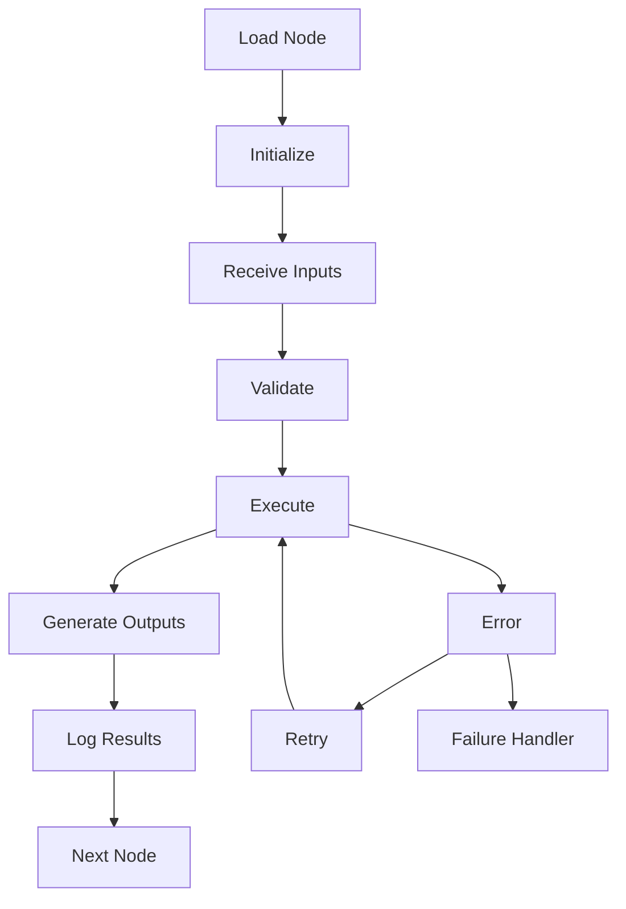

# QS-OS Workflow Engine Blueprint

# Volume 2 — QS Node SDK Specification (V1)

Version: 1.0

> ⚠️ **V3 COMPATIBILITY NOTICE** — Updated: 2026-06-18  
> This document was written for QS-OS V1. The SDK contract remains valid but terminology has changed in V3.  
> **V3 terminology:** "QS Node" → "Skill", "Node SDK" → "Skill SDK", "Pack" → "Capability Pack".  
> V3 adds: `skillId`, `packId`, `mode` (`active | muted | bypassed`) fields on every Skill; `uses_services[]` and `data_pack_deps[]` dependency declarations.  
> A new **Vol 16 — Skill SDK Specification** will be the V3 update of this document.  
> **Current authoritative reference:** `QS-OS_V3_Architecture_and_QS-WFUI_Continuation_Blueprint.md`  
> **Document index:** `Master_Documentation_Index.md`

---

## Purpose

The QS Node SDK defines a standard contract for every node in the QS-OS
ecosystem.

Goals:

-   Consistent development experience
-   Plug-and-play node compatibility
-   Visual workflow composition
-   AI-first extensibility
-   Stable execution engine integration

------------------------------------------------------------------------

# SDK Architecture

``` text
+---------------------------+
| Workflow Engine           |
+-------------+-------------+
              |
      Execution Context
              |
+-------------v-------------+
| Node SDK                  |
+-------------+-------------+
              |
     Custom Node Packages
              |
+------+------+------+------+
| QS | AI | Docs | Finance |
+------+------+------+------+
```

------------------------------------------------------------------------

# Node Philosophy

One node performs one business responsibility.

Examples:

-   Read BOQ
-   Generate RFQ
-   Compare Quotations
-   Calculate Rate
-   Human Approval

Nodes never contain an entire business process.

------------------------------------------------------------------------

# Standard Node Contract

``` typescript
interface QSNode {

  metadata
  inputs
  outputs

  configuration

  validate()

  execute()

  onSuccess()

  onFailure()

  destroy()

}
```

------------------------------------------------------------------------

# Node Lifecycle



Lifecycle stages:

1.  Registration
2.  Initialization
3.  Configuration
4.  Validation
5.  Execution
6.  Output
7.  Logging
8.  Cleanup

------------------------------------------------------------------------

# Metadata

Every node declares metadata.

``` yaml
id: qs.read_boq

name: Read BOQ

version: 1.0.0

category: QS

icon: boq.svg

author: QS-OS

description: Reads BOQ spreadsheets.

tags:
- boq
- excel
- estimation
```

------------------------------------------------------------------------

# Ports

## Input Ports

Receive data.

Examples:

-   File
-   JSON
-   Text
-   Number
-   BOQ
-   Drawing

## Output Ports

Produce data.

Examples:

-   BOQ Items
-   Error
-   Report
-   Document
-   Approval Request

------------------------------------------------------------------------

# Port Types

  Type      Example
  --------- ---------------
  String    Project Name
  Number    Quantity
  Boolean   Approved
  File      PDF
  JSON      BOQ Items
  Array     Supplier List
  Object    Contract

------------------------------------------------------------------------

# Configuration

Configuration is edited from the property panel.

Example:

``` yaml
Sheet Name:
Header Row:
Currency:
Trade:
Confidence Threshold:
```

Configuration never changes runtime input.

------------------------------------------------------------------------

# Execution Context

Each execution receives a context.

``` text
Context

Project

Workflow

Current User

Execution Id

Variables

Secrets

Database

Logger

Storage

AI Services
```

No node should access global state directly.

------------------------------------------------------------------------

# Validation

Validation occurs before execution.

Checks include:

-   Required inputs
-   Data types
-   Permissions
-   Business rules
-   File availability

Return:

-   Warning
-   Error
-   Success

------------------------------------------------------------------------

# Outputs

A node can emit:

Primary output

Secondary outputs

Error output

Example

``` text
Read BOQ

Output 1

BOQ Items

Output 2

Warnings

Output 3

Errors
```

------------------------------------------------------------------------

# Error Handling

Every node supports:

-   Retry
-   Continue
-   Stop workflow
-   Route to error branch
-   Human intervention

------------------------------------------------------------------------

# Logging

Automatic logs:

-   Start time
-   Finish time
-   Duration
-   Inputs
-   Outputs
-   Warnings
-   Errors

------------------------------------------------------------------------

# Human Approval

SDK includes approval capability.

``` mermaid
flowchart LR

Execute

-->

Approval Request

-->

User Decision

-->

Approved

or

Rejected
```

------------------------------------------------------------------------

# AI Capability

Nodes may expose AI tools.

Examples:

-   OCR
-   Classification
-   Summarization
-   Drawing Analysis
-   Risk Detection

AI tools are optional modules.

------------------------------------------------------------------------

# UI Schema

Every node defines its UI.

``` yaml
title

icon

category

color

propertyPanels

inputPorts

outputPorts

help

documentation
```

------------------------------------------------------------------------

# Property Panel

Typical sections:

General

Inputs

Configuration

Advanced

Security

Debug

------------------------------------------------------------------------

# Testing

Every node requires:

Unit Tests

Integration Tests

Workflow Tests

Regression Tests

Performance Tests

Mock Data

Example checklist:

-   Valid input
-   Invalid input
-   Missing file
-   Permission denied
-   AI unavailable
-   Database unavailable

------------------------------------------------------------------------

# Security

Node developers must never:

-   Hardcode secrets
-   Log passwords
-   Expose API keys
-   Bypass permissions

Secrets are retrieved from execution context.

------------------------------------------------------------------------

# Packaging

A pack structure:

``` text
qs-pack/

package.json

manifest.yaml

nodes/

ReadBOQ/

GenerateRFQ/

CompareQuotation/

assets/

docs/

tests/
```

------------------------------------------------------------------------

# Manifest

``` yaml
name: QS Pack

version: 1.0.0

sdk: 1.x

author: QS-OS

dependencies:
- AI Pack
```

------------------------------------------------------------------------

# Versioning

Semantic Versioning:

Major

Minor

Patch

Workflows declare compatible SDK versions.

------------------------------------------------------------------------

# Documentation Requirements

Each node must include:

Purpose

Inputs

Outputs

Configuration

Example

Common Errors

Screenshots

Version History

------------------------------------------------------------------------

# Recommended Folder Structure

``` text
ReadBOQ/

index.ts

node.ts

schema.ts

ui.ts

validator.ts

executor.ts

tests/

README.md

icon.svg
```

------------------------------------------------------------------------

# Development Principles

1.  One node, one responsibility.
2.  Strongly typed inputs and outputs.
3.  Configuration is declarative.
4.  No hidden side effects.
5.  Deterministic execution where possible.
6.  Every node is testable.
7.  Every node is documented.
8.  AI features are modular.
9.  Human approval is supported.
10. Nodes are reusable across packs.

------------------------------------------------------------------------

# Long-term Vision

The QS Node SDK becomes the foundation of a construction workflow
ecosystem where internal teams and third-party developers can create
installable Packs that integrate seamlessly with the QS-OS Workflow
Engine.

By enforcing a common contract for lifecycle, ports, configuration,
execution, validation, UI, testing, and packaging, every node behaves
predictably while remaining flexible enough to support future AI
capabilities and construction-specific innovation.
