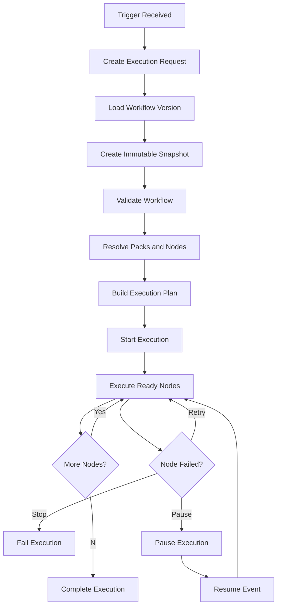
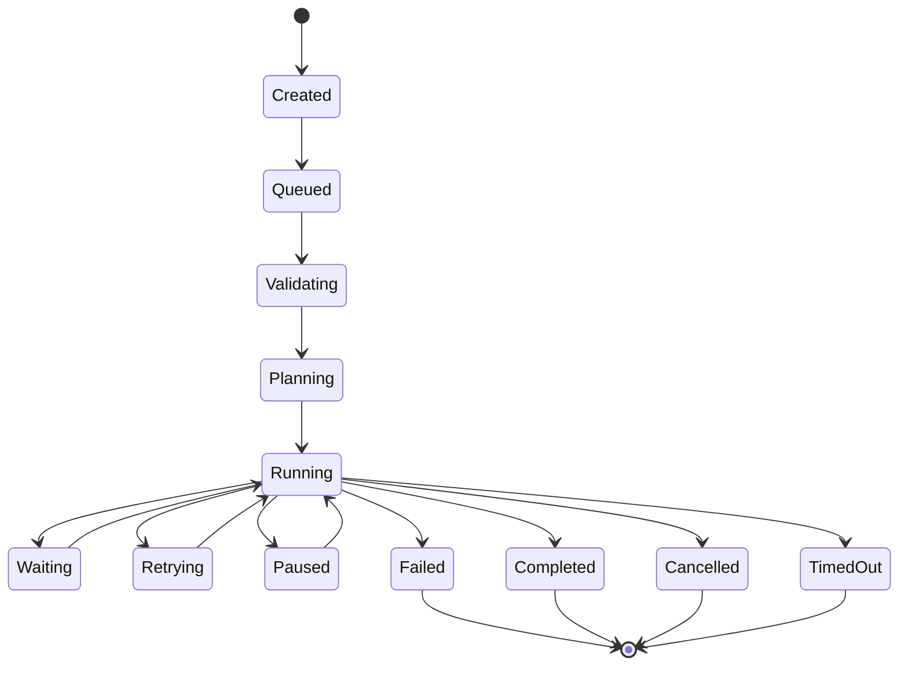
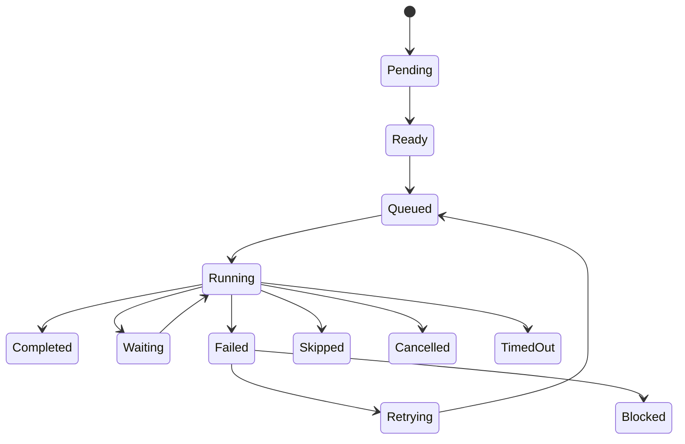
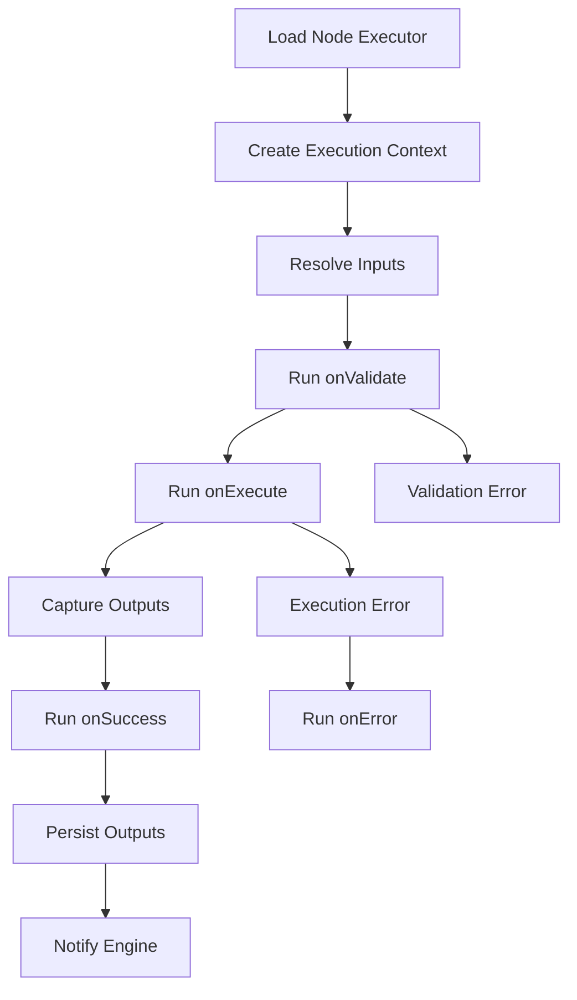
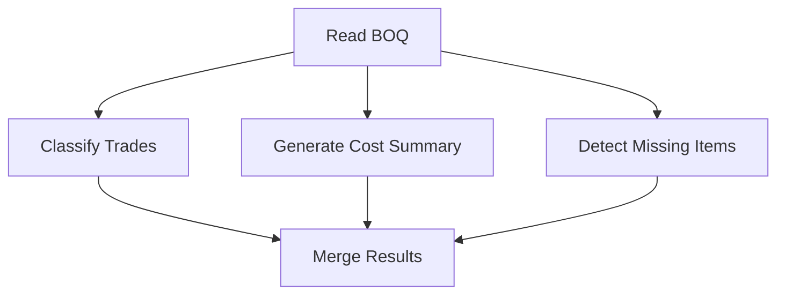
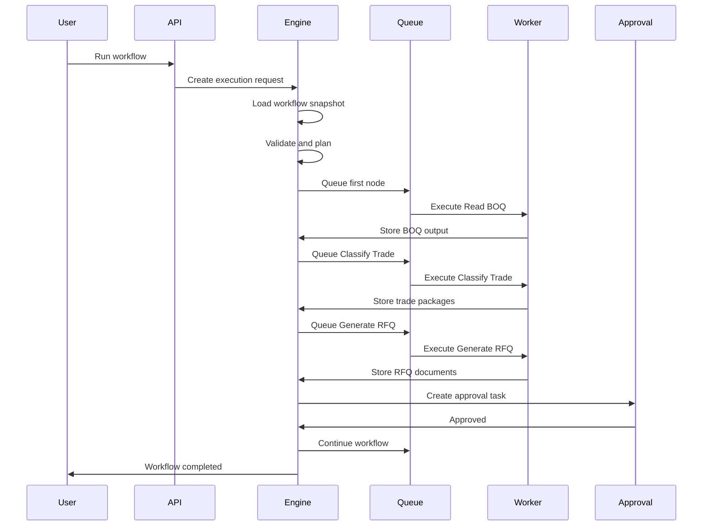

# QS-OS Workflow Engine Blueprint
# Volume 5 – Execution Engine Specification
Version: 1.0

> This specification defines how the QS-OS Execution Engine runs workflows.
>
> It covers scheduling, queues, runtime planning, node execution, branching, loops, retries, checkpoints, human approval, AI orchestration, sub-workflows, parallel execution, pause/resume, cancellation, logging, security, observability, and failure recovery.
>
> The Execution Engine is the operational heart of QS-OS.

---

# 1. Purpose

The Execution Engine is responsible for turning a saved Workflow JSON definition into a real running process.

It answers:

- When should a workflow run?
- Which workflow version should be used?
- Which nodes should execute first?
- What data should flow between nodes?
- How are node executors loaded from Packs?
- How are retries handled?
- How are loops handled?
- How are parallel branches handled?
- How does the workflow pause for human approval?
- How does the workflow resume?
- How are AI calls controlled?
- How are logs and outputs stored?
- How is failure recovered?
- How is auditability preserved?

```text
Workflow JSON
  ↓
Execution Planner
  ↓
Execution Runtime
  ↓
Node Executors
  ↓
Logs / Outputs / Approvals / Artifacts
```

---

# 2. Core Philosophy

QS-OS workflows must be executed safely, predictably, and transparently.

The Execution Engine should behave like an operations manager.

```text
Workflow Definition = The business process plan
Execution Engine = The operations manager
Node Executor = The worker performing one task
Execution Context = The controlled environment
Execution Log = The audit trail
```

The engine must not hide business decisions from users.

---

# 3. Relationship to Other Volumes

This volume depends on:

```text
Volume 1 – Workflow Engine Blueprint
Defines the platform and workflow concept.

Volume 2 – QS Node SDK Specification
Defines node contracts and lifecycle.

Volume 2.1 – QS Node Developer Guide
Defines how nodes execute through callbacks and context.

Volume 3 – QS Pack Specification
Defines how Packs register nodes, permissions, templates, and prompts.

Volume 4 – Workflow JSON Specification
Defines the workflow format that the execution engine runs.
```

This volume prepares for:

```text
Volume 6 – QS-OS Product Master Blueprint V2
Combines all specifications into the complete product architecture.
```

---

# 4. Execution Engine Responsibilities

The Execution Engine must:

1. Receive workflow run requests
2. Load published workflow JSON
3. Create execution snapshots
4. Validate workflow before execution
5. Resolve Pack and Node dependencies
6. Build an execution graph
7. Schedule node execution
8. Manage data flow
9. Execute nodes using the Node Runtime
10. Handle retries and errors
11. Manage branching and conditions
12. Manage loops and batches
13. Manage parallel execution
14. Pause and resume workflows
15. Create human approval tasks
16. Orchestrate AI calls
17. Store outputs and artifacts
18. Emit events
19. Log every execution step
20. Preserve auditability and reproducibility

---

# 5. Execution Engine Non-Responsibilities

The Execution Engine should not:

- Define node business logic
- Directly parse BOQs unless inside a node
- Directly send emails unless inside a node
- Directly call AI unless through AI runtime services
- Store raw secrets in workflow definitions
- Make final commercial decisions without human review
- Modify Pack code
- Bypass permissions
- Modify workflow design without versioning

The engine orchestrates.

Nodes perform work.

---

# 6. High-Level Architecture

```text
                       QS-OS Execution Engine

 ┌───────────────────────────────────────────────────────────┐
 │ Trigger Listener                                          │
 └──────────────────────┬────────────────────────────────────┘
                        │
 ┌──────────────────────▼────────────────────────────────────┐
 │ Execution Request Handler                                 │
 └──────────────────────┬────────────────────────────────────┘
                        │
 ┌──────────────────────▼────────────────────────────────────┐
 │ Workflow Loader + Snapshot Creator                        │
 └──────────────────────┬────────────────────────────────────┘
                        │
 ┌──────────────────────▼────────────────────────────────────┐
 │ Workflow Validator + Dependency Resolver                  │
 └──────────────────────┬────────────────────────────────────┘
                        │
 ┌──────────────────────▼────────────────────────────────────┐
 │ Execution Planner                                         │
 └──────────────────────┬────────────────────────────────────┘
                        │
 ┌──────────────────────▼────────────────────────────────────┐
 │ Scheduler + Queue Manager                                 │
 └──────────────────────┬────────────────────────────────────┘
                        │
 ┌──────────────────────▼────────────────────────────────────┐
 │ Node Runtime + Execution Context                          │
 └──────────────────────┬────────────────────────────────────┘
                        │
 ┌──────────────────────▼────────────────────────────────────┐
 │ Outputs / Logs / Artifacts / Approvals / Events            │
 └───────────────────────────────────────────────────────────┘
```

---

# 7. Core Components

Recommended components:

```text
Execution Request Handler
Workflow Loader
Snapshot Service
Workflow Validator
Dependency Resolver
Graph Builder
Execution Planner
Scheduler
Queue Manager
Node Runtime
Execution Context Factory
State Manager
Output Store
Artifact Store
Approval Manager
AI Orchestrator
Event Bus
Logger
Audit Service
Retry Manager
Checkpoint Manager
Cancellation Manager
Monitoring Service
```

---

# 8. Execution Lifecycle



---

# 9. Execution States

Workflow execution states:

```text
created
queued
validating
planning
running
waiting
paused
retrying
completed
failed
cancelled
timed_out
partially_completed
```

---

# 10. Execution State Machine



---

# 11. Node Execution States

Node execution states:

```text
pending
ready
queued
running
waiting
paused
completed
failed
skipped
cancelled
retrying
timed_out
blocked
```

---

# 12. Node Execution State Machine



---

# 13. Execution Request

An execution request starts a workflow run.

Example:

```json
{
  "workflowId": "workflow.tender_boq_to_rfq",
  "workflowVersion": "1.0.0",
  "triggerType": "manual",
  "startedBy": "user-placeholder",
  "organizationId": "org-placeholder",
  "projectId": "project-placeholder",
  "inputs": {
    "boqFile": "file.placeholder"
  }
}
```

---

# 14. Execution Request Sources

Workflows may start from:

```text
Manual trigger
Schedule trigger
Webhook trigger
File upload trigger
Email trigger
Event trigger
API request
Sub-workflow call
System automation
```

---

# 15. Trigger Listener

The Trigger Listener watches for workflow start events.

Responsibilities:

- Listen for enabled triggers
- Validate trigger payload
- Create execution request
- Prevent duplicate trigger firing where needed
- Respect workflow status
- Apply trigger-level permission rules
- Route request to queue

---

# 16. Manual Trigger Flow

```text
User clicks Run
  ↓
Check permission
  ↓
Collect required inputs
  ↓
Create execution request
  ↓
Queue workflow execution
```

---

# 17. Schedule Trigger Flow

```text
Scheduler wakes
  ↓
Find due workflows
  ↓
Check workflow active status
  ↓
Create execution request
  ↓
Queue execution
```

Schedule triggers should respect workflow timezone.

---

# 18. Webhook Trigger Flow

```text
Webhook request received
  ↓
Authenticate request
  ↓
Validate payload
  ↓
Map payload to workflow inputs
  ↓
Create execution request
  ↓
Queue execution
```

Webhook triggers must support rate limiting and security verification.

---

# 19. File Upload Trigger Flow

```text
File uploaded
  ↓
Match folder / file type rule
  ↓
Create file reference
  ↓
Create execution request
  ↓
Queue workflow
```

Useful for:

- BOQ upload
- Quotation upload
- Drawing upload
- Site instruction upload
- Claim document upload

---

# 20. Workflow Loader

The Workflow Loader retrieves the correct workflow version.

Rules:

- Production execution uses published version.
- Debug execution may use draft version.
- Historical re-run may use archived version.
- Execution snapshot must be created before nodes run.

---

# 21. Execution Snapshot

An execution snapshot is an immutable copy of the workflow definition used for a run.

Purpose:

- Auditability
- Reproducibility
- Debugging
- Dispute review
- Compliance
- Version traceability

Example:

```json
{
  "executionId": "exec-placeholder",
  "workflowId": "workflow.tender_boq_to_rfq",
  "workflowVersion": "1.0.0",
  "schemaVersion": "1.0.0",
  "snapshotHash": "sha256-placeholder",
  "capturedAt": "2026-06-15T00:00:00.000Z"
}
```

---

# 22. Snapshot Rules

Execution snapshots must:

- Be created before execution starts
- Include workflow JSON
- Include dependency versions
- Include node versions
- Include trigger information
- Include execution policy
- Be immutable
- Be referenced by all node executions

---

# 23. Workflow Validation Before Execution

Validation steps:

```text
Schema validation
Workflow status check
Dependency check
Node registry check
Pack availability check
Port compatibility check
Variable check
Secret reference check
Permission check
Trigger validation
Business rule validation
Execution policy validation
```

A workflow must not run if validation has critical errors.

---

# 24. Dependency Resolver

The Dependency Resolver checks:

- Required Packs are installed
- Pack versions are compatible
- Node types are registered
- Node versions are compatible
- Templates exist
- Prompts exist
- Required services are available
- Required permissions are granted

---

# 25. Node Resolver

The Node Resolver maps node instances to registered executors.

```text
Workflow node type
  ↓
Node Registry
  ↓
Pack Registry
  ↓
Executor path
  ↓
Node Runtime
```

Example:

```text
qs.read_boq
  ↓
qsos.qs-pack
  ↓
ReadBOQ executor
```

---

# 26. Graph Builder

The Graph Builder converts Workflow JSON nodes and connections into an executable graph.

It identifies:

- Start nodes
- End nodes
- Upstream dependencies
- Downstream dependencies
- Branch nodes
- Merge nodes
- Loop nodes
- Parallel branches
- Human approval pauses
- Error branches
- Invalid cycles

---

# 27. Execution Planner

The Execution Planner determines which nodes can run and when.

Planner responsibilities:

- Build dependency graph
- Determine execution order
- Identify parallelizable branches
- Detect cycles
- Detect disconnected nodes
- Apply disabled node rules
- Apply trigger inputs
- Apply retry and error policy
- Generate execution plan

---

# 28. Execution Plan

Example:

```json
{
  "executionPlan": {
    "executionId": "exec-placeholder",
    "startNodes": ["node_trigger"],
    "stages": [
      {
        "stage": 1,
        "nodes": ["node_trigger"]
      },
      {
        "stage": 2,
        "nodes": ["node_read_boq"]
      },
      {
        "stage": 3,
        "nodes": ["node_classify_trade", "node_extract_summary"]
      },
      {
        "stage": 4,
        "nodes": ["node_merge_results"]
      }
    ]
  }
}
```

---

# 29. Execution Order

Execution order is determined by graph dependencies, not canvas position.

Canvas position is visual only.

```text
Node can run when:
All required upstream inputs are available
AND
Conditions allow execution
AND
Node is not disabled
AND
Permissions are available
AND
No blocking approval is pending
```

---

# 30. Topological Execution

For normal directed acyclic workflows, execution can follow topological ordering.

```text
Read BOQ
  ↓
Classify Trade
  ↓
Generate RFQ
  ↓
Approval
  ↓
Send RFQ
```

Topological ordering is the default strategy.

---

# 31. Cycles and Loops

Cycles are not allowed unless represented by approved loop constructs.

Invalid:

```text
A → B → C → A
```

Valid:

```text
Loop Node
  ↓
Process Item
  ↓
Loop Controller
```

Loop handling must be explicit and controlled.

---

# 32. Scheduler

The Scheduler decides when executions and nodes enter queues.

Responsibilities:

- Schedule workflow execution
- Schedule node execution
- Schedule retries
- Schedule delayed nodes
- Schedule periodic triggers
- Respect concurrency limits
- Handle paused and resumed workflows
- Avoid duplicate execution

---

# 33. Queue Manager

The Queue Manager handles asynchronous work.

Recommended queue categories:

```text
workflow.queue
node.queue
ai.queue
document.queue
email.queue
approval.queue
webhook.queue
retry.queue
scheduled.queue
```

Each queue may have different concurrency limits.

---

# 34. Recommended Queue Technology

QS-OS may use a queue system such as BullMQ with Redis for MVP.

However, the architecture should remain queue-agnostic.

```text
Execution Engine
  ↓
Queue Adapter
  ↓
BullMQ / Redis / Other Queue
```

Do not hardwire business logic directly into queue implementation.

---

# 35. Worker Types

Recommended worker types:

```text
Workflow Worker
Node Worker
AI Worker
Document Worker
Email Worker
Approval Worker
Scheduler Worker
Cleanup Worker
Migration Worker
```

---

# 36. Workflow Worker

The Workflow Worker manages the overall workflow execution.

Responsibilities:

- Start execution
- Load execution plan
- Check node readiness
- Dispatch ready nodes
- Monitor node completion
- Evaluate branches
- Complete or fail workflow
- Pause or resume workflow

---

# 37. Node Worker

The Node Worker executes individual nodes.

Responsibilities:

- Load node executor
- Create execution context
- Validate inputs
- Run node lifecycle
- Capture outputs
- Store outputs
- Log execution
- Report status to State Manager

---

# 38. Node Runtime

The Node Runtime is the controlled environment in which node executors run.

It provides:

- Execution context
- Input data
- Configuration
- Variables
- Secret references
- Database client
- Storage client
- AI client
- Logger
- Event emitter
- Human task client

---

# 39. Node Runtime Lifecycle



---

# 40. Node Lifecycle Callbacks

From the Node SDK:

```text
onRegister
onInit
onConfigure
onValidate
onExecute
onSuccess
onError
onCleanup
```

During workflow execution, the most important callbacks are:

```text
onValidate
onExecute
onSuccess
onError
onCleanup
```

---

# 41. Execution Context

Each node receives an execution context.

```text
Execution Context
├── executionId
├── workflowId
├── workflowVersion
├── nodeId
├── nodeType
├── organizationId
├── projectId
├── user
├── inputs
├── configuration
├── variables
├── secrets
├── database
├── storage
├── ai
├── logger
├── events
├── approvals
├── artifacts
└── cancellationToken
```

---

# 42. Execution Context Rules

Nodes must:

- Use services from the context
- Never access global secrets directly
- Never bypass permission checks
- Never write outside allowed storage
- Never modify workflow definition directly
- Report progress through context
- Respect cancellation tokens
- Return structured outputs

---

# 43. Node Inputs

Node inputs are resolved from:

- Trigger payload
- Upstream node outputs
- Workflow variables
- Project variables
- Organization variables
- File references
- Secret references
- Default configuration

Input resolution must happen before node execution.

---

# 44. Input Resolution

Example:

```text
Connection:
node_read_boq.boqItems → node_classify_trade.items

Runtime:
Load node_read_boq output
  ↓
Apply mapping
  ↓
Validate type compatibility
  ↓
Pass as input to node_classify_trade
```

---

# 45. Output Storage

Node outputs should be stored outside the workflow definition.

Recommended storage:

```text
Small structured output → database JSONB
Large output → artifact storage
File output → storage service
Confidential output → encrypted storage
Temporary output → cache with retention policy
```

---

# 46. Output Reference

Downstream nodes should receive references where outputs are large.

Example:

```json
{
  "outputRef": "output.exec123.node_read_boq.boqItems"
}
```

This avoids passing huge BOQ arrays directly through memory.

---

# 47. Artifact Store

Artifacts are files generated or used during execution.

Examples:

- RFQ PDF
- Cost summary Excel
- Progress claim report
- Quotation comparison table
- AI review report
- OCR output
- Extracted drawing data

Artifact metadata:

```json
{
  "artifactId": "artifact-placeholder",
  "executionId": "exec-placeholder",
  "nodeId": "node_generate_rfq",
  "type": "document",
  "mimeType": "application/pdf",
  "storageRef": "storage.placeholder",
  "createdAt": "2026-06-15T00:00:00.000Z"
}
```

---

# 48. Data Flow

Data flow follows connections between node ports.

```text
Source node output
  ↓
Connection mapping
  ↓
Target node input
```

The engine must preserve:

- Type information
- Data lineage
- Source node ID
- Output port ID
- Transformation mapping
- Timestamp

---

# 49. Data Lineage

Every output should know where it came from.

Example:

```json
{
  "lineage": {
    "executionId": "exec-placeholder",
    "sourceNodeId": "node_read_boq",
    "sourcePortId": "boqItems",
    "targetNodeId": "node_classify_trade",
    "targetPortId": "items"
  }
}
```

Data lineage supports audit and debugging.

---

# 50. Branching

Branching occurs when a node has multiple outgoing paths.

Examples:

```text
If confidence >= 90% → continue automatically
If confidence < 90% → human review
```

The engine evaluates branch conditions after the source node completes.

---

# 51. Condition Evaluation

Conditions may be:

```text
Port-based
Expression-based
Boolean output-based
Approval decision-based
AI confidence-based
Error status-based
```

Example:

```json
{
  "condition": {
    "type": "expression",
    "expression": "{{node_ai_classify.outputs.confidence}} >= 0.9"
  }
}
```

Conditions must be sandboxed.

---

# 52. Branch Execution Rules

Rules:

- All true outgoing branches may run unless exclusive branching is configured.
- Exclusive decision nodes should run only one branch.
- Branch conditions must be logged.
- Failed condition evaluation should follow error policy.
- Branch result should be stored in execution logs.

---

# 53. Merge Handling

Merge nodes combine branches.

Merge strategies:

```text
waitAll
firstCompleted
appendArrays
mergeObjects
chooseByCondition
manualSelection
```

Example:

```text
Classify BOQ branch
Cost summary branch
Missing item detection branch
  ↓
Merge analysis results
```

---

# 54. Parallel Execution

The engine may run independent branches in parallel.

Parallel execution rules:

- Only run in parallel if dependencies allow.
- Respect workflow concurrency settings.
- Respect node-level concurrency limits.
- Respect organization resource limits.
- Preserve deterministic merge behavior where required.

---

# 55. Parallel Execution Example



The engine may run B, C, and D concurrently.

---

# 56. Concurrency Controls

Concurrency may be controlled at:

```text
Platform level
Organization level
Project level
Workflow level
Node type level
Queue level
AI provider level
External integration level
```

Example:

```json
{
  "execution": {
    "maxConcurrentRuns": 3,
    "maxParallelNodes": 5
  }
}
```

---

# 57. Loops

Loops process repeated data.

Examples:

- Loop through BOQ items
- Loop through suppliers
- Loop through quotation rows
- Loop through drawing sheets
- Loop through claim items

Loop types:

```text
forEach
while
batch
pagination
untilApproved
```

---

# 58. Loop Execution

Loop execution must be controlled.

```text
Input array
  ↓
Create iteration tasks
  ↓
Execute item processor
  ↓
Collect outputs
  ↓
Merge results
```

Loop nodes must declare:

```text
maxIterations
batchSize
timeout
failure behavior
parallelism
```

---

# 59. Loop Safety

Loop safety requirements:

- Maximum iterations
- Maximum runtime
- Maximum output size
- Cancellation support
- Failure threshold
- Progress logging
- Memory limit
- No uncontrolled recursion

---

# 60. Batch Processing

Batch processing is essential for large QS data.

Examples:

```text
10,000 BOQ rows
500 supplier rates
300 drawing sheets
1,000 variation items
```

Batch configuration:

```json
{
  "batch": {
    "enabled": true,
    "batchSize": 100,
    "maxParallelBatches": 3,
    "continueOnBatchError": false
  }
}
```

---

# 61. Retry System

The Retry Manager handles transient failures.

Retry examples:

- Temporary email failure
- AI provider timeout
- OCR service unavailable
- Database deadlock
- Network timeout
- Rate limit

---

# 62. Retry Policy

```json
{
  "retryPolicy": {
    "enabled": true,
    "maxAttempts": 3,
    "delaySeconds": 30,
    "backoff": "exponential",
    "retryOn": [
      "TIMEOUT",
      "RATE_LIMIT",
      "NETWORK_ERROR"
    ]
  }
}
```

---

# 63. Retry Backoff Types

Supported backoff types:

```text
fixed
linear
exponential
custom
```

Example:

```text
Attempt 1 → immediate
Attempt 2 → 30 seconds
Attempt 3 → 90 seconds
Attempt 4 → 270 seconds
```

---

# 64. Retry Rules

Retries must:

- Log every attempt
- Preserve attempt count
- Respect maximum attempts
- Avoid duplicate side effects
- Use idempotency keys where possible
- Stop on non-retryable errors
- Escalate after failure

---

# 65. Idempotency

Idempotency prevents duplicate side effects.

Examples:

- Do not send the same RFQ email twice accidentally.
- Do not create duplicate Purchase Orders.
- Do not duplicate payment certificates.
- Do not charge billing twice.

Idempotency key example:

```text
executionId + nodeId + attemptGroup + businessAction
```

---

# 66. Side Effect Nodes

Side effect nodes perform external actions.

Examples:

```text
Send Email
Send WhatsApp
Create Purchase Order
Generate Payment Certificate
Submit API Request
Update Database
```

Side effect nodes require stronger safeguards.

---

# 67. Side Effect Rules

Side effect nodes must:

- Support idempotency
- Log external action reference
- Confirm success or failure
- Avoid duplicate execution after retry
- Support dry-run mode if possible
- Require approval for high-risk actions

---

# 68. Error Handling

Error handling occurs at:

```text
Node level
Branch level
Workflow level
Queue level
System level
```

Error actions:

```text
stop
retry
continue
skip
route
pause
manualReview
compensate
```

---

# 69. Error Object

Standard error object:

```json
{
  "code": "AI_TIMEOUT",
  "message": "AI provider did not respond within timeout.",
  "severity": "warning",
  "nodeId": "node_ai_classify",
  "retryable": true,
  "timestamp": "2026-06-15T00:00:00.000Z",
  "details": {}
}
```

---

# 70. Error Severity

Supported severity:

```text
info
warning
error
critical
```

Meaning:

```text
info:
Useful runtime information.

warning:
Execution can continue but user should review.

error:
Node or branch failed.

critical:
Workflow must stop or require admin intervention.
```

---

# 71. Error Branches

Workflows may define error branches.

Example:

```text
Send RFQ fails
  ↓
Notify Procurement Officer
  ↓
Create manual task
```

Error branch connection:

```json
{
  "source": {
    "nodeId": "node_send_rfq",
    "portId": "error"
  },
  "target": {
    "nodeId": "node_notify_user",
    "portId": "input"
  }
}
```

---

# 72. Compensation

Compensation reverses or mitigates previous actions.

Examples:

```text
Cancel generated Purchase Order
Void draft certificate
Mark sent RFQ as cancelled
Reverse temporary database update
Notify users of failed process
```

QS-OS MVP may defer full compensation, but the architecture should support it later.

---

# 73. Checkpoints

A checkpoint records workflow execution state so it can resume safely.

Checkpoint includes:

```text
Completed nodes
Pending nodes
Current node states
Stored outputs
Branch decisions
Loop progress
Approval waits
Retry attempts
Execution variables
```

---

# 74. Checkpoint Creation

Create checkpoints:

```text
After each node completion
Before side effect node
After side effect node
Before workflow pause
After approval decision
Before retry
At loop batch boundary
Before workflow completion
```

---

# 75. Checkpoint Example

```json
{
  "checkpointId": "checkpoint-placeholder",
  "executionId": "exec-placeholder",
  "status": "running",
  "completedNodes": ["node_read_boq", "node_classify_trade"],
  "pendingNodes": ["node_generate_rfq"],
  "waitingNodes": [],
  "createdAt": "2026-06-15T00:00:00.000Z"
}
```

---

# 76. Resume From Checkpoint

Resume flow:

```text
Load execution
  ↓
Load latest checkpoint
  ↓
Validate workflow snapshot
  ↓
Restore node states
  ↓
Restore outputs references
  ↓
Queue ready nodes
  ↓
Continue execution
```

---

# 77. Pause and Resume

Workflows may pause for:

```text
Human approval
Manual review
Missing input
Rate limit cooldown
External system wait
Scheduled delay
User pause request
```

Paused workflows must preserve state.

---

# 78. Human Approval Manager

The Approval Manager creates and manages approval tasks.

Responsibilities:

- Create approval request
- Assign user or role
- Attach documents or summaries
- Track due date
- Receive decision
- Store comments
- Resume workflow
- Route based on decision

---

# 79. Approval Task Object

```json
{
  "approvalId": "approval-placeholder",
  "executionId": "exec-placeholder",
  "nodeId": "node_manager_approval",
  "title": "Approve RFQ Documents",
  "assigneeRole": "Procurement Manager",
  "status": "pending",
  "decisionOptions": ["approve", "reject", "request_changes"],
  "dueAt": "2026-06-16T00:00:00.000Z",
  "createdAt": "2026-06-15T00:00:00.000Z"
}
```

---

# 80. Approval States

```text
pending
approved
rejected
changes_requested
expired
cancelled
delegated
```

---

# 81. Approval Resume Rules

When approval is completed:

```text
Approved → continue approved branch
Rejected → follow rejection policy
Changes requested → route to revision branch
Expired → follow timeout policy
Cancelled → cancel or pause workflow
```

---

# 82. AI Orchestrator

The AI Orchestrator manages AI calls across workflows.

Responsibilities:

- Resolve AI provider
- Load prompt
- Validate prompt version
- Inject input safely
- Enforce output schema
- Capture confidence score
- Log token usage
- Apply rate limits
- Apply privacy policy
- Route low confidence to human review

---

# 83. AI Call Flow

```text
AI Node starts
  ↓
Resolve prompt and model profile
  ↓
Prepare structured input
  ↓
Call AI provider
  ↓
Validate structured output
  ↓
Capture confidence
  ↓
Store AI output and usage
  ↓
Route result
```

---

# 84. AI Output Requirements

AI-enabled nodes should return:

```text
structured output
confidence score
reasoning summary
warnings
model profile
prompt version
token usage
human review recommendation
```

Do not store hidden chain-of-thought style reasoning.

Store concise, auditable explanations.

---

# 85. AI Human Review Rules

Human review should be required for:

```text
Low confidence classification
Supplier award recommendation
Contract entitlement conclusion
Payment certification
Final account recommendation
High value tender pricing
Legal or contractual risk decision
```

AI may assist.

Human approves.

---

# 86. AI Usage Log

```json
{
  "executionId": "exec-placeholder",
  "nodeId": "node_ai_review",
  "provider": "openai-compatible",
  "modelProfile": "standard-reviewer",
  "promptId": "prompt.tender_risk_review",
  "promptVersion": "1.0.0",
  "inputTokens": 1200,
  "outputTokens": 450,
  "confidence": 0.86,
  "createdAt": "2026-06-15T00:00:00.000Z"
}
```

---

# 87. Sub-Workflows

A sub-workflow is a workflow called from another workflow.

Use cases:

```text
Supplier prequalification
Document approval
Tender risk review
Payment certificate review
Variation evaluation
```

Sub-workflow execution modes:

```text
sync
async
fireAndForget
waitForApproval
```

---

# 88. Sub-Workflow Flow

```text
Parent workflow reaches sub-workflow node
  ↓
Create child execution
  ↓
Pass mapped inputs
  ↓
Run child workflow
  ↓
Return mapped outputs
  ↓
Parent workflow continues
```

---

# 89. Sub-Workflow Rules

Rules:

- Child workflow gets its own execution ID.
- Parent execution records child execution reference.
- Circular sub-workflow calls are not allowed.
- Permissions must be checked for both workflows.
- Parent may wait or continue depending on configuration.

---

# 90. Cancellation

Cancellation stops an active execution.

Cancellation may be triggered by:

```text
User
Admin
System timeout
Workflow update
Organization policy
Critical error
```

Cancellation must be graceful where possible.

---

# 91. Cancellation Flow

```text
Cancel requested
  ↓
Mark execution cancelling
  ↓
Signal running nodes
  ↓
Stop queued nodes
  ↓
Allow safe cleanup
  ↓
Record cancelled state
  ↓
Notify user
```

---

# 92. Cancellation Token

Node execution context should include cancellation token.

Nodes should check cancellation during:

```text
Long file parsing
AI calls
Batch loops
Document generation
External API polling
Large database operations
```

---

# 93. Timeouts

Timeout levels:

```text
Workflow timeout
Node timeout
Queue timeout
AI call timeout
Approval timeout
Webhook timeout
Loop timeout
```

Timeout action may be:

```text
retry
fail
pause
route
notify
manualReview
```

---

# 94. Delays and Waits

Some workflows need deliberate waits.

Examples:

```text
Wait 3 days for supplier quotation
Wait until approval due date
Wait until next claim cycle
Wait for webhook callback
```

Delay nodes should not block worker processes.

They should schedule resume events.

---

# 95. External Event Wait

A workflow may wait for external events.

Examples:

```text
Supplier quotation received
Client approval received
Payment received
Drawing revision uploaded
Site instruction issued
```

The engine should store wait conditions and resume when matching event arrives.

---

# 96. Event Bus

The Event Bus publishes execution and business events.

Event examples:

```text
workflow.execution.started
workflow.execution.completed
workflow.execution.failed
node.execution.started
node.execution.completed
node.execution.failed
approval.created
approval.completed
document.generated
ai.review.completed
quotation.received
```

---

# 97. Event Object

```json
{
  "eventId": "event-placeholder",
  "eventType": "workflow.execution.completed",
  "executionId": "exec-placeholder",
  "workflowId": "workflow.tender_boq_to_rfq",
  "organizationId": "org-placeholder",
  "timestamp": "2026-06-15T00:00:00.000Z",
  "payload": {}
}
```

---

# 98. Logging

The engine must log:

```text
Workflow started
Workflow completed
Workflow failed
Node started
Node completed
Node failed
Retry scheduled
Branch selected
Approval created
Approval completed
AI invoked
Document generated
External action performed
Permission denied
Secret missing
Checkpoint created
```

---

# 99. Log Levels

```text
debug
info
warning
error
critical
```

---

# 100. Execution Log Object

```json
{
  "logId": "log-placeholder",
  "executionId": "exec-placeholder",
  "nodeId": "node_read_boq",
  "level": "info",
  "message": "Read BOQ completed.",
  "timestamp": "2026-06-15T00:00:00.000Z",
  "metadata": {
    "rowCount": 1250
  }
}
```

---

# 101. Audit Logs

Audit logs are different from debug logs.

Audit logs record important business and security events.

Examples:

```text
Workflow activated
Workflow executed
Human approval decision made
RFQ sent
Purchase Order generated
Payment Certificate approved
Pack permission granted
AI risk review completed
```

Audit logs should be immutable.

---

# 102. Observability

The engine should expose operational metrics.

Metrics:

```text
Execution count
Success rate
Failure rate
Average execution duration
Average node duration
Queue length
Retry count
AI token usage
Approval waiting time
Node failure rate
Pack failure rate
```

---

# 103. Monitoring Dashboard

Recommended dashboard sections:

```text
Running workflows
Failed workflows
Waiting approvals
Queue status
AI usage
Slow nodes
Error trends
Pack health
System capacity
```

---

# 104. Permissions Runtime

The engine must enforce permissions at runtime.

Permission checks occur:

```text
Before workflow activation
Before execution starts
Before node execution
Before side effect action
Before secret injection
Before external network call
Before document generation
```

---

# 105. Secret Injection

Secrets are injected only at runtime.

Flow:

```text
Node requests secret reference
  ↓
Permission check
  ↓
Secret manager resolves secret
  ↓
Secret provided to node context
  ↓
Secret is masked in logs
```

Secrets must never be written to execution logs.

---

# 106. Sandbox and Resource Limits

Each node may run inside a controlled runtime.

Limits:

```text
Timeout
Memory
CPU
Network access
File access
Database access
AI token usage
Concurrent executions
Output size
```

---

# 107. Security Boundaries

The engine must prevent:

```text
Unauthorized Pack access
Unauthorized secret access
Unapproved email sending
Untrusted workflow auto-run
Arbitrary code execution
Cross-organization data access
Workflow tampering
Execution log modification
```

---

# 108. Multi-Tenant Execution

QS-OS should be multi-tenant.

Every execution must include:

```text
organizationId
projectId
workflowId
executionId
userId or system actor
permission context
```

No execution should access another organization data.

---

# 109. Database Transactions

Use transactions for state updates where consistency matters.

Examples:

```text
Create execution and snapshot
Mark node completed and store output reference
Create approval task and pause workflow
Record side effect reference and checkpoint
Publish final execution status
```

Long-running external operations should not hold database transactions open.

---

# 110. Execution Data Model

Recommended tables:

```text
workflow_executions
node_executions
execution_logs
execution_outputs
execution_artifacts
execution_checkpoints
execution_events
approval_tasks
ai_usage_logs
execution_locks
execution_errors
```

---

# 111. workflow_executions Table

```sql
CREATE TABLE workflow_executions (
  id UUID PRIMARY KEY,
  workflow_id TEXT NOT NULL,
  workflow_version TEXT NOT NULL,
  organization_id UUID NOT NULL,
  project_id UUID,
  status TEXT NOT NULL,
  trigger_type TEXT,
  started_by UUID,
  started_at TIMESTAMP DEFAULT NOW(),
  completed_at TIMESTAMP,
  snapshot JSONB NOT NULL,
  snapshot_hash TEXT,
  error JSONB,
  created_at TIMESTAMP DEFAULT NOW(),
  updated_at TIMESTAMP DEFAULT NOW()
);
```

---

# 112. node_executions Table

```sql
CREATE TABLE node_executions (
  id UUID PRIMARY KEY,
  execution_id UUID NOT NULL,
  node_id TEXT NOT NULL,
  node_type TEXT NOT NULL,
  pack_id TEXT NOT NULL,
  status TEXT NOT NULL,
  attempt INTEGER DEFAULT 1,
  started_at TIMESTAMP,
  completed_at TIMESTAMP,
  duration_ms INTEGER,
  input_refs JSONB,
  output_refs JSONB,
  error JSONB,
  created_at TIMESTAMP DEFAULT NOW(),
  updated_at TIMESTAMP DEFAULT NOW()
);
```

---

# 113. execution_outputs Table

```sql
CREATE TABLE execution_outputs (
  id UUID PRIMARY KEY,
  execution_id UUID NOT NULL,
  node_id TEXT NOT NULL,
  port_id TEXT NOT NULL,
  type TEXT NOT NULL,
  value JSONB,
  storage_ref TEXT,
  size_bytes BIGINT,
  created_at TIMESTAMP DEFAULT NOW()
);
```

---

# 114. execution_checkpoints Table

```sql
CREATE TABLE execution_checkpoints (
  id UUID PRIMARY KEY,
  execution_id UUID NOT NULL,
  checkpoint_index INTEGER NOT NULL,
  status TEXT NOT NULL,
  state JSONB NOT NULL,
  created_at TIMESTAMP DEFAULT NOW()
);
```

---

# 115. approval_tasks Table

```sql
CREATE TABLE approval_tasks (
  id UUID PRIMARY KEY,
  execution_id UUID NOT NULL,
  node_id TEXT NOT NULL,
  title TEXT NOT NULL,
  description TEXT,
  assignee_user_id UUID,
  assignee_role TEXT,
  status TEXT NOT NULL,
  decision TEXT,
  comments TEXT,
  due_at TIMESTAMP,
  decided_at TIMESTAMP,
  created_at TIMESTAMP DEFAULT NOW()
);
```

---

# 116. ai_usage_logs Table

```sql
CREATE TABLE ai_usage_logs (
  id UUID PRIMARY KEY,
  execution_id UUID NOT NULL,
  node_id TEXT NOT NULL,
  provider TEXT,
  model_profile TEXT,
  prompt_id TEXT,
  prompt_version TEXT,
  input_tokens INTEGER,
  output_tokens INTEGER,
  confidence NUMERIC,
  cost_estimate NUMERIC,
  created_at TIMESTAMP DEFAULT NOW()
);
```

---

# 117. Execution Locks

Execution locks prevent duplicate work.

Use locks for:

```text
Workflow execution start
Node execution
Side effect action
Scheduled trigger firing
Webhook deduplication
Sub-workflow call
```

Lock key example:

```text
workflow:{workflowId}:execution:{executionId}:node:{nodeId}
```

---

# 118. Duplicate Prevention

Duplicate prevention is required for:

```text
Webhook retries
Email sending
Purchase Order generation
Payment Certificate issuance
Scheduled trigger overlap
Manual double-click run
```

Use:

```text
idempotency key
execution lock
unique database constraint
external reference tracking
```

---

# 119. Execution APIs

Recommended backend APIs:

```text
POST   /workflows/:id/run
GET    /executions/:id
GET    /executions/:id/logs
GET    /executions/:id/nodes
GET    /executions/:id/artifacts
POST   /executions/:id/cancel
POST   /executions/:id/pause
POST   /executions/:id/resume
POST   /executions/:id/retry
GET    /executions/:id/checkpoints
POST   /approvals/:id/decision
```

---

# 120. Execution API: Run Workflow

Request:

```json
{
  "workflowVersion": "1.0.0",
  "mode": "standard",
  "inputs": {
    "boqFile": "file.placeholder"
  }
}
```

Response:

```json
{
  "executionId": "exec-placeholder",
  "status": "queued"
}
```

---

# 121. Execution API: Approval Decision

Request:

```json
{
  "decision": "approve",
  "comments": "RFQ documents reviewed and approved."
}
```

Response:

```json
{
  "approvalId": "approval-placeholder",
  "status": "approved",
  "workflowStatus": "running"
}
```

---

# 122. Frontend Execution Viewer

The frontend should show:

```text
Workflow status
Current running node
Completed nodes
Failed nodes
Skipped nodes
Waiting approvals
Execution logs
Node outputs
Generated artifacts
Retry attempts
Timeline view
```

---

# 123. Visual Execution States

On the workflow canvas:

```text
Pending node → neutral
Running node → animated
Completed node → success
Failed node → error
Waiting node → paused
Skipped node → muted
Retrying node → warning
```

---

# 124. Debug Mode

Debug mode should allow:

```text
Step-by-step execution
Inspect inputs
Inspect outputs
View resolved variables
View branch decisions
View AI response summary
View validation messages
Replay from checkpoint
Dry-run side effects
```

Debug mode must protect secrets.

---

# 125. Dry Run Mode

Dry run validates and simulates workflow execution without side effects.

Dry run should not:

```text
Send emails
Create purchase orders
Submit API requests
Generate official certificates
Modify financial records
Call paid external services unless allowed
```

Dry run may:

```text
Validate graph
Resolve dependencies
Preview node inputs
Estimate execution path
Estimate AI usage
Generate mock outputs
```

---

# 126. Execution Modes

Supported modes:

```text
standard
debug
dryRun
manualStep
background
replay
recovery
```

---

# 127. Replay Execution

Replay allows re-running a workflow using a historical snapshot.

Use cases:

```text
Debug failed execution
Audit dispute
Compare old and new workflow behavior
Reproduce tender calculation
```

Replay must be clearly marked and should avoid side effects unless explicitly allowed.

---

# 128. Recovery Mode

Recovery mode resumes from failure.

Use cases:

```text
System crash
Worker restart
Queue outage
Database interruption
AI provider failure
```

Recovery flow:

```text
Find incomplete executions
  ↓
Load latest checkpoint
  ↓
Check running node states
  ↓
Requeue safe nodes
  ↓
Mark uncertain side effects for review
```

---

# 129. Worker Crash Recovery

If a worker crashes:

```text
Node remains running too long
  ↓
Heartbeat expires
  ↓
Engine marks node uncertain
  ↓
Check if side effect occurred
  ↓
Retry or require manual review
```

Side effect nodes should not be blindly retried without idempotency.

---

# 130. Heartbeats

Long-running nodes should emit heartbeat signals.

Heartbeat fields:

```text
executionId
nodeExecutionId
nodeId
timestamp
progress
message
```

If heartbeat is missing beyond threshold, the engine may mark node as stalled.

---

# 131. Progress Reporting

Nodes may report progress.

Examples:

```text
Reading BOQ row 500 of 10,000
Processing supplier 12 of 80
Generating page 6 of 20
OCR sheet 3 of 15
```

Progress object:

```json
{
  "nodeId": "node_read_boq",
  "progress": 45,
  "message": "Parsed 4,500 of 10,000 rows."
}
```

---

# 132. Notification Integration

The engine may notify users when:

```text
Workflow completes
Workflow fails
Approval is required
Approval is overdue
Execution is cancelled
Node repeatedly fails
Document is generated
```

Notifications should be handled through Notification Pack or service.

---

# 133. Execution Engine Configuration

System-level configuration:

```json
{
  "executionEngine": {
    "maxConcurrentWorkflowExecutions": 100,
    "maxConcurrentNodeExecutions": 500,
    "defaultWorkflowTimeoutSeconds": 3600,
    "defaultNodeTimeoutSeconds": 300,
    "checkpointFrequency": "afterEachNode",
    "enableDebugMode": true,
    "enableDryRun": true
  }
}
```

---

# 134. Performance Considerations

The engine should:

- Avoid loading huge outputs into memory
- Use output references for large data
- Stream large files where possible
- Batch BOQ and quotation processing
- Use queues for long-running tasks
- Apply concurrency limits
- Clean temporary artifacts
- Support pagination for logs and outputs

---

# 135. Scaling Strategy

MVP scaling:

```text
Single backend service
Redis queue
Worker processes
Supabase PostgreSQL
Supabase Storage
```

Later scaling:

```text
Dedicated scheduler service
Dedicated worker pools
Separate AI queue
Separate document queue
Horizontal workers
Distributed locks
Event streaming
Multi-region execution
```

---

# 136. MVP Execution Engine

For QS-OS MVP 0.1, implement:

```text
Manual workflow run
Published workflow loading
Execution snapshot
Basic workflow validation
Topological graph execution
Node queue
Node runtime
Execution context
Basic input/output passing
Basic retry policy
Basic error handling
Human approval pause/resume
Execution logs
Artifact references
Workflow completion status
```

Defer until later:

```text
Advanced scheduler
Complex loops
Sub-workflows
Full compensation
Advanced replay
Advanced marketplace execution policies
Distributed execution
Advanced AI governance
Multi-region orchestration
```

---

# 137. MVP Execution Flow

```text
User clicks Run
  ↓
Backend creates execution
  ↓
Snapshot workflow JSON
  ↓
Validate dependencies
  ↓
Build simple graph
  ↓
Run first ready node
  ↓
Store output
  ↓
Run next node
  ↓
Pause if approval node
  ↓
Resume after approval
  ↓
Complete workflow
```

---

# 138. MVP Node Runtime Requirements

MVP Node Runtime must support:

```text
Load node executor
Pass configuration
Pass inputs
Pass variables
Provide logger
Provide storage client
Provide database client
Return outputs
Handle error
```

---

# 139. MVP Database Tables

Minimum tables:

```text
workflow_executions
node_executions
execution_logs
execution_outputs
approval_tasks
execution_artifacts
```

---

# 140. Recommended TypeScript Interfaces

```typescript
export interface ExecutionRequest {
  workflowId: string;
  workflowVersion?: string;
  triggerType: string;
  startedBy?: string;
  organizationId: string;
  projectId?: string;
  inputs?: Record<string, unknown>;
  mode?: ExecutionMode;
}

export type ExecutionMode =
  | "standard"
  | "debug"
  | "dryRun"
  | "manualStep"
  | "background"
  | "replay"
  | "recovery";

export interface WorkflowExecution {
  id: string;
  workflowId: string;
  workflowVersion: string;
  organizationId: string;
  projectId?: string;
  status: ExecutionStatus;
  snapshot: unknown;
  snapshotHash: string;
  startedAt: string;
  completedAt?: string;
}

export type ExecutionStatus =
  | "created"
  | "queued"
  | "validating"
  | "planning"
  | "running"
  | "waiting"
  | "paused"
  | "retrying"
  | "completed"
  | "failed"
  | "cancelled"
  | "timed_out";

export interface NodeExecution {
  id: string;
  executionId: string;
  nodeId: string;
  nodeType: string;
  packId: string;
  status: NodeExecutionStatus;
  attempt: number;
  inputRefs?: Record<string, unknown>;
  outputRefs?: Record<string, unknown>;
  error?: ExecutionError;
}

export type NodeExecutionStatus =
  | "pending"
  | "ready"
  | "queued"
  | "running"
  | "waiting"
  | "paused"
  | "completed"
  | "failed"
  | "skipped"
  | "cancelled"
  | "retrying"
  | "timed_out"
  | "blocked";

export interface ExecutionError {
  code: string;
  message: string;
  severity: "info" | "warning" | "error" | "critical";
  retryable: boolean;
  details?: Record<string, unknown>;
}
```

---

# 141. Execution Engine Service Modules

Recommended NestJS modules:

```text
ExecutionModule
SchedulerModule
QueueModule
NodeRuntimeModule
ApprovalModule
AIOrchestrationModule
ArtifactModule
CheckpointModule
EventBusModule
ExecutionLogModule
ExecutionValidationModule
```

---

# 142. Recommended Service Classes

```text
ExecutionService
ExecutionRequestService
WorkflowSnapshotService
ExecutionPlannerService
GraphBuilderService
NodeDispatchService
NodeRuntimeService
NodeInputResolverService
NodeOutputService
RetryService
CheckpointService
ApprovalService
AIOrchestratorService
ExecutionEventService
ExecutionLoggerService
ExecutionRecoveryService
```

---

# 143. Example Runtime Sequence: BOQ to RFQ



---

# 144. Business Risk Controls

The engine should identify high-risk nodes.

High-risk actions:

```text
Send RFQ externally
Generate Purchase Order
Certify Payment
Recommend Supplier Award
Submit Tender Price
Approve Variation
Finalize Account
```

High-risk nodes should support:

```text
Human approval
Audit log
Dry-run preview
Idempotency
Role-based permission
Execution snapshot
```

---

# 145. Construction-Specific Runtime Rules

QS-OS execution must respect construction business realities.

Examples:

```text
Tender workflows may require approval before external communication.
Payment workflows may require role-based certification.
Variation workflows may require supporting documents.
Supplier award workflows should not be fully automated without review.
AI risk review should be explainable.
Commercial decisions require audit trail.
```

---

# 146. Execution Readiness Checklist

Before execution starts:

```text
[ ] Workflow is active or executable draft
[ ] Workflow version loaded
[ ] Execution snapshot created
[ ] Schema valid
[ ] Required Packs installed
[ ] Required node types registered
[ ] Required permissions granted
[ ] Required secrets mapped
[ ] Trigger inputs valid
[ ] Execution policy valid
[ ] Graph valid
[ ] No invalid cycles
[ ] Human approval nodes configured
[ ] AI nodes configured
[ ] Queue available
[ ] Execution record created
```

---

# 147. Production Readiness Checklist

Before production deployment:

```text
[ ] Queue system configured
[ ] Worker scaling configured
[ ] Execution tables migrated
[ ] Logs stored and searchable
[ ] Checkpoints enabled
[ ] Permission checks enforced
[ ] Secrets masked
[ ] Approval resume tested
[ ] Retry behavior tested
[ ] Side effect idempotency tested
[ ] Cancellation tested
[ ] Worker crash recovery tested
[ ] AI usage logging tested
[ ] Artifact storage tested
[ ] Monitoring dashboard available
```

---

# 148. Anti-Patterns

Avoid:

```text
Executing workflow directly from draft without snapshot
Passing huge data through memory
Storing runtime outputs inside workflow JSON
Retrying side effects without idempotency
Allowing AI to approve high-risk decisions
Skipping Pack permission checks
Ignoring node version compatibility
Using canvas position as execution order
Running long waits inside worker process
Hiding execution errors from users
Not preserving audit trail
```

---

# 149. Future Extensions

Future Execution Engine extensions:

```text
Distributed workflow execution
Temporal-style durable workflows
Advanced compensation engine
Workflow simulation engine
AI execution optimizer
Policy-driven approval routing
Visual execution replay
Graph-level performance optimizer
Multi-region worker pools
Cost-aware AI routing
Formal workflow verification
Execution marketplace analytics
Workflow SLA monitoring
Enterprise compliance engine
```

---

# 150. Final Formula

```text
Execution Engine = Scheduler + Planner + Queue + Node Runtime + State Manager + Logs + Approvals + AI Orchestration
```

```text
QS-OS Execution = Workflow JSON transformed into a safe, auditable, resumable business process
```

---

# Conclusion

The Execution Engine is the operational heart of QS-OS.

It takes the structured Workflow JSON, resolves Packs and Nodes, creates a durable execution snapshot, plans the graph, dispatches node work, manages data flow, handles retries, pauses for human approvals, orchestrates AI safely, stores artifacts, logs every step, and preserves auditability.

Without the Execution Engine, QS-OS is only a visual editor.

With the Execution Engine, QS-OS becomes a real Construction Workflow Operating System capable of running tendering, procurement, contract administration, progress claim, variation, payment, and reporting processes in a controlled and trustworthy way.

---

# V3 Addendum — Execution Engine Specification Updates

**Addendum version:** V3 | **Added:** 2026-06-18

This addendum documents execution engine behaviours added in V3 that are not present in the original specification above.

## A1. Skill Execution Mode Handling

Before executing any skill node, the engine must check the `mode` field from the workflow JSON node definition:

```
Pre-execution check (runs before any skill dispatch):
  if node.mode == "muted"    → SKIP: emit null on all output ports, log as "muted"
  if node.mode == "bypassed" → SKIP: pipe input[0] to output[0], null on others, log as "bypassed"
  if node.mode == "active"   → EXECUTE: run the skill normally
  if mode is absent          → EXECUTE: treat as "active"
```

### Execution log entry for muted/bypassed nodes

```json
{
  "node_id": "node-clean-boq",
  "skill_id": "skill_clean_boq_v1",
  "status": "skipped",
  "skip_reason": "muted",
  "outputs": { "result": null },
  "duration_ms": 0
}
```

For bypassed nodes:
```json
{
  "skip_reason": "bypassed",
  "outputs": { "result": "<input value passed through>" }
}
```

---

## A2. Condition Node Execution (workflow.condition)

The Condition Node (`workflow.condition`) is a built-in routing node evaluated by the execution engine — it does not call any external service.

```
Execution flow:
  1. Receive input on the `value` port
  2. Evaluate config.expression against the value
     - Substitution: {{value}} → actual input value
     - Substitution: {{node_X.outputs.Y}} → output from a previous node
  3. If expression evaluates to true  → forward value to true_path output, null to false_path
  4. If expression evaluates to false → forward value to false_path output, null to true_path
  5. Write condition evaluation log entry (see below)
  6. Continue graph traversal only on the non-null path
```

### Condition evaluation log entry

```json
{
  "node_id": "node-confidence-check",
  "node_type": "workflow.condition",
  "status": "completed",
  "condition": {
    "expression": "{{value}} >= 0.9",
    "evaluated_value": 0.93,
    "result": true,
    "path_taken": "true_path"
  },
  "duration_ms": 1
}
```

### Supported expression operators

| Operator | Example | Notes |
|---|---|---|
| `>=`, `<=`, `>`, `<` | `{{value}} >= 0.9` | Numeric comparison |
| `==`, `!=` | `{{value}} == "approved"` | String or value equality |
| `includes` | `{{value}} includes "electrical"` | String contains |
| `!= null` | `{{value}} != null` | Null check |
| `== true`, `== false` | `{{value}} == true` | Boolean check |

---

## A3. Core Services Layer

V3 introduces a **Core Services** layer between the execution engine and external providers. Skills do not call external APIs directly — they call Core Services, which handle provider routing, retries, rate limiting, and audit logging.

```
Skill Execution:
  [Skill Node]
      ↓ calls service
  [Core Services Layer]
      ├── AI Service        → OpenAI / local model
      ├── OCR Service       → Azure Document Intelligence / Tesseract
      ├── Document Service  → PDF generation, Word generation
      ├── Geometry Service  → Area calc, takeoff
      ├── Storage Service   → Supabase Storage
      ├── Search Service    → Vector search, keyword search
      ├── Notification Service → Email, webhook, in-app
      └── Billing Service   → Usage metering, quota enforcement
```

### Service call from within a skill

Skills declare their service dependencies in `uses_services[]` on the registered_nodes record. The execution engine verifies service availability before dispatching the skill. If a required service is unavailable, the node is marked `failed` with reason `service_unavailable`.

### Service execution log entry

```json
{
  "node_id": "node-classify",
  "skill_id": "skill_classify_trade_v1",
  "service_calls": [
    {
      "service": "ai",
      "provider": "openai",
      "model": "gpt-4o-mini",
      "tokens_used": 842,
      "duration_ms": 1240,
      "status": "success"
    }
  ]
}
```

---

## A4. Data Pack Resolution

Skills that declare `data_pack_deps[]` require one or more Data Packs to be installed and active for the project before execution.

```
Pre-execution Data Pack check:
  1. Load node's data_pack_deps[] from registered_nodes
  2. For each declared dependency:
     a. Check data_packs table — is the pack installed for this project's org?
     b. Check pack status = "active"
  3. If any required pack is missing or inactive → mark node "failed" with reason "missing_data_pack"
  4. If all packs present → proceed with execution, inject pack connection config into skill context
```

---

## A5. V3 Execution Status Values

V3 adds two new values to the execution status vocabulary:

| Status | Meaning (V3 addition) |
|---|---|
| `muted` | Node was explicitly skipped due to mode = "muted" |
| `bypassed` | Node was explicitly skipped due to mode = "bypassed", input passed through |

These join the existing statuses: `queued`, `running`, `completed`, `failed`, `skipped` (branch not taken).
