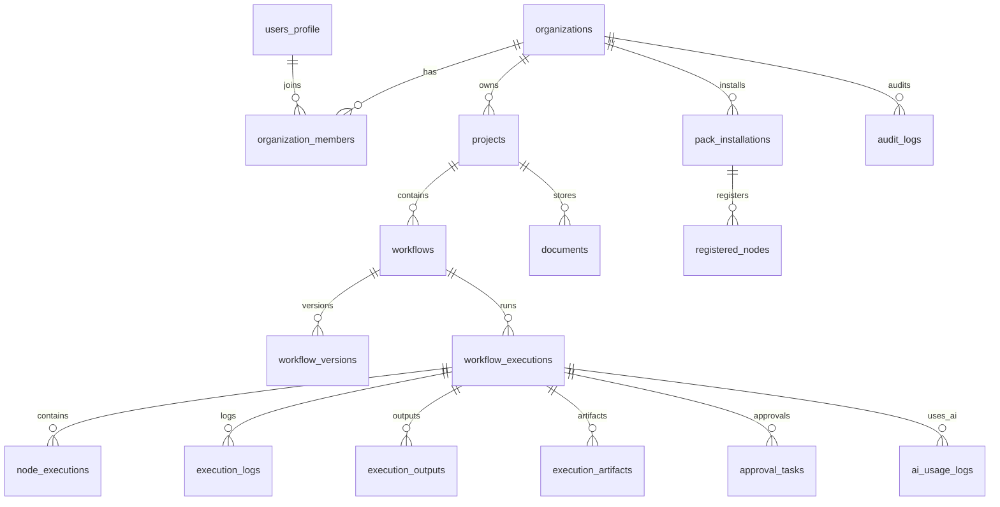
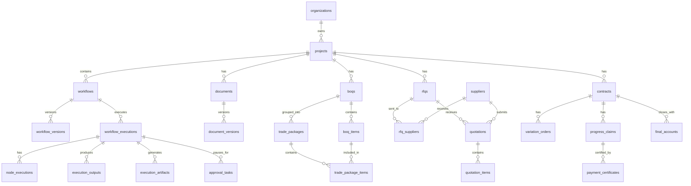

# QS-OS Workflow Engine Blueprint
# Volume 7 – Database Schema Specification
Version: 1.0

> This specification defines the database architecture for QS-OS.
>
> It covers schemas, tables, relationships, keys, indexes, JSONB usage, Row-Level Security concepts, workflow storage, execution storage, Pack registry storage, approval storage, AI usage logs, document storage metadata, audit logs, MVP tables, migration strategy, and future enterprise extensions.
>
> This document is designed for PostgreSQL / Supabase-first implementation.

---

# 1. Purpose

The QS-OS database must support:

- Multi-tenant organizations
- Project workspaces
- Workflow definitions
- Workflow versions
- Workflow JSON storage
- Pack installations
- Node registry
- Workflow executions
- Node executions
- Execution logs
- Execution outputs
- Execution artifacts
- Human approvals
- AI usage logging
- Documents
- BOQ data
- Procurement data
- Contract data
- Audit logs
- Permissions
- Marketplace readiness

The database is the durable record of QS-OS.

```text
Workflow Canvas
  ↓
Workflow JSON
  ↓
Database
  ↓
Execution Engine
  ↓
Logs / Outputs / Approvals / Artifacts
```

---

# 2. Database Philosophy

QS-OS should use a hybrid database model:

```text
Relational tables
  for identity, ownership, permissions, search, filtering, and reporting

JSONB fields
  for flexible workflow definitions, node configurations, execution snapshots, and dynamic Pack metadata
```

This gives both:

- Strong structure where the business domain is stable
- Flexibility where workflows, nodes, Packs, and AI outputs evolve

---

# 3. Recommended Database Technology

Recommended database:

```text
PostgreSQL
```

Recommended platform for MVP:

```text
Supabase PostgreSQL
Supabase Auth
Supabase Storage
Supabase Row-Level Security
```

Recommended supporting services:

```text
Redis / BullMQ for queues
Object storage for artifacts
AI provider logs stored in PostgreSQL
```

---

# 4. Database Design Principles

1. Every tenant-owned table should include `organization_id`.
2. Project-level records should include `project_id`.
3. Workflow definitions should be versioned.
4. Workflow executions should use immutable snapshots.
5. Runtime outputs should not be stored inside workflow definitions.
6. Large files should be stored in object storage, not database rows.
7. AI usage must be logged.
8. Human approval decisions must be auditable.
9. Pack and node versions must be tracked.
10. Sensitive values must not be stored in plain workflow JSON.
11. Use JSONB for flexible schemas but index important fields.
12. Avoid deleting critical records; prefer soft delete or archive.
13. Audit logs should be immutable.
14. Use database constraints to prevent duplicate side effects.
15. Use migrations for every schema change.

---

# 5. Core Database Domains

```text
Identity
Organization
Project
Workflow
Pack
Node
Execution
Approval
Document
QS Domain
Procurement
Contract
AI
Notification
Audit
Marketplace
```

---

# 6. Master Entity Relationship Overview

```text
Organization
  ├── Users / Members
  ├── Projects
  │   ├── Workflows
  │   │   ├── Workflow Versions
  │   │   └── Workflow Executions
  │   │       ├── Node Executions
  │   │       ├── Execution Logs
  │   │       ├── Execution Outputs
  │   │       ├── Execution Artifacts
  │   │       └── Approval Tasks
  │   ├── Documents
  │   ├── BOQs
  │   ├── RFQs
  │   ├── Quotations
  │   ├── Variations
  │   ├── Claims
  │   └── Reports
  ├── Pack Installations
  │   └── Registered Nodes
  ├── Secrets
  ├── Notifications
  └── Audit Logs
```

---

# 7. Suggested PostgreSQL Schemas

Use logical PostgreSQL schemas to organize tables.

```text
public
auth
core
workflow
pack
execution
document
qs
procurement
contract
ai
audit
notification
marketplace
```

For MVP, all tables may begin under `public` to reduce complexity.

For enterprise, separate schemas can improve governance.

---

# 8. Naming Conventions

Table names:

```text
snake_case
plural nouns
```

Examples:

```text
organizations
projects
workflows
workflow_versions
workflow_executions
node_executions
```

Column names:

```text
snake_case
```

Primary key:

```text
id UUID PRIMARY KEY
```

Foreign key style:

```text
organization_id
project_id
workflow_id
execution_id
node_execution_id
```

Timestamp fields:

```text
created_at
updated_at
deleted_at
archived_at
```

---

# 9. Common Columns

Most business tables should include:

```sql
id UUID PRIMARY KEY DEFAULT gen_random_uuid(),
organization_id UUID NOT NULL,
created_by UUID,
created_at TIMESTAMPTZ DEFAULT NOW(),
updated_by UUID,
updated_at TIMESTAMPTZ DEFAULT NOW(),
deleted_at TIMESTAMPTZ
```

Some system tables may not require `organization_id`.

---

# 10. Enum Strategy

For MVP, use `TEXT` fields with check constraints or application-level validation.

For mature versions, use PostgreSQL enums carefully.

Example:

```sql
status TEXT NOT NULL CHECK (
  status IN ('draft', 'active', 'inactive', 'archived')
)
```

This is easier to migrate than hard enum types during early development.

---

# 11. UUID Extension

Required extension:

```sql
CREATE EXTENSION IF NOT EXISTS pgcrypto;
```

This provides:

```text
gen_random_uuid()
```

---

# 12. Updated At Trigger

Recommended helper function:

```sql
CREATE OR REPLACE FUNCTION set_updated_at()
RETURNS TRIGGER AS $$
BEGIN
  NEW.updated_at = NOW();
  RETURN NEW;
END;
$$ LANGUAGE plpgsql;
```

Use on tables that have `updated_at`.

---

# 13. Identity Domain

QS-OS can use Supabase Auth for user authentication.

Application tables should reference Supabase auth user IDs.

---

# 14. users_profile Table

Purpose:

Stores application-level user profile data.

```sql
CREATE TABLE users_profile (
  id UUID PRIMARY KEY,
  full_name TEXT,
  display_name TEXT,
  avatar_url TEXT,
  email TEXT,
  phone TEXT,
  locale TEXT DEFAULT 'en',
  timezone TEXT DEFAULT 'Asia/Kuala_Lumpur',
  created_at TIMESTAMPTZ DEFAULT NOW(),
  updated_at TIMESTAMPTZ DEFAULT NOW()
);
```

Notes:

- `id` should match auth user ID.
- Do not store passwords.
- Email may be duplicated from auth for convenience.

---

# 15. organizations Table

Purpose:

Represents a company, QS firm, contractor, developer, or institution.

```sql
CREATE TABLE organizations (
  id UUID PRIMARY KEY DEFAULT gen_random_uuid(),
  name TEXT NOT NULL,
  legal_name TEXT,
  slug TEXT UNIQUE,
  type TEXT,
  country TEXT,
  default_currency TEXT DEFAULT 'MYR',
  default_timezone TEXT DEFAULT 'Asia/Kuala_Lumpur',
  settings JSONB DEFAULT '{}',
  status TEXT NOT NULL DEFAULT 'active',
  created_by UUID,
  created_at TIMESTAMPTZ DEFAULT NOW(),
  updated_by UUID,
  updated_at TIMESTAMPTZ DEFAULT NOW(),
  deleted_at TIMESTAMPTZ
);
```

Organization types:

```text
contractor
subcontractor
qs_consultant
developer
supplier
education
government
internal
```

---

# 16. organization_members Table

Purpose:

Links users to organizations and roles.

```sql
CREATE TABLE organization_members (
  id UUID PRIMARY KEY DEFAULT gen_random_uuid(),
  organization_id UUID NOT NULL REFERENCES organizations(id),
  user_id UUID NOT NULL REFERENCES users_profile(id),
  role TEXT NOT NULL,
  status TEXT NOT NULL DEFAULT 'active',
  invited_by UUID,
  invited_at TIMESTAMPTZ,
  joined_at TIMESTAMPTZ,
  created_at TIMESTAMPTZ DEFAULT NOW(),
  updated_at TIMESTAMPTZ DEFAULT NOW(),
  UNIQUE (organization_id, user_id)
);
```

Recommended roles:

```text
owner
admin
project_admin
senior_qs
qs
estimator
procurement
contract_manager
finance
approver
viewer
developer
```

---

# 17. organization_invitations Table

Purpose:

Handles invitations before user joins.

```sql
CREATE TABLE organization_invitations (
  id UUID PRIMARY KEY DEFAULT gen_random_uuid(),
  organization_id UUID NOT NULL REFERENCES organizations(id),
  email TEXT NOT NULL,
  role TEXT NOT NULL,
  token_hash TEXT NOT NULL,
  status TEXT NOT NULL DEFAULT 'pending',
  invited_by UUID,
  expires_at TIMESTAMPTZ,
  accepted_at TIMESTAMPTZ,
  created_at TIMESTAMPTZ DEFAULT NOW()
);
```

---

# 18. Project Domain

Projects are workspaces for tender, procurement, contract, and claim processes.

---

# 19. projects Table

```sql
CREATE TABLE projects (
  id UUID PRIMARY KEY DEFAULT gen_random_uuid(),
  organization_id UUID NOT NULL REFERENCES organizations(id),
  name TEXT NOT NULL,
  code TEXT,
  description TEXT,
  client_name TEXT,
  location TEXT,
  country TEXT,
  currency TEXT DEFAULT 'MYR',
  status TEXT NOT NULL DEFAULT 'active',
  project_type TEXT,
  contract_type TEXT,
  start_date DATE,
  end_date DATE,
  settings JSONB DEFAULT '{}',
  created_by UUID REFERENCES users_profile(id),
  created_at TIMESTAMPTZ DEFAULT NOW(),
  updated_by UUID REFERENCES users_profile(id),
  updated_at TIMESTAMPTZ DEFAULT NOW(),
  archived_at TIMESTAMPTZ,
  deleted_at TIMESTAMPTZ
);
```

Project types:

```text
building
infrastructure
sports_facility
civil
mep
landscape
interior
maintenance
other
```

---

# 20. project_members Table

Purpose:

Project-level membership and permissions.

```sql
CREATE TABLE project_members (
  id UUID PRIMARY KEY DEFAULT gen_random_uuid(),
  organization_id UUID NOT NULL REFERENCES organizations(id),
  project_id UUID NOT NULL REFERENCES projects(id),
  user_id UUID NOT NULL REFERENCES users_profile(id),
  role TEXT NOT NULL,
  status TEXT NOT NULL DEFAULT 'active',
  created_at TIMESTAMPTZ DEFAULT NOW(),
  updated_at TIMESTAMPTZ DEFAULT NOW(),
  UNIQUE (project_id, user_id)
);
```

---

# 21. Workflow Domain

Workflow tables store workflow definitions and versions.

---

# 22. workflows Table

Purpose:

Stores workflow identity and current status.

```sql
CREATE TABLE workflows (
  id TEXT PRIMARY KEY,
  organization_id UUID NOT NULL REFERENCES organizations(id),
  project_id UUID REFERENCES projects(id),
  name TEXT NOT NULL,
  description TEXT,
  category TEXT,
  tags JSONB DEFAULT '[]',
  status TEXT NOT NULL DEFAULT 'draft',
  visibility TEXT NOT NULL DEFAULT 'project',
  current_version TEXT,
  created_by UUID REFERENCES users_profile(id),
  created_at TIMESTAMPTZ DEFAULT NOW(),
  updated_by UUID REFERENCES users_profile(id),
  updated_at TIMESTAMPTZ DEFAULT NOW(),
  archived_at TIMESTAMPTZ,
  deleted_at TIMESTAMPTZ
);
```

Workflow statuses:

```text
draft
active
inactive
archived
deprecated
template
locked
invalid
```

---

# 23. workflow_versions Table

Purpose:

Stores immutable or semi-immutable Workflow JSON versions.

```sql
CREATE TABLE workflow_versions (
  id UUID PRIMARY KEY DEFAULT gen_random_uuid(),
  workflow_id TEXT NOT NULL REFERENCES workflows(id),
  organization_id UUID NOT NULL REFERENCES organizations(id),
  project_id UUID REFERENCES projects(id),
  version TEXT NOT NULL,
  schema_version TEXT NOT NULL,
  status TEXT NOT NULL DEFAULT 'draft',
  definition JSONB NOT NULL,
  definition_hash TEXT,
  change_summary TEXT,
  created_by UUID REFERENCES users_profile(id),
  created_at TIMESTAMPTZ DEFAULT NOW(),
  published_by UUID REFERENCES users_profile(id),
  published_at TIMESTAMPTZ,
  UNIQUE (workflow_id, version)
);
```

Version statuses:

```text
draft
published
superseded
archived
invalid
```

---

# 24. workflow_dependencies Table

Purpose:

Extracts dependency data from Workflow JSON for search and validation.

```sql
CREATE TABLE workflow_dependencies (
  id UUID PRIMARY KEY DEFAULT gen_random_uuid(),
  workflow_id TEXT NOT NULL REFERENCES workflows(id),
  workflow_version_id UUID NOT NULL REFERENCES workflow_versions(id),
  organization_id UUID NOT NULL REFERENCES organizations(id),
  dependency_type TEXT NOT NULL,
  dependency_id TEXT NOT NULL,
  dependency_version TEXT,
  required BOOLEAN DEFAULT TRUE,
  metadata JSONB DEFAULT '{}',
  created_at TIMESTAMPTZ DEFAULT NOW()
);
```

Dependency types:

```text
pack
node
template
prompt
feature
secret
```

---

# 25. workflow_templates Table

Purpose:

Stores reusable templates.

```sql
CREATE TABLE workflow_templates (
  id TEXT PRIMARY KEY,
  organization_id UUID REFERENCES organizations(id),
  pack_id TEXT,
  name TEXT NOT NULL,
  description TEXT,
  category TEXT,
  difficulty TEXT,
  definition JSONB NOT NULL,
  required_packs JSONB DEFAULT '[]',
  parameters JSONB DEFAULT '[]',
  visibility TEXT NOT NULL DEFAULT 'private',
  status TEXT NOT NULL DEFAULT 'active',
  created_by UUID REFERENCES users_profile(id),
  created_at TIMESTAMPTZ DEFAULT NOW(),
  updated_at TIMESTAMPTZ DEFAULT NOW()
);
```

Visibility:

```text
private
organization
marketplace
public
system
```

---

# 26. Pack Domain

Pack tables manage installed Packs and registered nodes.

---

# 27. packs Table

Purpose:

Stores Pack catalogue metadata.

```sql
CREATE TABLE packs (
  id TEXT PRIMARY KEY,
  name TEXT NOT NULL,
  display_name TEXT NOT NULL,
  description TEXT,
  category TEXT NOT NULL,
  publisher_id TEXT,
  latest_version TEXT,
  visibility TEXT DEFAULT 'private',
  status TEXT DEFAULT 'draft',
  manifest JSONB DEFAULT '{}',
  created_at TIMESTAMPTZ DEFAULT NOW(),
  updated_at TIMESTAMPTZ DEFAULT NOW()
);
```

---

# 28. pack_versions Table

Purpose:

Stores each Pack version and manifest.

```sql
CREATE TABLE pack_versions (
  id UUID PRIMARY KEY DEFAULT gen_random_uuid(),
  pack_id TEXT NOT NULL REFERENCES packs(id),
  version TEXT NOT NULL,
  manifest JSONB NOT NULL,
  checksum TEXT,
  signature_ref TEXT,
  status TEXT DEFAULT 'available',
  created_at TIMESTAMPTZ DEFAULT NOW(),
  UNIQUE (pack_id, version)
);
```

---

# 29. pack_installations Table

Purpose:

Tracks Packs installed per organization.

```sql
CREATE TABLE pack_installations (
  id UUID PRIMARY KEY DEFAULT gen_random_uuid(),
  organization_id UUID NOT NULL REFERENCES organizations(id),
  pack_id TEXT NOT NULL REFERENCES packs(id),
  version TEXT NOT NULL,
  status TEXT NOT NULL DEFAULT 'active',
  installed_by UUID REFERENCES users_profile(id),
  installed_at TIMESTAMPTZ DEFAULT NOW(),
  updated_by UUID REFERENCES users_profile(id),
  updated_at TIMESTAMPTZ DEFAULT NOW(),
  permissions JSONB DEFAULT '[]',
  configuration JSONB DEFAULT '{}',
  UNIQUE (organization_id, pack_id)
);
```

Installation statuses:

```text
installing
active
inactive
failed
updating
deprecated
uninstalled
blocked
```

---

# 30. registered_nodes Table

Purpose:

Stores node types available from installed Packs.

```sql
CREATE TABLE registered_nodes (
  id UUID PRIMARY KEY DEFAULT gen_random_uuid(),
  organization_id UUID NOT NULL REFERENCES organizations(id),
  pack_id TEXT NOT NULL REFERENCES packs(id),
  pack_version TEXT NOT NULL,
  node_type TEXT NOT NULL,
  node_version TEXT NOT NULL,
  display_name TEXT NOT NULL,
  category TEXT,
  description TEXT,
  input_schema JSONB DEFAULT '{}',
  output_schema JSONB DEFAULT '{}',
  config_schema JSONB DEFAULT '{}',
  ui_schema JSONB DEFAULT '{}',
  executor_ref TEXT,
  status TEXT DEFAULT 'active',
  created_at TIMESTAMPTZ DEFAULT NOW(),
  updated_at TIMESTAMPTZ DEFAULT NOW(),
  UNIQUE (organization_id, node_type)
);
```

---

# 31. pack_permissions Table

Purpose:

Tracks Pack permissions granted in each organization.

```sql
CREATE TABLE pack_permissions (
  id UUID PRIMARY KEY DEFAULT gen_random_uuid(),
  organization_id UUID NOT NULL REFERENCES organizations(id),
  pack_installation_id UUID NOT NULL REFERENCES pack_installations(id),
  permission TEXT NOT NULL,
  granted BOOLEAN DEFAULT FALSE,
  granted_by UUID REFERENCES users_profile(id),
  granted_at TIMESTAMPTZ,
  revoked_by UUID REFERENCES users_profile(id),
  revoked_at TIMESTAMPTZ,
  created_at TIMESTAMPTZ DEFAULT NOW(),
  UNIQUE (pack_installation_id, permission)
);
```

---

# 32. pack_assets Table

Purpose:

Stores metadata for Pack templates, prompts, icons, and sample data.

```sql
CREATE TABLE pack_assets (
  id UUID PRIMARY KEY DEFAULT gen_random_uuid(),
  organization_id UUID REFERENCES organizations(id),
  pack_id TEXT NOT NULL REFERENCES packs(id),
  pack_version TEXT NOT NULL,
  asset_type TEXT NOT NULL,
  asset_id TEXT NOT NULL,
  name TEXT,
  path TEXT,
  storage_ref TEXT,
  metadata JSONB DEFAULT '{}',
  created_at TIMESTAMPTZ DEFAULT NOW(),
  UNIQUE (pack_id, pack_version, asset_id)
);
```

Asset types:

```text
template
prompt
icon
screenshot
sample_data
documentation
workflow_template
```

---

# 33. Execution Domain

Execution tables record runtime behavior.

---

# 34. workflow_executions Table

Purpose:

Stores one execution run of a workflow.

```sql
CREATE TABLE workflow_executions (
  id UUID PRIMARY KEY DEFAULT gen_random_uuid(),
  organization_id UUID NOT NULL REFERENCES organizations(id),
  project_id UUID REFERENCES projects(id),
  workflow_id TEXT NOT NULL REFERENCES workflows(id),
  workflow_version TEXT NOT NULL,
  workflow_version_id UUID REFERENCES workflow_versions(id),
  status TEXT NOT NULL DEFAULT 'created',
  mode TEXT NOT NULL DEFAULT 'standard',
  trigger_type TEXT,
  trigger_payload JSONB DEFAULT '{}',
  inputs JSONB DEFAULT '{}',
  snapshot JSONB NOT NULL,
  snapshot_hash TEXT,
  started_by UUID REFERENCES users_profile(id),
  started_at TIMESTAMPTZ DEFAULT NOW(),
  completed_at TIMESTAMPTZ,
  duration_ms INTEGER,
  error JSONB,
  created_at TIMESTAMPTZ DEFAULT NOW(),
  updated_at TIMESTAMPTZ DEFAULT NOW()
);
```

Execution statuses:

```text
created
queued
validating
planning
running
waiting
paused
retrying
completed
failed
cancelled
timed_out
partially_completed
```

---

# 35. node_executions Table

Purpose:

Stores runtime record for each node instance.

```sql
CREATE TABLE node_executions (
  id UUID PRIMARY KEY DEFAULT gen_random_uuid(),
  organization_id UUID NOT NULL REFERENCES organizations(id),
  project_id UUID REFERENCES projects(id),
  execution_id UUID NOT NULL REFERENCES workflow_executions(id),
  workflow_id TEXT NOT NULL REFERENCES workflows(id),
  node_id TEXT NOT NULL,
  node_type TEXT NOT NULL,
  node_name TEXT,
  pack_id TEXT,
  node_version TEXT,
  status TEXT NOT NULL DEFAULT 'pending',
  attempt INTEGER DEFAULT 1,
  max_attempts INTEGER DEFAULT 1,
  started_at TIMESTAMPTZ,
  completed_at TIMESTAMPTZ,
  duration_ms INTEGER,
  input_refs JSONB DEFAULT '{}',
  output_refs JSONB DEFAULT '{}',
  progress JSONB DEFAULT '{}',
  error JSONB,
  created_at TIMESTAMPTZ DEFAULT NOW(),
  updated_at TIMESTAMPTZ DEFAULT NOW()
);
```

---

# 36. execution_outputs Table

Purpose:

Stores structured outputs or references to large outputs.

```sql
CREATE TABLE execution_outputs (
  id UUID PRIMARY KEY DEFAULT gen_random_uuid(),
  organization_id UUID NOT NULL REFERENCES organizations(id),
  project_id UUID REFERENCES projects(id),
  execution_id UUID NOT NULL REFERENCES workflow_executions(id),
  node_execution_id UUID REFERENCES node_executions(id),
  node_id TEXT NOT NULL,
  port_id TEXT NOT NULL,
  output_type TEXT NOT NULL,
  value JSONB,
  storage_ref TEXT,
  size_bytes BIGINT,
  lineage JSONB DEFAULT '{}',
  created_at TIMESTAMPTZ DEFAULT NOW()
);
```

Rules:

- Small outputs may be stored in `value`.
- Large outputs should use `storage_ref`.
- Sensitive outputs may require encryption.

---

# 37. execution_logs Table

Purpose:

Stores runtime logs.

```sql
CREATE TABLE execution_logs (
  id UUID PRIMARY KEY DEFAULT gen_random_uuid(),
  organization_id UUID NOT NULL REFERENCES organizations(id),
  project_id UUID REFERENCES projects(id),
  execution_id UUID NOT NULL REFERENCES workflow_executions(id),
  node_execution_id UUID REFERENCES node_executions(id),
  node_id TEXT,
  level TEXT NOT NULL,
  message TEXT NOT NULL,
  code TEXT,
  metadata JSONB DEFAULT '{}',
  created_at TIMESTAMPTZ DEFAULT NOW()
);
```

Log levels:

```text
debug
info
warning
error
critical
```

---

# 38. execution_artifacts Table

Purpose:

Stores metadata for generated or consumed files.

```sql
CREATE TABLE execution_artifacts (
  id UUID PRIMARY KEY DEFAULT gen_random_uuid(),
  organization_id UUID NOT NULL REFERENCES organizations(id),
  project_id UUID REFERENCES projects(id),
  execution_id UUID NOT NULL REFERENCES workflow_executions(id),
  node_execution_id UUID REFERENCES node_executions(id),
  node_id TEXT,
  artifact_type TEXT NOT NULL,
  name TEXT NOT NULL,
  mime_type TEXT,
  storage_ref TEXT NOT NULL,
  size_bytes BIGINT,
  metadata JSONB DEFAULT '{}',
  created_by UUID REFERENCES users_profile(id),
  created_at TIMESTAMPTZ DEFAULT NOW()
);
```

Artifact types:

```text
input_file
output_file
report
rfq
quotation_comparison
approval_attachment
ai_report
log_export
```

---

# 39. execution_checkpoints Table

Purpose:

Stores resumable execution state.

```sql
CREATE TABLE execution_checkpoints (
  id UUID PRIMARY KEY DEFAULT gen_random_uuid(),
  organization_id UUID NOT NULL REFERENCES organizations(id),
  execution_id UUID NOT NULL REFERENCES workflow_executions(id),
  checkpoint_index INTEGER NOT NULL,
  status TEXT NOT NULL,
  state JSONB NOT NULL,
  created_at TIMESTAMPTZ DEFAULT NOW(),
  UNIQUE (execution_id, checkpoint_index)
);
```

---

# 40. execution_events Table

Purpose:

Stores emitted workflow execution events.

```sql
CREATE TABLE execution_events (
  id UUID PRIMARY KEY DEFAULT gen_random_uuid(),
  organization_id UUID NOT NULL REFERENCES organizations(id),
  project_id UUID REFERENCES projects(id),
  execution_id UUID REFERENCES workflow_executions(id),
  event_type TEXT NOT NULL,
  payload JSONB DEFAULT '{}',
  created_at TIMESTAMPTZ DEFAULT NOW()
);
```

Event examples:

```text
workflow.execution.started
workflow.execution.completed
node.execution.failed
approval.created
approval.completed
document.generated
ai.review.completed
```

---

# 41. execution_locks Table

Purpose:

Prevents duplicate execution and side effects.

```sql
CREATE TABLE execution_locks (
  id UUID PRIMARY KEY DEFAULT gen_random_uuid(),
  organization_id UUID NOT NULL REFERENCES organizations(id),
  lock_key TEXT NOT NULL,
  execution_id UUID REFERENCES workflow_executions(id),
  node_execution_id UUID REFERENCES node_executions(id),
  status TEXT NOT NULL DEFAULT 'active',
  expires_at TIMESTAMPTZ,
  created_at TIMESTAMPTZ DEFAULT NOW(),
  UNIQUE (organization_id, lock_key)
);
```

---

# 42. Human Approval Domain

Approval tables support workflow pause and resume.

---

# 43. approval_tasks Table

```sql
CREATE TABLE approval_tasks (
  id UUID PRIMARY KEY DEFAULT gen_random_uuid(),
  organization_id UUID NOT NULL REFERENCES organizations(id),
  project_id UUID REFERENCES projects(id),
  execution_id UUID NOT NULL REFERENCES workflow_executions(id),
  node_execution_id UUID REFERENCES node_executions(id),
  node_id TEXT NOT NULL,
  title TEXT NOT NULL,
  description TEXT,
  assignee_user_id UUID REFERENCES users_profile(id),
  assignee_role TEXT,
  status TEXT NOT NULL DEFAULT 'pending',
  decision TEXT,
  decision_options JSONB DEFAULT '[]',
  comments TEXT,
  due_at TIMESTAMPTZ,
  decided_by UUID REFERENCES users_profile(id),
  decided_at TIMESTAMPTZ,
  metadata JSONB DEFAULT '{}',
  created_by UUID REFERENCES users_profile(id),
  created_at TIMESTAMPTZ DEFAULT NOW(),
  updated_at TIMESTAMPTZ DEFAULT NOW()
);
```

Approval statuses:

```text
pending
approved
rejected
changes_requested
expired
cancelled
delegated
```

---

# 44. approval_comments Table

Purpose:

Supports discussion around approval.

```sql
CREATE TABLE approval_comments (
  id UUID PRIMARY KEY DEFAULT gen_random_uuid(),
  organization_id UUID NOT NULL REFERENCES organizations(id),
  approval_task_id UUID NOT NULL REFERENCES approval_tasks(id),
  user_id UUID NOT NULL REFERENCES users_profile(id),
  comment TEXT NOT NULL,
  created_at TIMESTAMPTZ DEFAULT NOW()
);
```

---

# 45. approval_attachments Table

Purpose:

Links documents or artifacts to approvals.

```sql
CREATE TABLE approval_attachments (
  id UUID PRIMARY KEY DEFAULT gen_random_uuid(),
  organization_id UUID NOT NULL REFERENCES organizations(id),
  approval_task_id UUID NOT NULL REFERENCES approval_tasks(id),
  artifact_id UUID REFERENCES execution_artifacts(id),
  document_id UUID,
  name TEXT,
  created_at TIMESTAMPTZ DEFAULT NOW()
);
```

---

# 46. Document Domain

Document tables store metadata. Actual files live in object storage.

---

# 47. documents Table

```sql
CREATE TABLE documents (
  id UUID PRIMARY KEY DEFAULT gen_random_uuid(),
  organization_id UUID NOT NULL REFERENCES organizations(id),
  project_id UUID REFERENCES projects(id),
  name TEXT NOT NULL,
  document_type TEXT NOT NULL,
  status TEXT NOT NULL DEFAULT 'active',
  current_version INTEGER DEFAULT 1,
  storage_ref TEXT,
  mime_type TEXT,
  size_bytes BIGINT,
  metadata JSONB DEFAULT '{}',
  created_by UUID REFERENCES users_profile(id),
  created_at TIMESTAMPTZ DEFAULT NOW(),
  updated_by UUID REFERENCES users_profile(id),
  updated_at TIMESTAMPTZ DEFAULT NOW(),
  deleted_at TIMESTAMPTZ
);
```

Document types:

```text
boq
drawing
specification
rfq
quotation
purchase_order
variation_order
progress_claim
payment_certificate
final_account
contract
report
other
```

---

# 48. document_versions Table

```sql
CREATE TABLE document_versions (
  id UUID PRIMARY KEY DEFAULT gen_random_uuid(),
  organization_id UUID NOT NULL REFERENCES organizations(id),
  document_id UUID NOT NULL REFERENCES documents(id),
  version_number INTEGER NOT NULL,
  storage_ref TEXT NOT NULL,
  mime_type TEXT,
  size_bytes BIGINT,
  checksum TEXT,
  metadata JSONB DEFAULT '{}',
  created_by UUID REFERENCES users_profile(id),
  created_at TIMESTAMPTZ DEFAULT NOW(),
  UNIQUE (document_id, version_number)
);
```

---

# 49. document_links Table

Purpose:

Links documents to workflows, executions, approvals, BOQs, RFQs, and claims.

```sql
CREATE TABLE document_links (
  id UUID PRIMARY KEY DEFAULT gen_random_uuid(),
  organization_id UUID NOT NULL REFERENCES organizations(id),
  document_id UUID NOT NULL REFERENCES documents(id),
  linked_type TEXT NOT NULL,
  linked_id TEXT NOT NULL,
  relationship TEXT,
  created_at TIMESTAMPTZ DEFAULT NOW()
);
```

Linked types:

```text
project
workflow
execution
approval
boq
rfq
quotation
variation
claim
payment_certificate
```

---

# 50. QS Domain

QS tables store structured commercial data extracted or generated by workflows.

---

# 51. boqs Table

```sql
CREATE TABLE boqs (
  id UUID PRIMARY KEY DEFAULT gen_random_uuid(),
  organization_id UUID NOT NULL REFERENCES organizations(id),
  project_id UUID NOT NULL REFERENCES projects(id),
  document_id UUID REFERENCES documents(id),
  name TEXT NOT NULL,
  source_type TEXT,
  status TEXT NOT NULL DEFAULT 'draft',
  currency TEXT DEFAULT 'MYR',
  total_amount NUMERIC(18, 2),
  metadata JSONB DEFAULT '{}',
  created_by UUID REFERENCES users_profile(id),
  created_at TIMESTAMPTZ DEFAULT NOW(),
  updated_by UUID REFERENCES users_profile(id),
  updated_at TIMESTAMPTZ DEFAULT NOW()
);
```

---

# 52. boq_items Table

```sql
CREATE TABLE boq_items (
  id UUID PRIMARY KEY DEFAULT gen_random_uuid(),
  organization_id UUID NOT NULL REFERENCES organizations(id),
  project_id UUID NOT NULL REFERENCES projects(id),
  boq_id UUID NOT NULL REFERENCES boqs(id),
  parent_item_id UUID REFERENCES boq_items(id),
  item_no TEXT,
  description TEXT NOT NULL,
  unit TEXT,
  quantity NUMERIC(18, 4),
  rate NUMERIC(18, 4),
  amount NUMERIC(18, 2),
  trade TEXT,
  section TEXT,
  level TEXT,
  location TEXT,
  classification JSONB DEFAULT '{}',
  source_row INTEGER,
  metadata JSONB DEFAULT '{}',
  created_at TIMESTAMPTZ DEFAULT NOW(),
  updated_at TIMESTAMPTZ DEFAULT NOW()
);
```

---

# 53. trade_packages Table

```sql
CREATE TABLE trade_packages (
  id UUID PRIMARY KEY DEFAULT gen_random_uuid(),
  organization_id UUID NOT NULL REFERENCES organizations(id),
  project_id UUID NOT NULL REFERENCES projects(id),
  boq_id UUID REFERENCES boqs(id),
  name TEXT NOT NULL,
  trade TEXT,
  description TEXT,
  status TEXT NOT NULL DEFAULT 'draft',
  estimated_amount NUMERIC(18, 2),
  currency TEXT DEFAULT 'MYR',
  metadata JSONB DEFAULT '{}',
  created_by UUID REFERENCES users_profile(id),
  created_at TIMESTAMPTZ DEFAULT NOW(),
  updated_at TIMESTAMPTZ DEFAULT NOW()
);
```

---

# 54. trade_package_items Table

```sql
CREATE TABLE trade_package_items (
  id UUID PRIMARY KEY DEFAULT gen_random_uuid(),
  organization_id UUID NOT NULL REFERENCES organizations(id),
  trade_package_id UUID NOT NULL REFERENCES trade_packages(id),
  boq_item_id UUID NOT NULL REFERENCES boq_items(id),
  quantity NUMERIC(18, 4),
  metadata JSONB DEFAULT '{}',
  created_at TIMESTAMPTZ DEFAULT NOW(),
  UNIQUE (trade_package_id, boq_item_id)
);
```

---

# 55. rate_buildups Table

```sql
CREATE TABLE rate_buildups (
  id UUID PRIMARY KEY DEFAULT gen_random_uuid(),
  organization_id UUID NOT NULL REFERENCES organizations(id),
  project_id UUID REFERENCES projects(id),
  boq_item_id UUID REFERENCES boq_items(id),
  name TEXT NOT NULL,
  unit TEXT,
  total_rate NUMERIC(18, 4),
  currency TEXT DEFAULT 'MYR',
  status TEXT DEFAULT 'draft',
  metadata JSONB DEFAULT '{}',
  created_by UUID REFERENCES users_profile(id),
  created_at TIMESTAMPTZ DEFAULT NOW(),
  updated_at TIMESTAMPTZ DEFAULT NOW()
);
```

---

# 56. rate_buildup_components Table

```sql
CREATE TABLE rate_buildup_components (
  id UUID PRIMARY KEY DEFAULT gen_random_uuid(),
  organization_id UUID NOT NULL REFERENCES organizations(id),
  rate_buildup_id UUID NOT NULL REFERENCES rate_buildups(id),
  component_type TEXT NOT NULL,
  description TEXT NOT NULL,
  unit TEXT,
  quantity NUMERIC(18, 4),
  rate NUMERIC(18, 4),
  amount NUMERIC(18, 2),
  metadata JSONB DEFAULT '{}',
  created_at TIMESTAMPTZ DEFAULT NOW()
);
```

Component types:

```text
material
labour
plant
subcontract
overhead
profit
risk
other
```

---

# 57. Procurement Domain

Procurement tables support suppliers, RFQs, quotations, comparisons, and purchase orders.

---

# 58. suppliers Table

```sql
CREATE TABLE suppliers (
  id UUID PRIMARY KEY DEFAULT gen_random_uuid(),
  organization_id UUID NOT NULL REFERENCES organizations(id),
  name TEXT NOT NULL,
  registration_no TEXT,
  contact_name TEXT,
  email TEXT,
  phone TEXT,
  address TEXT,
  country TEXT,
  trade_categories JSONB DEFAULT '[]',
  status TEXT DEFAULT 'active',
  rating NUMERIC(3, 2),
  metadata JSONB DEFAULT '{}',
  created_by UUID REFERENCES users_profile(id),
  created_at TIMESTAMPTZ DEFAULT NOW(),
  updated_at TIMESTAMPTZ DEFAULT NOW()
);
```

---

# 59. rfqs Table

```sql
CREATE TABLE rfqs (
  id UUID PRIMARY KEY DEFAULT gen_random_uuid(),
  organization_id UUID NOT NULL REFERENCES organizations(id),
  project_id UUID NOT NULL REFERENCES projects(id),
  trade_package_id UUID REFERENCES trade_packages(id),
  rfq_no TEXT,
  title TEXT NOT NULL,
  description TEXT,
  status TEXT DEFAULT 'draft',
  issue_date DATE,
  closing_date DATE,
  currency TEXT DEFAULT 'MYR',
  document_id UUID REFERENCES documents(id),
  created_by UUID REFERENCES users_profile(id),
  created_at TIMESTAMPTZ DEFAULT NOW(),
  updated_by UUID REFERENCES users_profile(id),
  updated_at TIMESTAMPTZ DEFAULT NOW()
);
```

---

# 60. rfq_suppliers Table

```sql
CREATE TABLE rfq_suppliers (
  id UUID PRIMARY KEY DEFAULT gen_random_uuid(),
  organization_id UUID NOT NULL REFERENCES organizations(id),
  rfq_id UUID NOT NULL REFERENCES rfqs(id),
  supplier_id UUID NOT NULL REFERENCES suppliers(id),
  status TEXT DEFAULT 'invited',
  sent_at TIMESTAMPTZ,
  responded_at TIMESTAMPTZ,
  metadata JSONB DEFAULT '{}',
  created_at TIMESTAMPTZ DEFAULT NOW(),
  UNIQUE (rfq_id, supplier_id)
);
```

Statuses:

```text
invited
sent
viewed
responded
declined
expired
```

---

# 61. quotations Table

```sql
CREATE TABLE quotations (
  id UUID PRIMARY KEY DEFAULT gen_random_uuid(),
  organization_id UUID NOT NULL REFERENCES organizations(id),
  project_id UUID NOT NULL REFERENCES projects(id),
  rfq_id UUID REFERENCES rfqs(id),
  supplier_id UUID REFERENCES suppliers(id),
  quotation_no TEXT,
  title TEXT,
  status TEXT DEFAULT 'received',
  received_at TIMESTAMPTZ,
  currency TEXT DEFAULT 'MYR',
  total_amount NUMERIC(18, 2),
  document_id UUID REFERENCES documents(id),
  metadata JSONB DEFAULT '{}',
  created_by UUID REFERENCES users_profile(id),
  created_at TIMESTAMPTZ DEFAULT NOW(),
  updated_at TIMESTAMPTZ DEFAULT NOW()
);
```

---

# 62. quotation_items Table

```sql
CREATE TABLE quotation_items (
  id UUID PRIMARY KEY DEFAULT gen_random_uuid(),
  organization_id UUID NOT NULL REFERENCES organizations(id),
  quotation_id UUID NOT NULL REFERENCES quotations(id),
  boq_item_id UUID REFERENCES boq_items(id),
  item_no TEXT,
  description TEXT,
  unit TEXT,
  quantity NUMERIC(18, 4),
  rate NUMERIC(18, 4),
  amount NUMERIC(18, 2),
  compliance_status TEXT,
  remarks TEXT,
  metadata JSONB DEFAULT '{}',
  created_at TIMESTAMPTZ DEFAULT NOW()
);
```

---

# 63. quotation_comparisons Table

```sql
CREATE TABLE quotation_comparisons (
  id UUID PRIMARY KEY DEFAULT gen_random_uuid(),
  organization_id UUID NOT NULL REFERENCES organizations(id),
  project_id UUID NOT NULL REFERENCES projects(id),
  rfq_id UUID REFERENCES rfqs(id),
  title TEXT NOT NULL,
  status TEXT DEFAULT 'draft',
  recommendation JSONB DEFAULT '{}',
  summary JSONB DEFAULT '{}',
  created_by UUID REFERENCES users_profile(id),
  created_at TIMESTAMPTZ DEFAULT NOW(),
  updated_at TIMESTAMPTZ DEFAULT NOW()
);
```

---

# 64. purchase_orders Table

```sql
CREATE TABLE purchase_orders (
  id UUID PRIMARY KEY DEFAULT gen_random_uuid(),
  organization_id UUID NOT NULL REFERENCES organizations(id),
  project_id UUID NOT NULL REFERENCES projects(id),
  supplier_id UUID REFERENCES suppliers(id),
  quotation_id UUID REFERENCES quotations(id),
  po_no TEXT,
  title TEXT NOT NULL,
  status TEXT DEFAULT 'draft',
  issue_date DATE,
  currency TEXT DEFAULT 'MYR',
  total_amount NUMERIC(18, 2),
  document_id UUID REFERENCES documents(id),
  metadata JSONB DEFAULT '{}',
  created_by UUID REFERENCES users_profile(id),
  created_at TIMESTAMPTZ DEFAULT NOW(),
  updated_at TIMESTAMPTZ DEFAULT NOW()
);
```

---

# 65. Contract Domain

Contract tables support variation, claims, certificates, and final account workflows.

---

# 66. contracts Table

```sql
CREATE TABLE contracts (
  id UUID PRIMARY KEY DEFAULT gen_random_uuid(),
  organization_id UUID NOT NULL REFERENCES organizations(id),
  project_id UUID NOT NULL REFERENCES projects(id),
  contract_no TEXT,
  title TEXT NOT NULL,
  contractor_name TEXT,
  client_name TEXT,
  contract_type TEXT,
  currency TEXT DEFAULT 'MYR',
  original_contract_sum NUMERIC(18, 2),
  revised_contract_sum NUMERIC(18, 2),
  start_date DATE,
  completion_date DATE,
  status TEXT DEFAULT 'active',
  metadata JSONB DEFAULT '{}',
  created_by UUID REFERENCES users_profile(id),
  created_at TIMESTAMPTZ DEFAULT NOW(),
  updated_at TIMESTAMPTZ DEFAULT NOW()
);
```

---

# 67. variation_orders Table

```sql
CREATE TABLE variation_orders (
  id UUID PRIMARY KEY DEFAULT gen_random_uuid(),
  organization_id UUID NOT NULL REFERENCES organizations(id),
  project_id UUID NOT NULL REFERENCES projects(id),
  contract_id UUID REFERENCES contracts(id),
  vo_no TEXT,
  title TEXT NOT NULL,
  description TEXT,
  status TEXT DEFAULT 'draft',
  instruction_ref TEXT,
  currency TEXT DEFAULT 'MYR',
  claimed_amount NUMERIC(18, 2),
  approved_amount NUMERIC(18, 2),
  document_id UUID REFERENCES documents(id),
  created_by UUID REFERENCES users_profile(id),
  created_at TIMESTAMPTZ DEFAULT NOW(),
  updated_at TIMESTAMPTZ DEFAULT NOW()
);
```

---

# 68. progress_claims Table

```sql
CREATE TABLE progress_claims (
  id UUID PRIMARY KEY DEFAULT gen_random_uuid(),
  organization_id UUID NOT NULL REFERENCES organizations(id),
  project_id UUID NOT NULL REFERENCES projects(id),
  contract_id UUID REFERENCES contracts(id),
  claim_no TEXT,
  title TEXT NOT NULL,
  status TEXT DEFAULT 'draft',
  claim_period_start DATE,
  claim_period_end DATE,
  currency TEXT DEFAULT 'MYR',
  claimed_amount NUMERIC(18, 2),
  certified_amount NUMERIC(18, 2),
  document_id UUID REFERENCES documents(id),
  created_by UUID REFERENCES users_profile(id),
  created_at TIMESTAMPTZ DEFAULT NOW(),
  updated_at TIMESTAMPTZ DEFAULT NOW()
);
```

---

# 69. payment_certificates Table

```sql
CREATE TABLE payment_certificates (
  id UUID PRIMARY KEY DEFAULT gen_random_uuid(),
  organization_id UUID NOT NULL REFERENCES organizations(id),
  project_id UUID NOT NULL REFERENCES projects(id),
  contract_id UUID REFERENCES contracts(id),
  progress_claim_id UUID REFERENCES progress_claims(id),
  certificate_no TEXT,
  status TEXT DEFAULT 'draft',
  certificate_date DATE,
  currency TEXT DEFAULT 'MYR',
  certified_amount NUMERIC(18, 2),
  retention_amount NUMERIC(18, 2),
  net_payable NUMERIC(18, 2),
  document_id UUID REFERENCES documents(id),
  approved_by UUID REFERENCES users_profile(id),
  approved_at TIMESTAMPTZ,
  created_by UUID REFERENCES users_profile(id),
  created_at TIMESTAMPTZ DEFAULT NOW(),
  updated_at TIMESTAMPTZ DEFAULT NOW()
);
```

---

# 70. final_accounts Table

```sql
CREATE TABLE final_accounts (
  id UUID PRIMARY KEY DEFAULT gen_random_uuid(),
  organization_id UUID NOT NULL REFERENCES organizations(id),
  project_id UUID NOT NULL REFERENCES projects(id),
  contract_id UUID REFERENCES contracts(id),
  status TEXT DEFAULT 'draft',
  currency TEXT DEFAULT 'MYR',
  final_contract_sum NUMERIC(18, 2),
  total_variations NUMERIC(18, 2),
  total_claims NUMERIC(18, 2),
  total_payments NUMERIC(18, 2),
  balance_due NUMERIC(18, 2),
  document_id UUID REFERENCES documents(id),
  created_by UUID REFERENCES users_profile(id),
  created_at TIMESTAMPTZ DEFAULT NOW(),
  updated_at TIMESTAMPTZ DEFAULT NOW()
);
```

---

# 71. AI Domain

AI tables track prompts, usage, reviews, and outputs.

---

# 72. ai_prompts Table

```sql
CREATE TABLE ai_prompts (
  id TEXT PRIMARY KEY,
  organization_id UUID REFERENCES organizations(id),
  pack_id TEXT,
  name TEXT NOT NULL,
  description TEXT,
  version TEXT NOT NULL,
  prompt_type TEXT,
  input_schema JSONB DEFAULT '{}',
  output_schema JSONB DEFAULT '{}',
  template TEXT NOT NULL,
  status TEXT DEFAULT 'active',
  created_by UUID REFERENCES users_profile(id),
  created_at TIMESTAMPTZ DEFAULT NOW(),
  updated_at TIMESTAMPTZ DEFAULT NOW()
);
```

---

# 73. ai_usage_logs Table

```sql
CREATE TABLE ai_usage_logs (
  id UUID PRIMARY KEY DEFAULT gen_random_uuid(),
  organization_id UUID NOT NULL REFERENCES organizations(id),
  project_id UUID REFERENCES projects(id),
  execution_id UUID REFERENCES workflow_executions(id),
  node_execution_id UUID REFERENCES node_executions(id),
  provider TEXT,
  model_profile TEXT,
  model_name TEXT,
  prompt_id TEXT,
  prompt_version TEXT,
  input_tokens INTEGER,
  output_tokens INTEGER,
  total_tokens INTEGER,
  confidence NUMERIC(5, 4),
  cost_estimate NUMERIC(18, 6),
  status TEXT DEFAULT 'completed',
  metadata JSONB DEFAULT '{}',
  created_at TIMESTAMPTZ DEFAULT NOW()
);
```

---

# 74. ai_reviews Table

Purpose:

Stores AI review results that may require human review.

```sql
CREATE TABLE ai_reviews (
  id UUID PRIMARY KEY DEFAULT gen_random_uuid(),
  organization_id UUID NOT NULL REFERENCES organizations(id),
  project_id UUID REFERENCES projects(id),
  execution_id UUID REFERENCES workflow_executions(id),
  node_execution_id UUID REFERENCES node_executions(id),
  review_type TEXT NOT NULL,
  subject_type TEXT,
  subject_id TEXT,
  summary TEXT,
  result JSONB DEFAULT '{}',
  confidence NUMERIC(5, 4),
  risk_level TEXT,
  human_review_required BOOLEAN DEFAULT FALSE,
  approval_task_id UUID REFERENCES approval_tasks(id),
  created_at TIMESTAMPTZ DEFAULT NOW()
);
```

Review types:

```text
boq_classification
quotation_comparison
contract_risk
tender_risk
variation_review
claim_review
```

---

# 75. Notification Domain

Notifications help users act on workflow events.

---

# 76. notifications Table

```sql
CREATE TABLE notifications (
  id UUID PRIMARY KEY DEFAULT gen_random_uuid(),
  organization_id UUID NOT NULL REFERENCES organizations(id),
  user_id UUID REFERENCES users_profile(id),
  project_id UUID REFERENCES projects(id),
  title TEXT NOT NULL,
  message TEXT,
  notification_type TEXT,
  status TEXT DEFAULT 'unread',
  action_url TEXT,
  metadata JSONB DEFAULT '{}',
  created_at TIMESTAMPTZ DEFAULT NOW(),
  read_at TIMESTAMPTZ
);
```

---

# 77. notification_deliveries Table

```sql
CREATE TABLE notification_deliveries (
  id UUID PRIMARY KEY DEFAULT gen_random_uuid(),
  organization_id UUID NOT NULL REFERENCES organizations(id),
  notification_id UUID NOT NULL REFERENCES notifications(id),
  channel TEXT NOT NULL,
  status TEXT DEFAULT 'pending',
  sent_at TIMESTAMPTZ,
  error JSONB,
  metadata JSONB DEFAULT '{}',
  created_at TIMESTAMPTZ DEFAULT NOW()
);
```

Channels:

```text
in_app
email
whatsapp
telegram
push
webhook
```

---

# 78. Audit Domain

Audit tables preserve accountability.

---

# 79. audit_logs Table

```sql
CREATE TABLE audit_logs (
  id UUID PRIMARY KEY DEFAULT gen_random_uuid(),
  organization_id UUID REFERENCES organizations(id),
  project_id UUID REFERENCES projects(id),
  actor_user_id UUID REFERENCES users_profile(id),
  actor_type TEXT DEFAULT 'user',
  action TEXT NOT NULL,
  target_type TEXT,
  target_id TEXT,
  summary TEXT,
  metadata JSONB DEFAULT '{}',
  ip_address TEXT,
  user_agent TEXT,
  created_at TIMESTAMPTZ DEFAULT NOW()
);
```

Audit actions:

```text
workflow.created
workflow.updated
workflow.activated
workflow.executed
pack.installed
pack.permission_granted
approval.approved
approval.rejected
rfq.sent
purchase_order.generated
payment_certificate.approved
ai.review.completed
```

---

# 80. Audit Rules

Audit logs should:

- Be append-only
- Not be edited by normal users
- Not store secrets
- Be searchable by organization, project, action, user, and date
- Be exportable for enterprise compliance

---

# 81. Secrets Domain

Secrets should ideally use a dedicated secret manager.

For MVP, store encrypted references only.

---

# 82. secret_references Table

```sql
CREATE TABLE secret_references (
  id TEXT PRIMARY KEY,
  organization_id UUID NOT NULL REFERENCES organizations(id),
  name TEXT NOT NULL,
  description TEXT,
  provider TEXT,
  scope TEXT DEFAULT 'organization',
  encrypted_value_ref TEXT,
  status TEXT DEFAULT 'active',
  created_by UUID REFERENCES users_profile(id),
  created_at TIMESTAMPTZ DEFAULT NOW(),
  updated_at TIMESTAMPTZ DEFAULT NOW()
);
```

Important:

```text
Do not store plaintext secrets.
Use encrypted storage or external secret manager.
Never expose secret values through normal APIs.
```

---

# 83. Marketplace Domain

Marketplace tables can be deferred until later, but the schema should prepare for it.

---

# 84. marketplace_publishers Table

```sql
CREATE TABLE marketplace_publishers (
  id TEXT PRIMARY KEY,
  name TEXT NOT NULL,
  publisher_type TEXT,
  website TEXT,
  contact_email TEXT,
  verified BOOLEAN DEFAULT FALSE,
  status TEXT DEFAULT 'active',
  metadata JSONB DEFAULT '{}',
  created_at TIMESTAMPTZ DEFAULT NOW(),
  updated_at TIMESTAMPTZ DEFAULT NOW()
);
```

---

# 85. marketplace_listings Table

```sql
CREATE TABLE marketplace_listings (
  id UUID PRIMARY KEY DEFAULT gen_random_uuid(),
  pack_id TEXT REFERENCES packs(id),
  publisher_id TEXT REFERENCES marketplace_publishers(id),
  title TEXT NOT NULL,
  description TEXT,
  category TEXT,
  pricing_model TEXT,
  visibility TEXT DEFAULT 'public',
  certification_level TEXT,
  status TEXT DEFAULT 'draft',
  metadata JSONB DEFAULT '{}',
  created_at TIMESTAMPTZ DEFAULT NOW(),
  updated_at TIMESTAMPTZ DEFAULT NOW()
);
```

---

# 86. marketplace_reviews Table

```sql
CREATE TABLE marketplace_reviews (
  id UUID PRIMARY KEY DEFAULT gen_random_uuid(),
  listing_id UUID NOT NULL REFERENCES marketplace_listings(id),
  organization_id UUID REFERENCES organizations(id),
  user_id UUID REFERENCES users_profile(id),
  rating INTEGER CHECK (rating BETWEEN 1 AND 5),
  review TEXT,
  status TEXT DEFAULT 'published',
  created_at TIMESTAMPTZ DEFAULT NOW()
);
```

---

# 87. Indexing Strategy

Indexes are critical for performance.

---

# 88. Core Indexes

```sql
CREATE INDEX idx_projects_org ON projects(organization_id);
CREATE INDEX idx_workflows_org_project ON workflows(organization_id, project_id);
CREATE INDEX idx_workflow_versions_workflow ON workflow_versions(workflow_id);
CREATE INDEX idx_workflow_executions_workflow ON workflow_executions(workflow_id);
CREATE INDEX idx_workflow_executions_org_status ON workflow_executions(organization_id, status);
CREATE INDEX idx_node_executions_execution ON node_executions(execution_id);
CREATE INDEX idx_execution_logs_execution ON execution_logs(execution_id);
CREATE INDEX idx_execution_outputs_execution_node ON execution_outputs(execution_id, node_id);
CREATE INDEX idx_approval_tasks_org_status ON approval_tasks(organization_id, status);
CREATE INDEX idx_documents_org_project ON documents(organization_id, project_id);
CREATE INDEX idx_audit_logs_org_created ON audit_logs(organization_id, created_at DESC);
```

---

# 89. JSONB Indexes

Use GIN indexes for searchable JSONB fields.

```sql
CREATE INDEX idx_workflow_versions_definition_gin
ON workflow_versions USING GIN (definition);

CREATE INDEX idx_pack_versions_manifest_gin
ON pack_versions USING GIN (manifest);

CREATE INDEX idx_execution_logs_metadata_gin
ON execution_logs USING GIN (metadata);
```

Do not over-index JSONB fields too early.

---

# 90. Full-Text Search Indexes

For document, workflow, and supplier search:

```sql
CREATE INDEX idx_workflows_search
ON workflows USING GIN (
  to_tsvector('english', coalesce(name, '') || ' ' || coalesce(description, ''))
);

CREATE INDEX idx_documents_search
ON documents USING GIN (
  to_tsvector('english', coalesce(name, ''))
);

CREATE INDEX idx_suppliers_search
ON suppliers USING GIN (
  to_tsvector('english', coalesce(name, '') || ' ' || coalesce(contact_name, ''))
);
```

---

# 91. Row-Level Security Strategy

Supabase RLS should protect tenant data.

Core rule:

```text
Users can only access records from organizations where they are active members.
```

---

# 92. RLS Helper Function

Example concept:

```sql
CREATE OR REPLACE FUNCTION is_org_member(org_id UUID)
RETURNS BOOLEAN AS $$
BEGIN
  RETURN EXISTS (
    SELECT 1
    FROM organization_members
    WHERE organization_id = org_id
      AND user_id = auth.uid()
      AND status = 'active'
  );
END;
$$ LANGUAGE plpgsql SECURITY DEFINER;
```

---

# 93. Example RLS Policy

```sql
ALTER TABLE projects ENABLE ROW LEVEL SECURITY;

CREATE POLICY "Members can view organization projects"
ON projects
FOR SELECT
USING (is_org_member(organization_id));
```

---

# 94. RLS Policy Categories

Policies needed:

```text
Organization member can read
Organization admin can write
Project member can read project records
Project admin can write project records
Approver can update assigned approval task
Developer can manage private Packs
Admin can grant Pack permissions
```

---

# 95. Soft Delete Strategy

For important business records, prefer soft delete.

Use:

```text
deleted_at
archived_at
status
```

Do not hard-delete:

```text
workflow executions
approval tasks
audit logs
payment certificates
final accounts
AI usage logs
```

---

# 96. Data Retention Strategy

Retention rules should be configurable.

Examples:

```text
Execution logs: 365 days
Intermediate outputs: 30 days
Generated documents: project retention policy
Audit logs: 7 years for enterprise
AI usage logs: 365 days
Temporary files: 7 days
```

---

# 97. Storage Strategy

Files should be stored in object storage.

Database stores:

```text
storage_ref
mime_type
size_bytes
checksum
metadata
created_by
created_at
```

Do not store large binary files in PostgreSQL.

---

# 98. Workflow JSON Storage Strategy

Workflow definitions are stored in:

```text
workflow_versions.definition JSONB
```

Also extract:

```text
workflow_id
version
schema_version
status
dependencies
tags
category
```

This supports both flexibility and fast search.

---

# 99. Execution Snapshot Storage

Execution snapshots are stored in:

```text
workflow_executions.snapshot JSONB
```

Rules:

- Snapshot is immutable.
- Snapshot represents the exact workflow used.
- Snapshot is linked to execution logs and node executions.
- Snapshot hash should be stored.

---

# 100. Large Output Strategy

For large BOQs or AI outputs:

```text
Small structured outputs → execution_outputs.value
Large structured outputs → object storage + execution_outputs.storage_ref
Files → execution_artifacts.storage_ref
```

---

# 101. Idempotency Strategy

Use unique constraints and locks.

Examples:

```text
Prevent duplicate RFQ send
Prevent duplicate PO generation
Prevent duplicate scheduled execution
Prevent duplicate webhook processing
```

Recommended table:

```text
execution_locks
```

Additional side-effect reference table may be added later.

---

# 102. Side Effect References Table

Optional:

```sql
CREATE TABLE side_effect_references (
  id UUID PRIMARY KEY DEFAULT gen_random_uuid(),
  organization_id UUID NOT NULL REFERENCES organizations(id),
  execution_id UUID NOT NULL REFERENCES workflow_executions(id),
  node_execution_id UUID REFERENCES node_executions(id),
  idempotency_key TEXT NOT NULL,
  action_type TEXT NOT NULL,
  external_ref TEXT,
  status TEXT NOT NULL,
  metadata JSONB DEFAULT '{}',
  created_at TIMESTAMPTZ DEFAULT NOW(),
  UNIQUE (organization_id, idempotency_key)
);
```

---

# 103. Migration Strategy

All schema changes must be migration-based.

Recommended migration folders:

```text
supabase/migrations/
apps/api/src/database/migrations/
packages/database/migrations/
```

Migration naming:

```text
YYYYMMDDHHMMSS_create_core_tables.sql
YYYYMMDDHHMMSS_create_workflow_tables.sql
YYYYMMDDHHMMSS_create_execution_tables.sql
```

---

# 104. Migration Principles

1. Never manually edit production schema.
2. Every schema change must be versioned.
3. Migrations should be reversible where possible.
4. Avoid destructive changes without backup.
5. Use additive changes during active development.
6. Backfill data through controlled scripts.
7. Test migrations on sample data.

---

# 105. Seed Data

MVP seed data should include:

```text
Default organization
Default admin user
Core Pack
Document Pack
QS Pack
AI Pack
Procurement Pack
Registered MVP nodes
BOQ to RFQ workflow template
Sample project
Sample BOQ document metadata
```

---

# 106. MVP Database Scope

For QS-OS MVP 0.1, implement only the necessary tables first.

Required MVP tables:

```text
users_profile
organizations
organization_members
projects
project_members
workflows
workflow_versions
packs
pack_versions
pack_installations
registered_nodes
pack_permissions
workflow_executions
node_executions
execution_outputs
execution_logs
execution_artifacts
approval_tasks
documents
document_versions
ai_usage_logs
audit_logs
notifications
```

Optional for MVP:

```text
boqs
boq_items
trade_packages
rfqs
suppliers
quotations
```

These can be added if the MVP stores structured QS data rather than only workflow artifacts.

---

# 107. MVP Schema Build Order

Recommended order:

```text
1. Extensions and helper functions
2. Users and organizations
3. Projects
4. Workflows and workflow_versions
5. Packs and registered_nodes
6. Executions and node_executions
7. Outputs, logs, artifacts
8. Approvals
9. Documents
10. AI usage logs
11. Audit logs
12. QS domain tables
13. Procurement tables
14. Contract tables
```

---

# 108. MVP ERD



---

# 109. Full Domain ERD



---

# 110. Reporting Views

Create views for common dashboards.

---

# 111. active_workflows_view

```sql
CREATE VIEW active_workflows_view AS
SELECT
  w.id,
  w.organization_id,
  w.project_id,
  w.name,
  w.category,
  w.status,
  w.current_version,
  w.updated_at
FROM workflows w
WHERE w.status = 'active'
  AND w.deleted_at IS NULL;
```

---

# 112. execution_summary_view

```sql
CREATE VIEW execution_summary_view AS
SELECT
  e.id,
  e.organization_id,
  e.project_id,
  e.workflow_id,
  w.name AS workflow_name,
  e.status,
  e.mode,
  e.started_at,
  e.completed_at,
  e.duration_ms
FROM workflow_executions e
JOIN workflows w ON w.id = e.workflow_id;
```

---

# 113. pending_approvals_view

```sql
CREATE VIEW pending_approvals_view AS
SELECT
  a.id,
  a.organization_id,
  a.project_id,
  a.execution_id,
  a.title,
  a.assignee_user_id,
  a.assignee_role,
  a.status,
  a.due_at,
  a.created_at
FROM approval_tasks a
WHERE a.status = 'pending';
```

---

# 114. boq_trade_summary_view

```sql
CREATE VIEW boq_trade_summary_view AS
SELECT
  organization_id,
  project_id,
  boq_id,
  trade,
  COUNT(*) AS item_count,
  SUM(amount) AS total_amount
FROM boq_items
GROUP BY organization_id, project_id, boq_id, trade;
```

---

# 115. Security Considerations

The database must protect:

```text
Tender data
Supplier quotations
Commercial pricing
Contract documents
Payment certificates
AI outputs
Workflow automation logic
Private Pack data
User and organization data
```

---

# 116. Database Security Rules

1. Enable RLS on tenant tables.
2. Restrict service-role access to backend only.
3. Never expose secret tables directly to frontend.
4. Use signed URLs for storage access.
5. Mask sensitive metadata.
6. Audit high-risk operations.
7. Encrypt sensitive values.
8. Separate public marketplace data from private organization data.
9. Validate organization membership for all reads and writes.
10. Test RLS policies.

---

# 117. Backup Strategy

Recommended backup policy:

```text
Daily automated backups
Point-in-time recovery where available
Pre-migration backup
Exportable workflow definitions
Exportable audit logs for enterprise
Storage backup policy
```

---

# 118. Performance Strategy

Performance practices:

```text
Index organization_id
Index project_id
Index status
Index created_at
Index workflow_id
Index execution_id
Use pagination for logs
Use storage for large outputs
Avoid unbounded JSONB queries
Archive old execution logs
Batch insert BOQ items
```

---

# 119. BOQ Import Performance

For large BOQs:

```text
Insert BOQ metadata first
Batch insert BOQ items
Use COPY or bulk insert where possible
Store source row number
Create indexes after large import if needed
Avoid one transaction per row
```

---

# 120. Execution Log Performance

Execution logs can grow quickly.

Recommended:

```text
Paginate logs
Index by execution_id
Index by created_at
Archive old logs
Limit debug logs in production
Store large debug payloads in object storage
```

---

# 121. AI Usage Reporting

AI usage should be reportable by:

```text
Organization
Project
Workflow
Node
Prompt
Model profile
Date range
Token usage
Cost estimate
Confidence
```

---

# 122. Financial Precision

Use `NUMERIC`, not floating point, for money.

Recommended:

```sql
NUMERIC(18, 2) for currency amounts
NUMERIC(18, 4) for rates
NUMERIC(18, 4) for quantities
NUMERIC(5, 4) for confidence score
```

---

# 123. Currency Strategy

Store currency code with monetary values.

Example:

```text
amount NUMERIC(18,2)
currency TEXT DEFAULT 'MYR'
```

Do not assume one currency across all projects.

---

# 124. Unit Strategy

BOQ items and quotations should store units as text initially.

Later, introduce controlled unit library.

Examples:

```text
m
m2
m3
kg
tonne
nr
ls
day
hour
```

---

# 125. Audit and Compliance Retention

Important records should be retained:

```text
workflow_executions
node_executions
approval_tasks
payment_certificates
audit_logs
ai_usage_logs
```

Use archive rather than delete.

---

# 126. Future Enterprise Tables

Future tables:

```text
roles
permissions
role_permissions
user_project_permissions
organization_policies
workflow_policies
approval_policies
billing_accounts
subscriptions
invoices
marketplace_purchases
pack_licenses
pack_certifications
api_keys
webhook_endpoints
external_integrations
```

---

# 127. Future Collaboration Tables

```text
workflow_comments
workflow_review_threads
workflow_change_requests
workflow_locks
canvas_presence
user_activity
```

---

# 128. Future BIM Tables

```text
bim_models
bim_model_versions
bim_elements
bim_quantity_extractions
bim_boq_mappings
drawing_sheets
drawing_revisions
```

---

# 129. Future Supplier Portal Tables

```text
supplier_users
supplier_portal_invites
supplier_submission_sessions
supplier_uploaded_documents
supplier_messages
supplier_clarifications
```

---

# 130. Future Billing Tables

```text
billing_accounts
plans
subscriptions
usage_records
invoices
invoice_items
payment_methods
pack_purchases
ai_credit_transactions
```

---

# 131. Data Classification

Recommended data classification:

```text
public
internal
confidential
commercial_sensitive
restricted
```

Example:

```sql
data_classification TEXT DEFAULT 'internal'
```

Add to tables later if enterprise governance requires it.

---

# 132. Database Anti-Patterns

Avoid:

```text
Storing raw secrets in workflow_versions.definition
Storing large files in JSONB
Storing execution logs inside Workflow JSON
Hard deleting audit logs
Using floating point for money
Ignoring organization_id in tenant tables
No indexes on execution logs
No versioning for workflow definitions
No snapshot for workflow executions
Putting all business data into one JSONB blob
```

---

# 133. MVP Migration File Example

```sql
-- 20260615000100_create_core_tables.sql

CREATE EXTENSION IF NOT EXISTS pgcrypto;

CREATE TABLE organizations (
  id UUID PRIMARY KEY DEFAULT gen_random_uuid(),
  name TEXT NOT NULL,
  slug TEXT UNIQUE,
  default_currency TEXT DEFAULT 'MYR',
  status TEXT NOT NULL DEFAULT 'active',
  created_at TIMESTAMPTZ DEFAULT NOW(),
  updated_at TIMESTAMPTZ DEFAULT NOW()
);

CREATE TABLE projects (
  id UUID PRIMARY KEY DEFAULT gen_random_uuid(),
  organization_id UUID NOT NULL REFERENCES organizations(id),
  name TEXT NOT NULL,
  status TEXT NOT NULL DEFAULT 'active',
  created_at TIMESTAMPTZ DEFAULT NOW(),
  updated_at TIMESTAMPTZ DEFAULT NOW()
);
```

---

# 134. Database Readiness Checklist

Before development:

```text
[ ] Choose database platform
[ ] Enable UUID extension
[ ] Create core tables
[ ] Create workflow tables
[ ] Create Pack tables
[ ] Create execution tables
[ ] Create approval tables
[ ] Create document tables
[ ] Create AI usage table
[ ] Create audit logs table
[ ] Add indexes
[ ] Add RLS policies
[ ] Add seed data
[ ] Test migrations
```

---

# 135. MVP Database Readiness Checklist

For MVP 0.1:

```text
[ ] organizations
[ ] organization_members
[ ] users_profile
[ ] projects
[ ] workflows
[ ] workflow_versions
[ ] packs
[ ] pack_installations
[ ] registered_nodes
[ ] workflow_executions
[ ] node_executions
[ ] execution_logs
[ ] execution_outputs
[ ] execution_artifacts
[ ] approval_tasks
[ ] documents
[ ] ai_usage_logs
[ ] audit_logs
```

---

# 136. Relationship to Other Volumes

This volume connects to:

```text
Volume 1 – Workflow Engine Blueprint
Database stores platform objects and workflow structure.

Volume 2 – QS Node SDK Specification
Database stores node registry and node execution records.

Volume 2.1 – QS Node Developer Guide
Database supports node outputs, logs, and testing fixtures.

Volume 3 – QS Pack Specification
Database stores Pack registry, Pack versions, installations, and permissions.

Volume 4 – Workflow JSON Specification
Database stores workflow definitions, versions, dependencies, and snapshots.

Volume 5 – Execution Engine Specification
Database stores executions, node executions, checkpoints, logs, outputs, artifacts, and approvals.

Volume 6 – Product Master Blueprint V2
Database supports the full product architecture and MVP roadmap.
```

---

# 137. Recommended Next Specification

After this database specification, the next most useful documents are:

```text
Volume 8 – API Specification
Volume 9 – UI/UX Product Specification
Volume 10 – MVP Sprint Backlog
```

Recommended order:

```text
Volume 8 – API Specification
Volume 9 – UI/UX Product Specification
Volume 10 – MVP Sprint Backlog
```

Reason:

```text
Database defines storage.
API defines how frontend and backend communicate.
UI/UX defines the user experience.
Sprint backlog converts all specifications into development tasks.
```

---

# 138. Final Formula

```text
QS-OS Database =
  Organizations
  + Projects
  + Workflow JSON
  + Packs
  + Nodes
  + Executions
  + Logs
  + Approvals
  + Artifacts
  + QS Commercial Data
  + Audit Trail
```

```text
The database is not only storage.
It is the memory, audit trail, and operational record of QS-OS.
```

---

# Conclusion

The Database Schema Specification defines the durable foundation for QS-OS.

The schema supports the core product idea:

```text
Build workflows visually.
Save them as Workflow JSON.
Execute them safely.
Store every result.
Pause for human approval.
Track AI usage.
Preserve auditability.
Grow through Packs.
```

For MVP, the database should start simple but be designed with the future in mind.

The recommended first implementation should prioritize:

```text
Organizations
Projects
Workflows
Workflow Versions
Packs
Registered Nodes
Executions
Node Executions
Logs
Outputs
Artifacts
Approvals
Documents
AI Usage
Audit Logs
```

Once these are stable, QS-OS can expand into structured QS data, procurement, contract administration, marketplace, billing, BIM, and enterprise governance.

---

# V3 Addendum — Database Schema Updates

**Addendum version:** V3 | **Added:** 2026-06-18  
**Migration files:** `supabase/migrations/0013_*`, `0014_*`, `0015_*`

This addendum documents new tables and column additions required for V3 architecture. All changes are additive — existing tables are unchanged except for new columns noted below.

## A1. New Table: core_services

Registry of available Core Services and their configuration.

```sql
-- Migration: 0013_core_services.sql
CREATE TABLE core_services (
  id            uuid DEFAULT gen_random_uuid() PRIMARY KEY,
  name          text NOT NULL,                        -- e.g. "ai", "ocr", "document"
  display_name  text NOT NULL,                        -- e.g. "AI Service"
  description   text,
  status        text NOT NULL DEFAULT 'active',       -- 'active' | 'degraded' | 'offline'
  provider      text,                                 -- e.g. "openai", "azure", "internal"
  config        jsonb NOT NULL DEFAULT '{}',          -- provider-specific config (no secrets)
  created_at    timestamptz NOT NULL DEFAULT now(),
  updated_at    timestamptz NOT NULL DEFAULT now()
);

-- Seed: 8 core services
INSERT INTO core_services (name, display_name, provider) VALUES
  ('ai',           'AI Service',           'openai'),
  ('ocr',          'OCR Service',          'azure'),
  ('document',     'Document Service',     'internal'),
  ('geometry',     'Geometry Service',     'internal'),
  ('storage',      'Storage Service',      'supabase'),
  ('search',       'Search Service',       'internal'),
  ('notification', 'Notification Service', 'internal'),
  ('billing',      'Billing Service',      'internal');
```

**RLS:** Public read. Admin write only.

---

## A2. New Table: data_packs

Registry of available Data Packs and their installation status per organization.

```sql
-- Migration: 0014_data_packs.sql
CREATE TABLE data_packs (
  id              uuid DEFAULT gen_random_uuid() PRIMARY KEY,
  slug            text NOT NULL UNIQUE,               -- e.g. "supplier-my"
  name            text NOT NULL,                      -- "Malaysian Supplier Registry"
  description     text,
  category        text NOT NULL,                      -- "supplier" | "price" | "material" | "labour" | "bq_template"
  version         text NOT NULL DEFAULT '1.0.0',
  publisher       text,
  status          text NOT NULL DEFAULT 'available',  -- 'available' | 'beta' | 'deprecated'
  config_schema   jsonb NOT NULL DEFAULT '{}',        -- JSON Schema for connection config
  created_at      timestamptz NOT NULL DEFAULT now()
);

-- Organization Data Pack installations
CREATE TABLE org_data_pack_installations (
  id            uuid DEFAULT gen_random_uuid() PRIMARY KEY,
  org_id        uuid NOT NULL REFERENCES organizations(id) ON DELETE CASCADE,
  data_pack_id  uuid NOT NULL REFERENCES data_packs(id) ON DELETE CASCADE,
  status        text NOT NULL DEFAULT 'active',       -- 'active' | 'paused' | 'error'
  config        jsonb NOT NULL DEFAULT '{}',          -- org-specific connection config
  installed_at  timestamptz NOT NULL DEFAULT now(),
  installed_by  uuid REFERENCES auth.users(id),
  UNIQUE(org_id, data_pack_id)
);
```

**RLS:** Org members read their own installations. Org admin write.

---

## A3. New Columns: registered_nodes

Two new columns on the existing `registered_nodes` table to support V3 skill dependency declarations:

```sql
-- Migration: 0015_registered_nodes_v3_columns.sql
ALTER TABLE registered_nodes
  ADD COLUMN IF NOT EXISTS uses_services  text[] NOT NULL DEFAULT '{}',
  ADD COLUMN IF NOT EXISTS data_pack_deps text[] NOT NULL DEFAULT '{}';

COMMENT ON COLUMN registered_nodes.uses_services IS
  'Core service names this skill requires, e.g. ["ai", "storage"]';
COMMENT ON COLUMN registered_nodes.data_pack_deps IS
  'Data pack slugs this skill requires, e.g. ["supplier-my"]';
```

**Example updated seed rows:**

```sql
UPDATE registered_nodes SET
  uses_services  = ARRAY['ai'],
  data_pack_deps = ARRAY[]::text[]
WHERE type = 'qs.classify_trade';

UPDATE registered_nodes SET
  uses_services  = ARRAY['ai'],
  data_pack_deps = ARRAY[]::text[]
WHERE type = 'procurement.generate_rfq';
```

---

## A4. Schema Entity Map (V3)

```
organizations
  └── projects
        ├── workflows
        │     ├── execution_runs
        │     │     └── execution_logs
        │     └── workflow_templates (reference)
        ├── project_pipelines
        ├── project_artifacts
        └── org_data_pack_installations  ← NEW V3
              └── data_packs             ← NEW V3

packs
  └── registered_nodes
        ├── uses_services[]  ← NEW V3 column
        └── data_pack_deps[] ← NEW V3 column

core_services                ← NEW V3 table
data_packs                   ← NEW V3 table
```

---

## A5. V3 Workflow JSON — mode field

The `mode` field (`"active" | "muted" | "bypassed"`) on skill nodes in workflow JSON is a **canvas-layer field** and is not stored as a separate database column. It lives inside the `workflow_definition` JSONB column of the `workflows` table, as defined in Vol 4 V3 Addendum A1.
