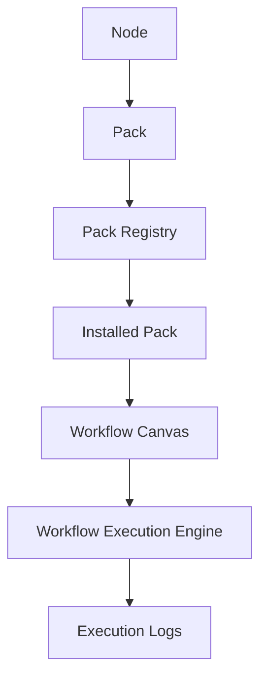
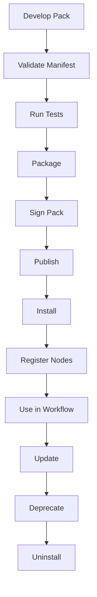
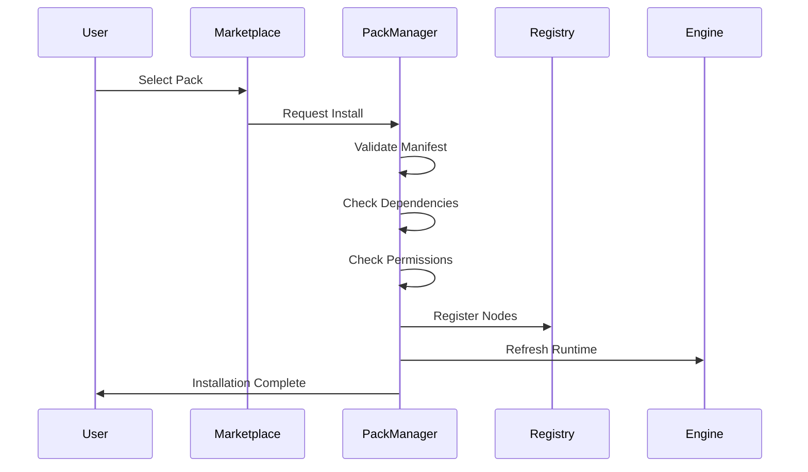
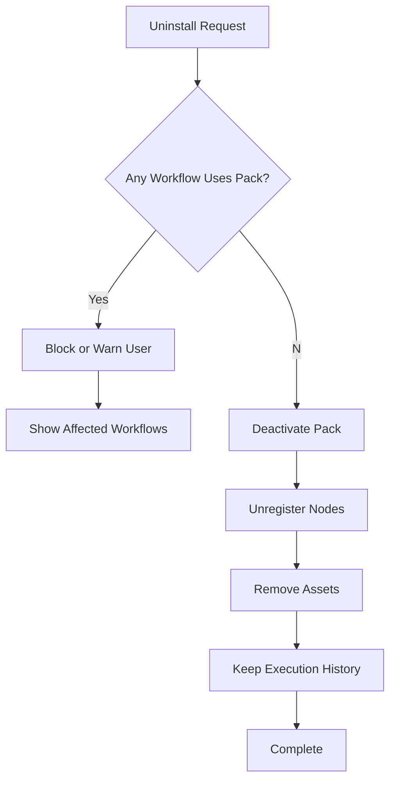
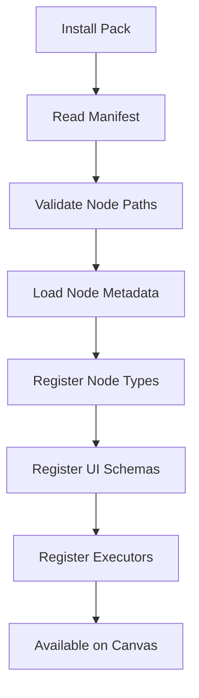
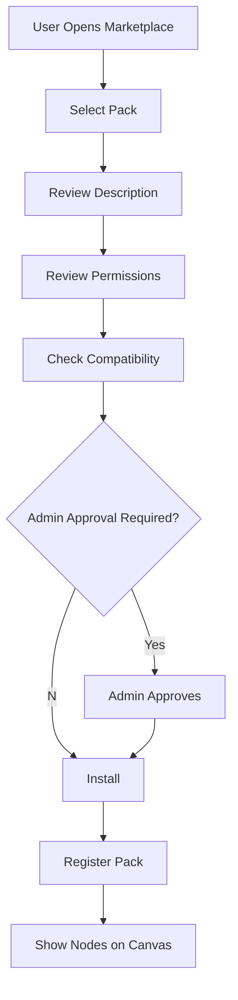
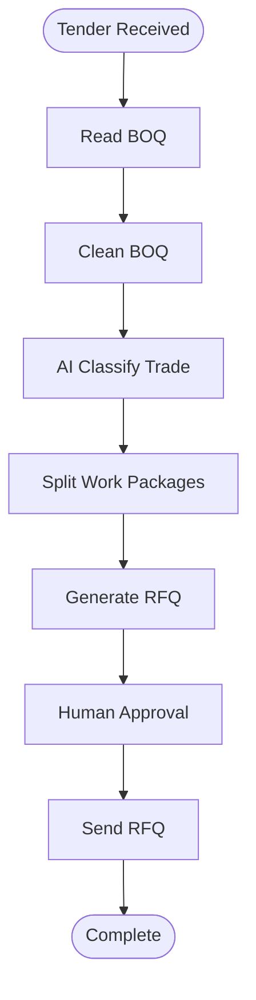
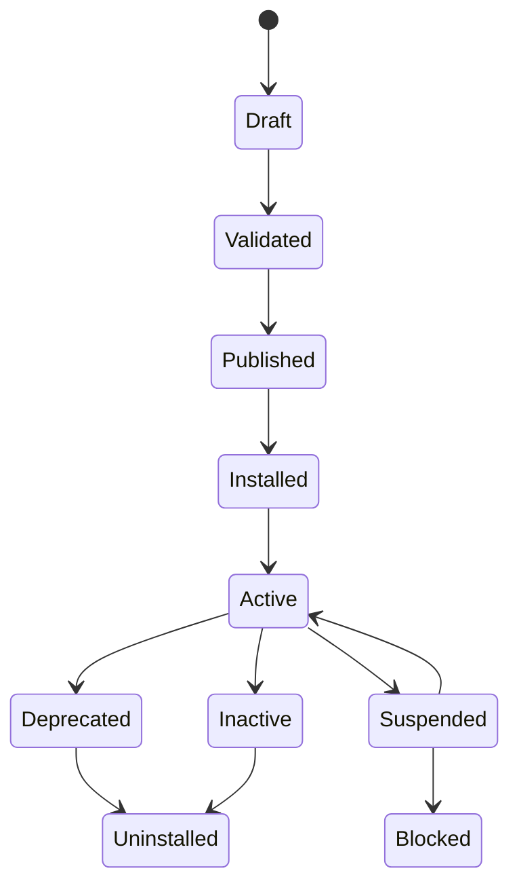

# QS-OS Workflow Engine Blueprint
# Volume 3 – QS Pack Specification
Version: 1.0

> This specification defines how QS-OS Packs are created, installed, versioned, secured, tested, licensed, distributed, and maintained.
>
> It is the bridge between the **QS Node SDK** and the wider **QS-OS ecosystem**.

---

# 1. Purpose

A **Pack** is an installable collection of QS-OS capabilities.

A Pack may contain:

- Nodes
- Templates
- Prompts
- Assets
- Documentation
- Tests
- Sample workflows
- Permissions
- Configuration schemas
- Localization files
- Licensing metadata

A Pack allows QS-OS to grow modularly without changing the core platform.

```text
Node  = one reusable capability
Pack  = collection of related capabilities
Workflow = business process built from nodes
QS-OS = platform that installs, manages, and executes everything
```

---

# 2. Core Philosophy

QS-OS should not be a fixed application with hardcoded features.

QS-OS should be a platform where construction capabilities can be added through installable Packs.

```text
QS-OS Core
   │
   ├── Core Pack
   ├── QS Pack
   ├── Procurement Pack
   ├── Contract Pack
   ├── AI Pack
   ├── Document Pack
   ├── BIM Pack
   ├── Finance Pack
   └── Integration Pack
```

The Pack system allows QS-OS to evolve like an ecosystem.

---

# 3. Relationship Between Nodes, Packs, and Workflows



A node cannot be installed directly into QS-OS without belonging to a Pack.

Every node must belong to exactly one Pack.

A workflow may use nodes from multiple Packs.

---

# 4. What Is a Pack?

A Pack is a structured software package that registers capabilities into QS-OS.

Example:

```text
QS Pack
├── Read BOQ Node
├── Clean BOQ Node
├── Classify BOQ Items Node
├── Split Work Packages Node
├── Rate Analysis Node
├── Cost Summary Node
├── BOQ Review Template
├── Tender BOQ Workflow Template
├── AI Prompts
├── Icons
├── Documentation
└── Tests
```

A Pack is not only code. It is a product module.

---

# 5. Pack Types

## 5.1 Official Packs

Official Packs are maintained by the QS-OS core team.

Examples:

- Core Pack
- QS Pack
- Document Pack
- Integration Pack

Official Packs are trusted by default.

---

## 5.2 Verified Partner Packs

Verified Partner Packs are created by approved external developers or companies.

Examples:

- BIM plugin company
- Cost database provider
- Supplier marketplace provider
- Accounting software integration provider

Verified Packs require certification.

---

## 5.3 Community Packs

Community Packs are created by third-party developers.

They may be free, open-source, or experimental.

They require stronger sandboxing and user warnings.

---

## 5.4 Private Packs

Private Packs are installed only inside one organization.

Examples:

- Contractor internal rate library
- Company-specific approval workflow
- Government tender compliance pack
- Developer-specific cost reporting pack

Private Packs are not visible in the public marketplace.

---

# 6. Pack Categories

Recommended first-class Pack categories:

```text
Core
QS
Procurement
Contract
Document
AI
BIM
Finance
Integration
Reporting
Compliance
Supplier
Project Control
Administration
```

---

# 7. Official MVP Packs

For QS-OS MVP, the recommended official Packs are:

## 7.1 Core Pack

Basic workflow control.

Nodes:

- Trigger
- Manual Trigger
- Schedule Trigger
- Webhook Trigger
- Condition
- Loop
- Merge
- Delay
- Variable
- Human Approval
- Logger
- Error Handler

---

## 7.2 Document Pack

File and document processing.

Nodes:

- Upload File
- Read Excel
- Read PDF
- OCR Document
- Extract Table
- Generate Word
- Generate PDF
- Save Document
- Convert File

---

## 7.3 QS Pack

Quantity surveying logic.

Nodes:

- Read BOQ
- Clean BOQ
- Normalize BOQ Item
- Classify Trade
- Split Work Package
- Rate Analysis
- Cost Build-Up
- Generate BOQ Summary
- Tender Cost Summary

---

## 7.4 Procurement Pack

Supplier and quotation workflows.

Nodes:

- Supplier Lookup
- Generate RFQ
- Send RFQ
- Collect Quotation
- Compare Quotations
- Recommend Supplier
- Generate Purchase Order

---

## 7.5 AI Pack

Shared AI capabilities.

Nodes:

- AI Classifier
- AI Extractor
- AI Reviewer
- AI Summarizer
- AI Comparison
- AI Risk Detector
- AI Recommendation
- Prompt Runner

---

# 8. Pack Folder Structure

Standard Pack structure:

```text
qs-pack/
├── manifest.yaml
├── package.json
├── README.md
├── CHANGELOG.md
├── LICENSE.md
├── nodes/
│   ├── ReadBOQ/
│   │   ├── index.ts
│   │   ├── metadata.ts
│   │   ├── schema.ts
│   │   ├── ui.ts
│   │   ├── validator.ts
│   │   ├── executor.ts
│   │   ├── tests/
│   │   └── README.md
│   └── RateAnalysis/
│       ├── index.ts
│       ├── metadata.ts
│       ├── schema.ts
│       ├── ui.ts
│       ├── validator.ts
│       ├── executor.ts
│       ├── tests/
│       └── README.md
├── workflows/
│   ├── tender-boq-to-rfq.workflow.json
│   └── quotation-comparison.workflow.json
├── templates/
│   ├── rfq-template.docx
│   ├── cost-summary-template.xlsx
│   └── progress-claim-template.docx
├── prompts/
│   ├── boq-classification.prompt.yaml
│   └── quotation-comparison.prompt.yaml
├── assets/
│   ├── icons/
│   ├── screenshots/
│   └── sample-data/
├── locales/
│   ├── en.json
│   ├── ms.json
│   └── id.json
├── docs/
│   ├── installation.md
│   ├── usage.md
│   ├── permissions.md
│   └── troubleshooting.md
└── tests/
    ├── pack.test.ts
    ├── workflow.test.ts
    └── fixtures/
```

---

# 9. Pack Manifest

The `manifest.yaml` file is the identity card of a Pack.

It tells QS-OS:

- What the Pack is
- Who created it
- Which SDK version it supports
- Which nodes it provides
- Which permissions it needs
- Which dependencies it requires
- Which license applies
- Which assets and templates are included

---

# 10. Basic Manifest Example

```yaml
id: qsos.qs-pack
name: QS Pack
version: 1.0.0
displayName: QS Pack
description: Core quantity surveying nodes for BOQ, rate analysis, and cost summary workflows.
category: QS
author:
  name: QS-OS
  email: team@qs-os.local
license: QSOS-Commercial
sdk:
  minVersion: 1.0.0
  maxVersion: 1.x
engine:
  minVersion: 1.0.0
status: stable
```

---

# 11. Complete Manifest Example

```yaml
id: qsos.qs-pack
name: QS Pack
version: 1.0.0
displayName: QS Pack
description: Core quantity surveying nodes for BOQ processing, trade classification, rate build-up, and tender summaries.
category: QS
author:
  name: QS-OS Core Team
  email: team@qs-os.local
  website: https://qs-os.local

license:
  type: QSOS-Commercial
  url: ./LICENSE.md

sdk:
  minVersion: 1.0.0
  maxVersion: 1.x

engine:
  minVersion: 1.0.0

compatibility:
  qsos:
    minVersion: 0.1.0
    maxVersion: 1.x
  database:
    minSchemaVersion: 1

dependencies:
  - id: qsos.core-pack
    version: "^1.0.0"
    required: true
  - id: qsos.document-pack
    version: "^1.0.0"
    required: true
  - id: qsos.ai-pack
    version: "^1.0.0"
    required: false

permissions:
  - storage.read
  - storage.write
  - database.read
  - database.write
  - ai.invoke
  - workflow.pause
  - document.generate

nodes:
  - id: qs.read_boq
    path: ./nodes/ReadBOQ
  - id: qs.clean_boq
    path: ./nodes/CleanBOQ
  - id: qs.classify_trade
    path: ./nodes/ClassifyTrade
  - id: qs.rate_analysis
    path: ./nodes/RateAnalysis
  - id: qs.cost_summary
    path: ./nodes/CostSummary

workflows:
  - id: template.tender_boq_to_rfq
    path: ./workflows/tender-boq-to-rfq.workflow.json
    title: Tender BOQ to RFQ Workflow

templates:
  - id: template.rfq_doc
    path: ./templates/rfq-template.docx
    type: document
  - id: template.cost_summary
    path: ./templates/cost-summary-template.xlsx
    type: spreadsheet

prompts:
  - id: prompt.boq_classification
    path: ./prompts/boq-classification.prompt.yaml
  - id: prompt.quotation_comparison
    path: ./prompts/quotation-comparison.prompt.yaml

locales:
  - code: en
    path: ./locales/en.json
  - code: ms
    path: ./locales/ms.json
  - code: id
    path: ./locales/id.json

assets:
  icon: ./assets/icons/pack-icon.svg
  screenshots:
    - ./assets/screenshots/boq-workflow.png

security:
  sandbox: true
  signed: true
  checksum: sha256-placeholder

marketplace:
  visibility: public
  pricing: free
  certification: official

support:
  documentation: ./docs/usage.md
  issues: https://qs-os.local/support
  contact: support@qs-os.local
```

---

# 12. Manifest Required Fields

Every Pack must declare:

```text
id
name
version
displayName
description
category
author
license
sdk
engine
nodes
permissions
```

Without these fields, QS-OS must reject the Pack during validation.

---

# 13. Pack ID Rules

Pack IDs must be globally unique.

Recommended format:

```text
publisher.category-pack
```

Examples:

```text
qsos.core-pack
qsos.qs-pack
qsos.procurement-pack
qsos.ai-pack
acme.concrete-rate-pack
builderx.internal-approval-pack
```

Rules:

- Lowercase only
- No spaces
- Use hyphen for word separation
- Use reverse-domain style for external vendors if needed
- ID must not change after publication

---

# 14. Node ID Rules Inside Packs

Node IDs should include the domain prefix.

Examples:

```text
qs.read_boq
qs.clean_boq
qs.rate_analysis
procurement.generate_rfq
contract.variation_order
ai.classify_trade
document.read_excel
```

A node ID must be unique within the whole QS-OS installation.

---

# 15. Pack Lifecycle



Lifecycle stages:

1. Development
2. Local validation
3. Testing
4. Packaging
5. Signing
6. Publishing
7. Installation
8. Activation
9. Runtime usage
10. Update
11. Deprecation
12. Uninstallation

---

# 16. Pack Development Lifecycle

A developer creates a Pack locally.

Recommended workflow:

```text
Create Pack
  ↓
Add Manifest
  ↓
Create Nodes
  ↓
Add Templates and Prompts
  ↓
Write Tests
  ↓
Run Local Validation
  ↓
Run Sample Workflows
  ↓
Package
  ↓
Publish or Install Privately
```

---

# 17. Pack Installation Lifecycle



Installation steps:

1. Download or receive Pack archive
2. Verify signature
3. Validate manifest
4. Check SDK compatibility
5. Check engine compatibility
6. Resolve dependencies
7. Request permissions
8. Register nodes
9. Register templates
10. Register prompts
11. Run installation hooks
12. Activate Pack

---

# 18. Pack Uninstallation Lifecycle

Before uninstalling a Pack, QS-OS must check whether existing workflows depend on it.



Rules:

- Do not delete historical execution logs.
- Do not break existing archived workflows.
- Warn if active workflows use Pack nodes.
- Allow forced uninstall only for admin users.
- Mark affected workflows as invalid until replacement nodes are provided.

---

# 19. Pack Update Lifecycle

Updates may include:

- New nodes
- Bug fixes
- Node version upgrades
- Template improvements
- Prompt updates
- Permission changes
- Deprecations

```text
Installed Pack v1.0.0
  ↓
Update Available v1.1.0
  ↓
Compatibility Check
  ↓
Migration Check
  ↓
Admin Approval
  ↓
Install Update
  ↓
Migrate Workflows if Needed
  ↓
Run Validation
```

---

# 20. Versioning

QS-OS Packs must use Semantic Versioning.

```text
MAJOR.MINOR.PATCH
```

Examples:

```text
1.0.0
1.1.0
1.1.1
2.0.0
```

## 20.1 Patch Version

Use for bug fixes that do not change node contracts.

Example:

```text
1.0.0 → 1.0.1
```

## 20.2 Minor Version

Use for backward-compatible additions.

Example:

```text
1.0.0 → 1.1.0
```

## 20.3 Major Version

Use for breaking changes.

Example:

```text
1.0.0 → 2.0.0
```

Major version changes require migration support.

---

# 21. Node Versioning Inside Packs

A Pack has a version.

Each node may also have its own version.

```yaml
nodes:
  - id: qs.read_boq
    version: 1.2.0
    path: ./nodes/ReadBOQ
  - id: qs.rate_analysis
    version: 1.0.0
    path: ./nodes/RateAnalysis
```

This allows a Pack to update one node without changing every node contract.

---

# 22. Workflow Compatibility

Workflows must record Pack and node versions used at save time.

Example:

```json
{
  "dependencies": {
    "packs": [
      {
        "id": "qsos.qs-pack",
        "version": "1.0.0"
      }
    ],
    "nodes": [
      {
        "id": "qs.read_boq",
        "version": "1.0.0"
      }
    ]
  }
}
```

This allows QS-OS to warn users before breaking workflow compatibility.

---

# 23. Dependency Management

Packs may depend on other Packs.

Example:

```text
QS Pack
  depends on Core Pack
  depends on Document Pack
  optionally depends on AI Pack
```

Manifest example:

```yaml
dependencies:
  - id: qsos.core-pack
    version: "^1.0.0"
    required: true
  - id: qsos.document-pack
    version: "^1.0.0"
    required: true
  - id: qsos.ai-pack
    version: "^1.0.0"
    required: false
```

Rules:

- Required dependencies must be installed before activation.
- Optional dependencies enable additional features.
- Circular dependencies are not allowed.
- Conflicting dependency versions must be reported.

---

# 24. Pack Permissions

Packs must explicitly declare required permissions.

Permissions protect users and organizations from unsafe Pack behavior.

Recommended permission categories:

```text
storage.read
storage.write
database.read
database.write
database.schema
ai.invoke
ai.train
network.http
email.send
notification.send
workflow.pause
workflow.resume
workflow.execute
document.generate
secret.read
secret.write
user.read
organization.read
billing.read
billing.write
marketplace.publish
```

---

# 25. Permission Rules

Packs should follow least privilege.

A Pack must only request permissions it needs.

Example:

A simple BOQ parser should not request email permissions.

A quotation workflow Pack may request email permissions because it sends RFQs.

```yaml
permissions:
  - storage.read
  - storage.write
  - database.write
```

QS-OS should show permissions clearly during installation.

---

# 26. Permission Approval Levels

## 26.1 User-Level Approval

For personal or project-level capabilities.

Examples:

- Read uploaded file
- Generate report
- Run AI classification

## 26.2 Admin-Level Approval

For organization-wide capabilities.

Examples:

- Send email from company domain
- Modify database schema
- Access all projects
- Install paid Pack

## 26.3 Developer-Level Approval

For marketplace and publishing capabilities.

Examples:

- Publish Pack
- Update signed Pack
- Access Pack analytics

---

# 27. Security Model

Packs must be sandboxed by default.

Security principles:

1. Least privilege
2. Explicit permissions
3. Signed packages
4. Dependency verification
5. No hidden network calls
6. No hardcoded secrets
7. No unsafe code execution
8. Audit logs for Pack actions
9. Revocable permissions
10. Marketplace review for public Packs

---

# 28. Pack Signing

Published Packs should be signed.

Signing proves:

- Publisher identity
- Package integrity
- No unauthorized modification after publication

Recommended fields:

```yaml
security:
  signed: true
  signature: ./signature.sig
  checksum: sha256-placeholder
  publisherId: qsos
```

Private development Packs may be unsigned, but QS-OS should warn the user.

---

# 29. Sandboxing

Sandboxing restricts what a Pack can do.

Recommended sandbox controls:

```text
File access restriction
Network access restriction
Database access restriction
Secret access restriction
Runtime timeout
Memory limit
CPU limit
AI token limit
Permission boundary
```

Example manifest:

```yaml
security:
  sandbox: true
  runtime:
    timeoutSeconds: 300
    memoryMb: 512
    maxConcurrentExecutions: 5
```

---

# 30. Secrets Management

Packs must never store secrets directly.

Correct approach:

```text
Pack requests secret reference
  ↓
User/admin grants secret
  ↓
Execution context injects secret at runtime
  ↓
Node uses secret
  ↓
Secret is never logged
```

Manifest example:

```yaml
secrets:
  - id: supplier_email_api_key
    label: Supplier Email API Key
    required: false
    scope: organization
```

---

# 31. Pack Registry

The Pack Registry is the internal database of installed Packs.

It stores:

- Pack ID
- Pack version
- Install status
- Publisher
- Permissions granted
- Nodes registered
- Templates registered
- Dependencies
- Installation date
- Update history

---

# 32. Registry Data Model

Recommended database tables:

```text
packs
pack_versions
pack_nodes
pack_permissions
pack_dependencies
pack_assets
pack_templates
pack_prompts
pack_installations
pack_updates
pack_certifications
pack_licenses
```

---

# 33. Example Registry Table: packs

```sql
CREATE TABLE packs (
  id TEXT PRIMARY KEY,
  name TEXT NOT NULL,
  display_name TEXT NOT NULL,
  description TEXT,
  category TEXT NOT NULL,
  publisher_id TEXT,
  latest_version TEXT,
  visibility TEXT,
  status TEXT,
  created_at TIMESTAMP DEFAULT NOW(),
  updated_at TIMESTAMP DEFAULT NOW()
);
```

---

# 34. Example Registry Table: pack_installations

```sql
CREATE TABLE pack_installations (
  id UUID PRIMARY KEY,
  organization_id UUID NOT NULL,
  pack_id TEXT NOT NULL,
  version TEXT NOT NULL,
  status TEXT NOT NULL,
  installed_by UUID NOT NULL,
  installed_at TIMESTAMP DEFAULT NOW(),
  permissions JSONB,
  config JSONB
);
```

---

# 35. Pack Manager Service

The Pack Manager is the backend service responsible for:

- Validating Packs
- Installing Packs
- Updating Packs
- Uninstalling Packs
- Registering nodes
- Checking dependencies
- Checking permissions
- Managing marketplace metadata
- Managing Pack licensing
- Exposing Pack APIs to the frontend

```text
Frontend Pack UI
   ↓
Pack Manager API
   ↓
Pack Registry
   ↓
Node Registry
   ↓
Workflow Engine
```

---

# 36. Pack Manager API

Recommended endpoints:

```text
GET    /packs
GET    /packs/:id
POST   /packs/install
POST   /packs/uninstall
POST   /packs/update
POST   /packs/validate
GET    /packs/:id/nodes
GET    /packs/:id/templates
GET    /packs/:id/prompts
GET    /packs/:id/permissions
POST   /packs/:id/permissions/grant
POST   /packs/:id/permissions/revoke
```

---

# 37. Node Registration

When a Pack is installed, all nodes declared in the manifest are registered.



The workflow canvas reads from the Node Registry to display available nodes.

---

# 38. Node Registry Entry

Example:

```json
{
  "nodeId": "qs.read_boq",
  "packId": "qsos.qs-pack",
  "nodeVersion": "1.0.0",
  "displayName": "Read BOQ",
  "category": "QS",
  "inputPorts": ["file"],
  "outputPorts": ["boqItems", "warnings", "errors"],
  "uiSchemaPath": "./nodes/ReadBOQ/ui.ts",
  "executorPath": "./nodes/ReadBOQ/executor.ts",
  "status": "active"
}
```

---

# 39. Pack Configuration

A Pack may expose configuration at install time or after installation.

Examples:

- Default currency
- Organization rate library
- AI provider selection
- Email sending identity
- Document template preferences
- Language
- Region
- Measurement standard

Manifest example:

```yaml
configuration:
  properties:
    defaultCurrency:
      type: string
      label: Default Currency
      default: MYR
    measurementStandard:
      type: string
      label: Measurement Standard
      options:
        - SMM
        - POMI
        - NRM
        - Custom
    defaultLanguage:
      type: string
      label: Default Language
      default: en
```

---

# 40. Pack-Level Configuration vs Node-Level Configuration

Pack-level configuration applies broadly.

Node-level configuration applies only to one node instance inside one workflow.

Example:

```text
Pack-level:
Default currency = MYR

Node-level:
Read BOQ sheet name = "BQ"
Header row = 7
```

---

# 41. Assets

Packs may include assets.

Asset types:

```text
Icons
Screenshots
Sample files
Document templates
Spreadsheet templates
Prompt templates
Images
Stylesheets
Example reports
```

Assets must be declared in the manifest.

```yaml
assets:
  icon: ./assets/icons/pack-icon.svg
  screenshots:
    - ./assets/screenshots/workflow-example.png
  sampleData:
    - ./assets/sample-data/sample-boq.xlsx
```

---

# 42. Templates

Templates are reusable files used by nodes.

Examples:

- RFQ template
- Purchase Order template
- Payment Certificate template
- Variation Order template
- Cost Summary spreadsheet
- Tender report layout

Manifest:

```yaml
templates:
  - id: template.rfq_doc
    name: RFQ Template
    path: ./templates/rfq-template.docx
    type: document
  - id: template.cost_summary
    name: Cost Summary Template
    path: ./templates/cost-summary-template.xlsx
    type: spreadsheet
```

---

# 43. Prompt Files

AI-enabled Packs may include prompt files.

Prompt file example:

```yaml
id: prompt.boq_classification
name: BOQ Classification Prompt
version: 1.0.0
modelCompatibility:
  - openai-compatible
inputSchema:
  type: object
  required:
    - boqItemDescription
outputSchema:
  type: object
  required:
    - trade
    - confidence
template: |
  Classify the following BOQ item into a construction trade.

  BOQ Item:
  {{boqItemDescription}}

  Return JSON only:
  {
    "trade": "",
    "confidence": 0,
    "reason": ""
  }
```

Prompt files must be versioned.

---

# 44. Localization

Packs should support multiple languages.

Recommended first languages:

```text
English
Bahasa Melayu
Bahasa Indonesia
Arabic
```

Localization file example:

```json
{
  "pack.displayName": "QS Pack",
  "node.read_boq.name": "Read BOQ",
  "node.read_boq.description": "Reads and normalizes BOQ spreadsheet data.",
  "config.defaultCurrency.label": "Default Currency"
}
```

Localization allows QS-OS to serve regional construction markets.

---

# 45. Marketplace

The QS-OS Marketplace is where Packs can be discovered, installed, purchased, reviewed, and updated.

Marketplace listing includes:

- Pack name
- Publisher
- Version
- Category
- Description
- Screenshots
- Node list
- Permissions
- Pricing
- License
- Compatibility
- Certification status
- Ratings
- Documentation
- Support contacts

---

# 46. Marketplace Visibility

```text
public
private
unlisted
organization-only
beta
deprecated
```

Manifest example:

```yaml
marketplace:
  visibility: public
  pricing: free
  certification: official
```

---

# 47. Marketplace Pack Page

Recommended sections:

```text
Overview
Features
Nodes Included
Sample Workflows
Screenshots
Permissions
Dependencies
Pricing
License
Compatibility
Documentation
Changelog
Support
Security Review
```

---

# 48. Marketplace Installation Flow



---

# 49. Licensing Models

Packs may use different licensing models.

```text
Free
Open Source
Commercial
Subscription
Per-Seat
Per-Organization
Per-Execution
Usage-Based
Private Internal
Enterprise
```

---

# 50. License Manifest

```yaml
license:
  type: Commercial
  name: QS-OS Commercial Pack License
  url: ./LICENSE.md
  pricing:
    model: subscription
    currency: MYR
    amount: 99
    interval: monthly
```

---

# 51. License Enforcement

License enforcement may occur at:

- Installation
- Activation
- Workflow execution
- Node execution
- Organization billing cycle
- Marketplace update

Examples:

```text
Free Pack:
No license check needed

Commercial Pack:
License required before activation

Usage-Based Pack:
Deduct credit per execution

Enterprise Pack:
Check organization license
```

---

# 52. Certification

Certification provides trust.

Certification levels:

```text
Unverified
Community
Verified
Partner
Official
Enterprise Approved
```

---

# 53. Certification Checklist

A Pack can be certified only after passing:

- Manifest validation
- Security review
- Permission review
- Node contract validation
- Test coverage review
- Documentation review
- Sample workflow execution
- Performance benchmark
- License verification
- Compatibility check

---

# 54. Pack Testing

Pack testing verifies the whole Pack, not only individual nodes.

Required tests:

```text
Manifest validation test
Node registration test
Permission test
Dependency test
Template loading test
Prompt loading test
Workflow template test
Installation test
Uninstallation test
Upgrade test
Regression test
Security test
Performance test
```

---

# 55. Test Structure

```text
tests/
├── manifest.test.ts
├── install.test.ts
├── uninstall.test.ts
├── update.test.ts
├── permissions.test.ts
├── dependencies.test.ts
├── workflow-template.test.ts
├── security.test.ts
├── performance.test.ts
└── fixtures/
    ├── sample-boq.xlsx
    ├── sample-quotation.xlsx
    └── sample-workflow.json
```

---

# 56. Pack Validation Rules

A Pack is valid only if:

1. Manifest is complete.
2. Pack ID is unique.
3. Version is valid.
4. SDK compatibility is declared.
5. Engine compatibility is declared.
6. Node paths exist.
7. All nodes follow the Node SDK contract.
8. All required dependencies are resolvable.
9. Permissions are declared.
10. No forbidden files are included.
11. Templates are accessible.
12. Prompts are schema-valid.
13. Documentation exists.
14. Tests pass.
15. Security scan passes.

---

# 57. Pack Build Process

Recommended build command:

```bash
qsos pack build
```

Build process:

```text
Read manifest
  ↓
Validate schema
  ↓
Compile nodes
  ↓
Bundle assets
  ↓
Run tests
  ↓
Generate checksum
  ↓
Sign Pack
  ↓
Create Pack archive
```

Pack archive format:

```text
.qsospack
```

Example:

```text
qsos-qspack-1.0.0.qsospack
```

---

# 58. Pack CLI

The QS-OS CLI should support:

```bash
qsos pack create
qsos pack validate
qsos pack test
qsos pack build
qsos pack sign
qsos pack install
qsos pack uninstall
qsos pack publish
qsos pack update
qsos pack info
qsos pack list
```

---

# 59. Example CLI Workflow

```bash
qsos pack create qsos.qs-pack

cd qsos.qs-pack

qsos node create ReadBOQ

qsos pack validate

qsos pack test

qsos pack build

qsos pack publish
```

---

# 60. Pack Hooks

Packs may define lifecycle hooks.

Examples:

```text
onInstall
onActivate
onDeactivate
onUpdate
onUninstall
onPermissionGranted
onPermissionRevoked
```

Manifest:

```yaml
hooks:
  onInstall: ./hooks/onInstall.ts
  onUpdate: ./hooks/onUpdate.ts
  onUninstall: ./hooks/onUninstall.ts
```

Rules:

- Hooks must be sandboxed.
- Hooks must be idempotent.
- Hooks must be logged.
- Hooks must not run without permission.

---

# 61. Migrations

Packs may include migrations.

Migration examples:

- Add database tables
- Update node schema
- Convert old workflow configuration
- Rename deprecated outputs
- Update template references

Migration folder:

```text
migrations/
├── 001_create_rate_library.sql
├── 002_update_boq_item_schema.ts
└── 003_migrate_workflows.ts
```

Manifest:

```yaml
migrations:
  - id: 001_create_rate_library
    version: 1.0.0
    path: ./migrations/001_create_rate_library.sql
  - id: 002_update_boq_item_schema
    version: 1.1.0
    path: ./migrations/002_update_boq_item_schema.ts
```

---

# 62. Migration Rules

Migrations must:

- Be versioned
- Be reversible where possible
- Be logged
- Require admin permission if changing database schema
- Not delete user data without explicit confirmation
- Provide rollback instructions

---

# 63. Deprecation

Packs and nodes may be deprecated.

Deprecation does not mean immediate removal.

Deprecation means:

```text
Still works
  but
No longer recommended
  and
May be removed in future major version
```

Manifest:

```yaml
deprecation:
  deprecated: true
  since: 1.5.0
  removalTarget: 2.0.0
  message: Use qs.read_boq_v2 instead.
```

---

# 64. Compatibility Policy

QS-OS must check compatibility before Pack activation.

Compatibility dimensions:

```text
QS-OS platform version
Workflow engine version
Node SDK version
Database schema version
AI provider availability
Required dependencies
Organization license
Region availability
```

---

# 65. Compatibility Matrix

Example:

```yaml
compatibility:
  qsos:
    minVersion: 0.1.0
    maxVersion: 1.x
  sdk:
    minVersion: 1.0.0
    maxVersion: 1.x
  engine:
    minVersion: 1.0.0
  database:
    minSchemaVersion: 1
  ai:
    required: false
    providers:
      - openai-compatible
      - local
```

---

# 66. Runtime Behavior

At runtime, Packs provide node definitions and executors.

```text
Workflow Engine
  ↓
Node Registry
  ↓
Pack Runtime
  ↓
Node Executor
  ↓
Execution Context
```

The execution engine should not care which Pack a node came from as long as the node follows the SDK contract.

---

# 67. Pack Runtime Boundary

A Pack may provide executors, but it must not control the workflow engine.

Allowed:

```text
Execute node logic
Use granted services through context
Emit outputs
Log messages
Request human task
Invoke AI through approved AI client
```

Not allowed:

```text
Modify engine internals
Bypass permissions
Access secrets directly
Modify unrelated workflow state
Modify another Pack
Execute arbitrary shell commands
```

---

# 68. Events

Packs may listen to or emit events if permissions allow.

Example events:

```text
pack.installed
pack.updated
pack.uninstalled
node.executed
workflow.started
workflow.completed
workflow.failed
approval.created
approval.completed
document.generated
quotation.received
```

Manifest:

```yaml
events:
  emits:
    - quotation.received
    - document.generated
  listens:
    - workflow.completed
```

---

# 69. Pack Templates for Workflows

Packs can ship sample workflows.

Example:

```text
Tender BOQ to RFQ Workflow
Progress Claim Workflow
Quotation Comparison Workflow
Variation Order Workflow
Payment Certificate Workflow
```

Workflow template manifest:

```yaml
workflows:
  - id: template.tender_boq_to_rfq
    title: Tender BOQ to RFQ Workflow
    description: Converts a BOQ into trade packages and RFQs.
    path: ./workflows/tender-boq-to-rfq.workflow.json
    requiredPacks:
      - qsos.core-pack
      - qsos.qs-pack
      - qsos.procurement-pack
```

---

# 70. Example Pack Workflow Template



---

# 71. Pack Documentation Requirements

Every Pack must include documentation.

Required documents:

```text
README.md
Installation Guide
Usage Guide
Node Reference
Permission Explanation
Troubleshooting Guide
Changelog
License
```

Recommended documents:

```text
Quick Start
Sample Workflows
Migration Guide
Security Notes
FAQ
Developer Notes
```

---

# 72. README Template

```markdown
# QS Pack

## Overview

The QS Pack provides nodes for BOQ processing, rate analysis, and tender cost summaries.

## Nodes Included

- Read BOQ
- Clean BOQ
- Classify Trade
- Split Work Packages
- Rate Analysis
- Cost Summary

## Permissions

This Pack requires storage and database permissions.

## Sample Workflows

- Tender BOQ to RFQ
- BOQ Cost Summary

## Installation

Install from the QS-OS Marketplace or upload the `.qsospack` archive.

## Support

Contact support@qs-os.local.
```

---

# 73. Support and Maintenance

Each Pack should declare support channels.

```yaml
support:
  documentation: ./docs/usage.md
  contact: support@qs-os.local
  issues: https://qs-os.local/support
  responseTime: best-effort
```

For commercial Packs, support policy should be explicit.

---

# 74. Pack Analytics

QS-OS may collect Pack analytics if allowed by organization settings.

Analytics examples:

- Install count
- Active workflow count
- Node execution count
- Failure rate
- Average execution time
- Version adoption
- Permission usage
- Marketplace conversion

Analytics must not expose confidential project data.

---

# 75. Privacy Rules

Packs must not collect or transmit:

- BOQ data
- Tender prices
- Supplier quotations
- Client names
- Project financials
- User personal data
- Contract documents

unless the user explicitly grants permission and the Pack clearly explains why.

---

# 76. Commercial Pack Billing

Commercial Pack billing models:

```text
Monthly subscription
Annual subscription
Per organization
Per user
Per project
Per workflow execution
Per AI token usage
One-time purchase
Enterprise license
```

Billing enforcement must not corrupt workflows.

If a license expires, QS-OS should:

1. Warn user
2. Prevent new executions if required
3. Preserve existing workflows
4. Preserve historical logs
5. Allow export where legally required

---

# 77. Pack Governance

QS-OS should maintain governance rules for public Packs.

Governance includes:

- Publisher verification
- Security review
- Quality standards
- Naming rules
- Content rules
- License requirements
- Abuse reporting
- Deprecation policy
- Takedown policy

---

# 78. Publisher Accounts

A publisher may be:

```text
Individual developer
QS firm
Construction company
Software vendor
Supplier platform
Educational institution
QS-OS official team
```

Publisher profile:

```yaml
publisher:
  id: qsos
  name: QS-OS
  verified: true
  website: https://qs-os.local
  contact: publisher@qs-os.local
```

---

# 79. Official Pack Naming

Official Packs should use:

```text
qsos.core-pack
qsos.qs-pack
qsos.document-pack
qsos.procurement-pack
qsos.contract-pack
qsos.ai-pack
qsos.integration-pack
```

Third-party Packs should not use the `qsos.` namespace.

---

# 80. Private Organization Packs

Organizations may install private Packs.

Use cases:

- Internal cost database
- Company-specific approval matrix
- Private supplier list
- Proprietary tender strategy
- Regional compliance rules

Private Pack manifest:

```yaml
marketplace:
  visibility: organization-only
  organizationId: org-placeholder
```

---

# 81. Regional Packs

QS-OS should support region-specific Packs.

Examples:

```text
Malaysia Construction Pack
Indonesia Procurement Pack
GCC Tender Compliance Pack
UK NRM Measurement Pack
Australia Cost Planning Pack
```

Regional Packs may include:

- Local measurement standards
- Local currency
- Local tax rules
- Local document templates
- Local authority forms
- Local language support

---

# 82. Compliance Packs

Compliance Packs encode rules and checks.

Examples:

```text
Tender Compliance Review
Contract Clause Review
Procurement Approval Matrix
Tax Compliance
Payment Certificate Checklist
Safety Document Checklist
Green Building Requirement Review
```

Compliance Packs should always show explainable results.

---

# 83. AI Packs

AI Packs require additional governance.

AI Pack requirements:

- Prompt versioning
- Output schema
- Confidence score
- Explainability
- Token usage logging
- Human review option
- Data privacy controls
- Model provider declaration
- Fallback behavior

Manifest:

```yaml
ai:
  required: true
  providers:
    - openai-compatible
    - local
  dataPolicy:
    storePrompts: false
    storeOutputs: true
    allowTraining: false
```

---

# 84. AI Pack Safety Rules

AI Packs must not make final commercial decisions without human review where financial risk is high.

Examples requiring human review:

- Supplier award recommendation
- Contract risk conclusion
- Tender price recommendation
- Variation entitlement decision
- Final account certification

AI may recommend.

Human must approve.

---

# 85. BIM Packs

BIM Packs may integrate with model data.

Examples:

- Read IFC
- Extract quantities
- Map model elements to BOQ
- Compare drawing vs BOQ
- Detect missing quantities

BIM Pack considerations:

```text
Large file handling
Geometry processing
Model versioning
Classification mapping
Unit conversion
Performance limits
Visual review
```

---

# 86. Finance Packs

Finance Packs integrate QS workflows with financial systems.

Examples:

- Invoice matching
- Payment schedule
- Retention calculation
- Cashflow forecast
- Budget comparison
- Accounting export

Finance Packs require strict permissions.

```yaml
permissions:
  - database.read
  - database.write
  - finance.read
  - finance.write
```

---

# 87. Integration Packs

Integration Packs connect QS-OS to external systems.

Examples:

- Email
- WhatsApp
- Telegram
- Google Drive
- OneDrive
- Supabase
- PostgreSQL
- Accounting systems
- Supplier APIs

Integration Packs must declare network permissions.

```yaml
permissions:
  - network.http
  - secret.read
```

---

# 88. Pack Conflict Handling

Conflicts may occur when:

- Two Packs register the same node ID.
- Two Packs require incompatible dependencies.
- A Pack wants permissions already denied.
- A Pack overrides the same template ID.
- Two Packs define the same event name.

QS-OS should block conflicts and show clear explanations.

---

# 89. Pack Replacement

A deprecated Pack may be replaced by another Pack.

Manifest:

```yaml
replacement:
  packId: qsos.qs-pack-v2
  migrationGuide: ./docs/migration.md
```

QS-OS may offer migration assistance.

---

# 90. Pack Rollback

If an update fails, QS-OS should support rollback.

Rollback should restore:

- Previous Pack version
- Previous node definitions
- Previous templates
- Previous prompts
- Previous configuration

Rollback should not delete new execution logs.

---

# 91. Pack Status

Pack status values:

```text
draft
valid
published
installed
active
inactive
deprecated
suspended
blocked
uninstalled
```

---

# 92. Pack State Machine



---

# 93. Developer Experience

The Pack developer experience should be simple.

Recommended flow:

```text
Create Pack
Add Nodes
Test Locally
Preview in Canvas
Run Sample Workflow
Build Pack
Publish Pack
Monitor Usage
```

The developer should not need to understand the whole QS-OS internals.

---

# 94. Pack Preview Mode

Before installation, QS-OS should allow preview.

Preview includes:

- Node list
- Workflow templates
- Permissions
- Screenshots
- Dependencies
- Documentation
- Version history
- Certification status

Preview does not activate the Pack.

---

# 95. Pack Import and Export

QS-OS should allow Pack import and export.

Import sources:

```text
Marketplace
Local file
Private registry
Organization repository
Developer workspace
```

Export output:

```text
.qsospack archive
```

---

# 96. Air-Gapped Installation

Some construction organizations may require offline installation.

Air-gapped Pack installation should support:

- Offline `.qsospack` file
- Offline signature verification
- Offline license file
- Manual dependency bundle
- Manual update package

---

# 97. Pack Error Handling

Pack installation errors should be human-readable.

Examples:

```text
Missing required dependency: qsos.document-pack ^1.0.0
Pack requires SDK 2.0.0 but current SDK is 1.0.0
Node ID conflict: qs.read_boq already exists
Permission denied: email.send requires admin approval
Invalid manifest: missing license field
```

---

# 98. Pack Logging

Pack-level logs:

- Installed
- Updated
- Uninstalled
- Permission granted
- Permission revoked
- Node registered
- Node execution failed
- Migration executed
- License check failed

Logs should include:

```text
timestamp
organization
user
packId
packVersion
action
result
details
```

---

# 99. Pack Audit Trail

Audit trail is required for enterprise use.

Audit events:

```text
Pack installed
Pack updated
Pack removed
Permission approved
Permission revoked
Commercial license activated
AI Pack enabled
Migration executed
Security warning accepted
```

Audit logs should be immutable.

---

# 100. Recommended MVP Implementation

For QS-OS MVP 0.1, implement a simple Pack system first.

MVP Pack features:

```text
Local Pack installation
Manifest validation
Node registration
Basic permissions
Pack list page
Pack detail page
Workflow template registration
Manual update
Manual uninstall
Execution engine integration
```

Defer these until later:

```text
Public marketplace
Commercial billing
Publisher accounts
Advanced certification
Pack analytics
Air-gapped installation
Full signing infrastructure
```

---

# 101. MVP Pack Registry Schema

Minimum tables:

```text
installed_packs
registered_nodes
pack_permissions
workflow_dependencies
```

---

# 102. MVP Installation Flow

```text
Upload Pack Folder
  ↓
Read manifest.yaml
  ↓
Validate manifest
  ↓
Register nodes
  ↓
Grant basic permissions
  ↓
Display nodes in canvas
```

---

# 103. MVP Pack Manager API

```text
GET  /packs/installed
POST /packs/install-local
POST /packs/uninstall
GET  /packs/:id/nodes
GET  /packs/:id/workflows
```

---

# 104. Example Official QS Pack

```text
qsos.qs-pack

Nodes:
- qs.read_boq
- qs.clean_boq
- qs.classify_trade
- qs.split_work_package
- qs.rate_analysis
- qs.cost_summary

Templates:
- BOQ Summary
- Tender Cost Summary

Workflow Templates:
- Tender BOQ to RFQ
- BOQ Cost Summary
```

---

# 105. Example Procurement Pack

```text
qsos.procurement-pack

Nodes:
- procurement.supplier_lookup
- procurement.generate_rfq
- procurement.send_rfq
- procurement.collect_quotation
- procurement.compare_quotation
- procurement.recommend_supplier
- procurement.generate_purchase_order

Templates:
- RFQ Letter
- Quotation Comparison
- Purchase Order

Workflow Templates:
- RFQ Workflow
- Quotation Comparison Workflow
```

---

# 106. Example Contract Pack

```text
qsos.contract-pack

Nodes:
- contract.variation_order
- contract.eot_claim
- contract.progress_claim
- contract.payment_certificate
- contract.final_account
- contract.contract_review

Templates:
- Variation Order
- Progress Claim
- Payment Certificate
- Final Account Summary

Workflow Templates:
- Variation Order Workflow
- Progress Claim Workflow
```

---

# 107. Example AI Pack

```text
qsos.ai-pack

Nodes:
- ai.classifier
- ai.extractor
- ai.reviewer
- ai.summarizer
- ai.comparator
- ai.risk_detector
- ai.recommendation

Prompts:
- BOQ Classification
- Contract Clause Review
- Quotation Comparison
- Tender Risk Review

Workflow Templates:
- AI Tender Risk Review
- AI Quotation Comparison
```

---

# 108. Pack Readiness Checklist

Before publishing or installing a Pack:

```text
[ ] Manifest complete
[ ] Pack ID valid
[ ] Version valid
[ ] SDK compatibility declared
[ ] Engine compatibility declared
[ ] Dependencies declared
[ ] Permissions declared
[ ] Nodes follow SDK contract
[ ] Node documentation complete
[ ] Templates declared
[ ] Prompts versioned
[ ] Localization files valid
[ ] Tests pass
[ ] Security review complete
[ ] License included
[ ] Changelog updated
[ ] Sample workflow included
[ ] Installation tested
[ ] Uninstallation tested
[ ] Upgrade tested
```

---

# 109. Pack Design Principles

1. A Pack should solve one domain area.
2. A Pack should not become a whole application.
3. A Pack should expose reusable nodes.
4. A Pack should declare all permissions.
5. A Pack should include documentation.
6. A Pack should include sample workflows.
7. A Pack should be versioned.
8. A Pack should be testable.
9. A Pack should be secure by default.
10. A Pack should not hide business logic from users.
11. A Pack should support human review where risk is high.
12. A Pack should preserve workflow compatibility whenever possible.

---

# 110. Anti-Patterns

Avoid these Pack design mistakes:

```text
Mega Pack
A huge Pack containing unrelated features.

Hidden Logic Pack
A Pack that makes decisions without explainability.

Permission Hungry Pack
A Pack that asks for unnecessary permissions.

Unversioned Prompt Pack
AI prompts change without version history.

Workflow-Breaking Pack
Updates break existing workflows without migration.

Undocumented Pack
Users cannot understand what the Pack does.

Unsafe AI Pack
AI makes financial or contractual decisions without human approval.
```

---

# 111. Future Extensions

Future Pack system extensions:

```text
Public marketplace
Private organization marketplace
Pack analytics dashboard
Paid Pack monetization
Pack certification portal
Visual Pack builder
Pack dependency graph viewer
Pack security scanner
Pack usage billing
Regional Pack marketplace
AI prompt marketplace
BIM model Pack ecosystem
Supplier Pack ecosystem
Pack auto-update policies
Pack rollback dashboard
```

---

# 112. Relationship to Other Volumes

This volume depends on:

```text
Volume 1 – Workflow Engine Blueprint
Defines the overall platform vision.

Volume 2 – QS Node SDK Specification
Defines the node contract inside Packs.

Volume 2.1 – QS Node Developer Guide
Defines how developers build nodes that Packs contain.
```

This volume prepares for:

```text
Volume 4 – Workflow JSON Specification
Workflows must record Pack and node dependencies.

Volume 5 – Execution Engine Specification
Execution engine must load nodes from installed Packs.

Volume 6 – QS-OS Product Master Blueprint V2
Master blueprint will combine Packs, workflows, execution, product, and architecture.
```

---

# 113. Final Formula

```text
QS-OS Pack = Nodes + Templates + Prompts + Assets + Permissions + Documentation + Tests + License
```

```text
QS-OS Ecosystem = Core Platform + Installable Packs + Workflow Engine + Marketplace + AI-first QS Capabilities
```

---

# Conclusion

The QS Pack Specification defines how QS-OS becomes extensible.

Without Packs, QS-OS is only a fixed application.

With Packs, QS-OS becomes a construction workflow platform where official teams, partner developers, QS firms, contractors, suppliers, and regional experts can contribute reusable capabilities.

The Pack system is therefore one of the most important foundations of QS-OS.

It allows the platform to grow from a simple BOQ workflow tool into a full Construction Operating System.
