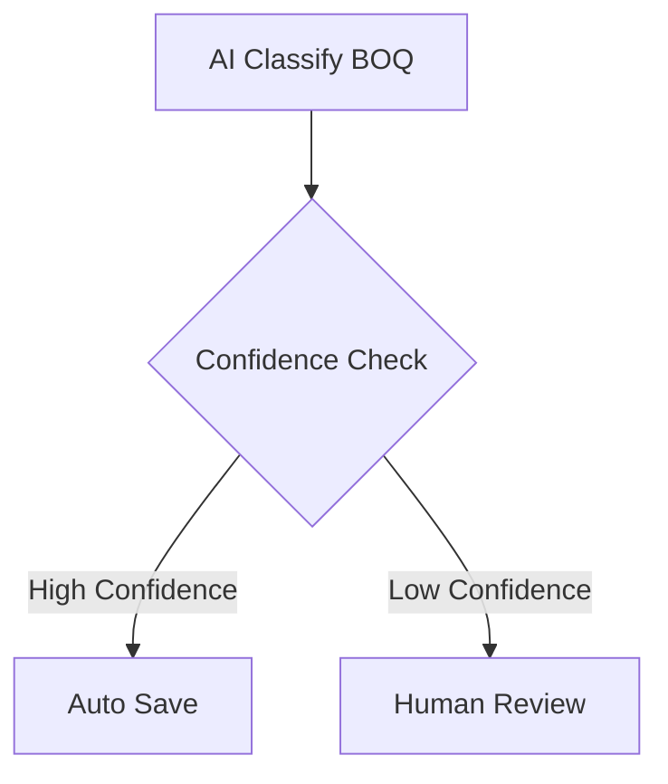
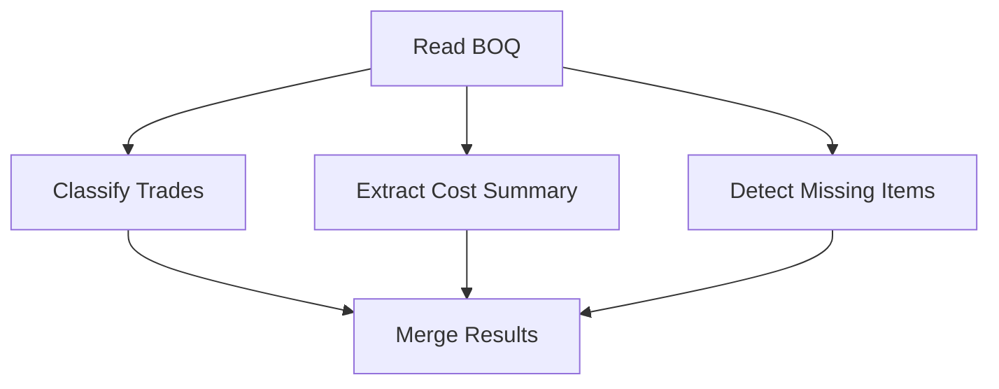

# QS-OS Workflow Engine Blueprint
# Volume 4 – Workflow JSON Specification
Version: 1.0

> This specification defines the internal JSON format used to save, load, validate, version, migrate, share, execute, and archive QS-OS workflows.
>
> It is inspired by visual workflow systems such as ComfyUI and n8n, but designed specifically for a **Quantity Surveying workflow operating system** built around Packs, Nodes, Human Approval, AI, and construction business processes.

---

# 1. Purpose

The Workflow JSON format is the portable representation of a QS-OS workflow.

It answers:

- What is the workflow?
- Which nodes are used?
- Which Packs provide those nodes?
- How are nodes connected?
- What configuration does each node use?
- What variables are available?
- What triggers start the workflow?
- What execution rules apply?
- Which permissions are required?
- Which humans must approve?
- Which AI prompts, tools, or providers are used?
- How should the workflow be validated?
- How should the workflow be migrated across versions?

The Workflow JSON file becomes the contract between:

```text
Workflow Canvas
  ↓
Workflow JSON
  ↓
Workflow Validator
  ↓
Execution Engine
  ↓
Execution Logs
```

---

# 2. Core Philosophy

A QS-OS workflow is a business process saved as a graph.

```text
Nodes = business capabilities
Connections = data flow
Configuration = business settings
Variables = reusable values
Triggers = starting events
Execution policy = runtime behavior
Dependencies = required Packs and Nodes
```

A workflow should be:

- Human-readable
- Machine-validatable
- Version-controlled
- Portable
- Safe to execute
- Compatible with Packs
- Traceable during execution
- Migratable across platform versions

---

# 3. Relationship to Other Volumes

This volume depends on:

```text
Volume 1 – Workflow Engine Blueprint
Defines the overall platform and workflow concept.

Volume 2 – QS Node SDK Specification
Defines the standard contract each node must follow.

Volume 2.1 – QS Node Developer Guide
Defines how node developers implement lifecycle, ports, configuration, validation, and execution.

Volume 3 – QS Pack Specification
Defines how nodes are grouped into installable Packs.
```

This volume prepares for:

```text
Volume 5 – Execution Engine Specification
Defines how this JSON is executed.

Volume 6 – QS-OS Product Master Blueprint V2
Combines the product architecture, Packs, Nodes, JSON, execution, and roadmap.
```

---

# 4. Workflow JSON Design Goals

The format must support:

1. Visual node graph storage
2. Pack and node dependency tracking
3. Strongly typed node inputs and outputs
4. Human approval steps
5. AI-enabled nodes
6. Workflow variables
7. Secret references
8. Branching and conditional logic
9. Loops and batches
10. Parallel execution
11. Sub-workflows
12. Scheduling and triggers
13. Error handling and retries
14. Execution policy
15. Versioning and migration
16. Import/export
17. Template sharing
18. Marketplace workflow templates
19. Audit and provenance
20. Multi-tenant organization usage

---

# 5. File Extension

Recommended file extension:

```text
.qsworkflow.json
```

Examples:

```text
tender-boq-to-rfq.qsworkflow.json
quotation-comparison.qsworkflow.json
progress-claim.qsworkflow.json
variation-order.qsworkflow.json
```

For marketplace workflow templates:

```text
.template.qsworkflow.json
```

Example:

```text
tender-boq-to-rfq.template.qsworkflow.json
```

---

# 6. Root Object

Every workflow JSON file must have one root object.

```json
{
  "schemaVersion": "1.0.0",
  "workflow": {},
  "dependencies": {},
  "nodes": [],
  "connections": [],
  "variables": {},
  "settings": {},
  "validation": {},
  "metadata": {}
}
```

---

# 7. Required Root Fields

Minimum required root fields:

```text
schemaVersion
workflow
dependencies
nodes
connections
metadata
```

Optional root fields:

```text
variables
secrets
settings
triggers
permissions
validation
ui
execution
audit
migrations
template
```

---

# 8. Root Field Summary

| Field | Purpose |
|---|---|
| schemaVersion | Workflow JSON schema version |
| workflow | Workflow identity and description |
| dependencies | Required Packs and Nodes |
| nodes | Node instances on the canvas |
| connections | Edges between node ports |
| variables | Workflow-level variables |
| secrets | Secret references, not secret values |
| triggers | Workflow start definitions |
| settings | Workflow behavior and defaults |
| execution | Runtime execution policy |
| permissions | Required permission summary |
| validation | Validation results or rules |
| ui | Canvas layout and visual state |
| audit | Creation and modification records |
| migrations | Applied workflow migrations |
| metadata | General metadata |

---

# 9. Minimal Workflow JSON Example

```json
{
  "schemaVersion": "1.0.0",
  "workflow": {
    "id": "workflow.tender_boq_to_rfq",
    "name": "Tender BOQ to RFQ",
    "version": "1.0.0",
    "status": "draft"
  },
  "dependencies": {
    "packs": [
      {
        "id": "qsos.core-pack",
        "version": "^1.0.0"
      },
      {
        "id": "qsos.qs-pack",
        "version": "^1.0.0"
      }
    ],
    "nodes": []
  },
  "nodes": [],
  "connections": [],
  "metadata": {
    "createdBy": "user-placeholder",
    "createdAt": "2026-06-15T00:00:00.000Z"
  }
}
```

---

# 10. Workflow Object

The `workflow` object describes the identity of the workflow.

```json
{
  "workflow": {
    "id": "workflow.tender_boq_to_rfq",
    "name": "Tender BOQ to RFQ",
    "description": "Converts a tender BOQ into trade packages and RFQs.",
    "version": "1.0.0",
    "status": "draft",
    "category": "Tendering",
    "tags": ["boq", "rfq", "procurement"],
    "owner": {
      "type": "organization",
      "id": "org-placeholder"
    }
  }
}
```

---

# 11. Workflow ID Rules

Workflow IDs must be unique within an organization.

Recommended format:

```text
workflow.domain_process_name
```

Examples:

```text
workflow.tender_boq_to_rfq
workflow.quotation_comparison
workflow.progress_claim
workflow.variation_order
workflow.final_account
```

Rules:

- Lowercase preferred
- No spaces
- Use underscores for process names
- Must be stable after publication
- Must not contain secrets or client-sensitive names if shared publicly

---

# 12. Workflow Status

Supported statuses:

```text
draft
active
inactive
archived
deprecated
template
locked
invalid
```

Meaning:

| Status | Meaning |
|---|---|
| draft | Editable and not production-ready |
| active | Can be executed |
| inactive | Disabled but retained |
| archived | Historical record only |
| deprecated | Still works but discouraged |
| template | Used as reusable starting point |
| locked | Protected from editing |
| invalid | Cannot execute until fixed |

---

# 13. Workflow Versioning

Workflows must use Semantic Versioning.

```text
MAJOR.MINOR.PATCH
```

Rules:

```text
Patch change:
Fix label, UI layout, description, non-breaking configuration.

Minor change:
Add optional node, optional branch, or backward-compatible setting.

Major change:
Change required inputs, remove node, change output contract, or alter business outcome.
```

Example:

```json
{
  "workflow": {
    "version": "1.2.0"
  }
}
```

---

# 14. Schema Version vs Workflow Version

These are different.

```text
schemaVersion = version of the Workflow JSON format
workflow.version = version of the user workflow
```

Example:

```json
{
  "schemaVersion": "1.0.0",
  "workflow": {
    "version": "2.1.0"
  }
}
```

The schema may remain the same even when the workflow changes.

---

# 15. Dependencies Object

The `dependencies` object records required Packs, Nodes, templates, prompts, and runtime features.

```json
{
  "dependencies": {
    "packs": [],
    "nodes": [],
    "templates": [],
    "prompts": [],
    "features": []
  }
}
```

---

# 16. Pack Dependencies

A workflow must record all Packs used by its nodes.

```json
{
  "packs": [
    {
      "id": "qsos.core-pack",
      "version": "^1.0.0",
      "required": true
    },
    {
      "id": "qsos.qs-pack",
      "version": "^1.0.0",
      "required": true
    },
    {
      "id": "qsos.ai-pack",
      "version": "^1.0.0",
      "required": false
    }
  ]
}
```

---

# 17. Node Dependencies

A workflow should record node type dependencies.

```json
{
  "nodes": [
    {
      "type": "qs.read_boq",
      "version": "1.0.0",
      "packId": "qsos.qs-pack"
    },
    {
      "type": "procurement.generate_rfq",
      "version": "1.0.0",
      "packId": "qsos.procurement-pack"
    }
  ]
}
```

This allows QS-OS to check if the workflow can run before execution.

---

# 18. Feature Dependencies

Some workflows require platform features.

Examples:

```json
{
  "features": [
    "humanApproval",
    "aiInvocation",
    "scheduledExecution",
    "fileStorage",
    "documentGeneration"
  ]
}
```

---

# 19. Nodes Array

The `nodes` array stores node instances placed on the workflow canvas.

A node instance is not the same as a node type.

```text
Node type:
qs.read_boq

Node instance:
node_001 using qs.read_boq in a specific workflow
```

Example:

```json
{
  "nodes": [
    {
      "id": "node_001",
      "type": "qs.read_boq",
      "name": "Read Tender BOQ",
      "packId": "qsos.qs-pack",
      "version": "1.0.0",
      "configuration": {},
      "position": {
        "x": 120,
        "y": 240
      }
    }
  ]
}
```

---

# 20. Node Instance Required Fields

Each node instance must include:

```text
id
type
name
packId
version
configuration
```

Recommended fields:

```text
description
position
ports
ui
retryPolicy
errorPolicy
timeout
disabled
notes
```

---

# 21. Node Instance Schema

```json
{
  "id": "node_001",
  "type": "qs.read_boq",
  "name": "Read BOQ",
  "description": "Reads the uploaded BOQ Excel file.",
  "packId": "qsos.qs-pack",
  "version": "1.0.0",
  "configuration": {
    "sheetName": "BQ",
    "headerRow": 7,
    "currency": "MYR"
  },
  "position": {
    "x": 120,
    "y": 240
  },
  "ui": {
    "collapsed": false,
    "color": "default"
  },
  "disabled": false
}
```

---

# 22. Node ID Rules

Node instance IDs must be unique within a workflow.

Recommended format:

```text
node_001
node_002
node_read_boq
node_generate_rfq
```

Rules:

- Must be stable once saved.
- Must not be reused for another node instance.
- Must be referenced by connections.
- Must not contain confidential data.

---

# 23. Node Type

The `type` field references the registered node type from a Pack.

Examples:

```text
core.manual_trigger
document.read_excel
qs.read_boq
qs.classify_trade
procurement.generate_rfq
ai.classifier
contract.variation_order
```

The execution engine resolves the node type using the Node Registry.

---

# 24. Node Configuration

The `configuration` object stores user-defined node settings.

Example:

```json
{
  "configuration": {
    "sheetName": "BQ",
    "headerRow": 7,
    "itemColumn": "Description",
    "quantityColumn": "Qty",
    "unitColumn": "Unit",
    "rateColumn": "Rate",
    "amountColumn": "Amount"
  }
}
```

Configuration must not store:

- Raw secrets
- Passwords
- API keys
- Confidential credentials
- Temporary runtime output

Use secret references instead.

---

# 25. Node Configuration Principles

Configuration should be:

- JSON serializable
- Deterministic
- Human-readable where possible
- Validated by the node schema
- Safe to export
- Free from runtime-only data
- Free from raw secret values

---

# 26. Position Object

The `position` object stores the visual canvas position.

```json
{
  "position": {
    "x": 320,
    "y": 180
  }
}
```

Position does not affect execution order.

Execution order is determined by graph topology and execution rules.

---

# 27. Node UI Object

The optional `ui` object stores visual state.

```json
{
  "ui": {
    "collapsed": false,
    "color": "blue",
    "width": 280,
    "height": 120,
    "selected": false,
    "locked": false
  }
}
```

UI fields should not affect business execution.

---

# 28. Disabled Nodes

A node may be disabled.

```json
{
  "id": "node_005",
  "disabled": true
}
```

Rules:

- Disabled nodes are ignored during execution.
- Connections to or from disabled nodes are invalid unless explicitly allowed in draft mode.
- Disabled nodes may remain on the canvas for future use.

---

# 29. Notes

Nodes may include user notes.

```json
{
  "notes": "Review this classification threshold before using in production."
}
```

Notes are for users only and should not affect execution.

---

# 30. Ports

Ports define how data enters and leaves nodes.

Port information may be inherited from the node type, but workflows may store a snapshot for validation.

```json
{
  "ports": {
    "inputs": [
      {
        "id": "file",
        "type": "File",
        "required": true
      }
    ],
    "outputs": [
      {
        "id": "boqItems",
        "type": "BOQItem[]"
      },
      {
        "id": "warnings",
        "type": "Warning[]"
      }
    ]
  }
}
```

---

# 31. Port ID Rules

Port IDs must match the node definition.

Examples:

```text
file
boqItems
quotationList
approvalDecision
document
errors
warnings
```

A connection references node ID and port ID.

---

# 32. Connections Array

The `connections` array defines edges between node ports.

```json
{
  "connections": [
    {
      "id": "edge_001",
      "source": {
        "nodeId": "node_001",
        "portId": "boqItems"
      },
      "target": {
        "nodeId": "node_002",
        "portId": "items"
      }
    }
  ]
}
```

---

# 33. Connection Required Fields

Each connection must include:

```text
id
source.nodeId
source.portId
target.nodeId
target.portId
```

Recommended fields:

```text
label
condition
mapping
ui
disabled
```

---

# 34. Connection Schema

```json
{
  "id": "edge_001",
  "label": "BOQ Items",
  "source": {
    "nodeId": "node_read_boq",
    "portId": "boqItems"
  },
  "target": {
    "nodeId": "node_classify_trade",
    "portId": "items"
  },
  "mapping": {
    "mode": "direct"
  },
  "ui": {
    "curve": "smooth"
  },
  "disabled": false
}
```

---

# 35. Connection ID Rules

Connection IDs must be unique within a workflow.

Recommended format:

```text
edge_001
edge_read_boq_to_classify_trade
```

Connections must not create invalid cycles unless the workflow explicitly supports loops.

---

# 36. Data Mapping

Connections may map data from one node output to another node input.

## 36.1 Direct Mapping

```json
{
  "mapping": {
    "mode": "direct"
  }
}
```

## 36.2 Field Mapping

```json
{
  "mapping": {
    "mode": "fields",
    "fields": {
      "description": "itemDescription",
      "quantity": "qty",
      "unit": "unit"
    }
  }
}
```

## 36.3 Expression Mapping

```json
{
  "mapping": {
    "mode": "expression",
    "expression": "{{source.amount}} * {{variables.markupRate}}"
  }
}
```

Expression mapping should be sandboxed.

---

# 37. Conditional Connections

Connections may contain conditions.

Example:

```json
{
  "condition": {
    "type": "expression",
    "expression": "{{node_ai_classify.outputs.confidence}} >= 0.9"
  }
}
```

Conditional connections are used for branching.

---

# 38. Branching

Branching is represented by multiple outgoing connections from a decision node.



JSON example:

```json
{
  "connections": [
    {
      "id": "edge_high_confidence",
      "source": {
        "nodeId": "node_confidence_check",
        "portId": "yes"
      },
      "target": {
        "nodeId": "node_save",
        "portId": "input"
      }
    },
    {
      "id": "edge_low_confidence",
      "source": {
        "nodeId": "node_confidence_check",
        "portId": "no"
      },
      "target": {
        "nodeId": "node_human_review",
        "portId": "input"
      }
    }
  ]
}
```

---

# 39. Variables

Workflow variables store reusable values.

Example:

```json
{
  "variables": {
    "defaultCurrency": {
      "type": "String",
      "value": "MYR"
    },
    "markupRate": {
      "type": "Number",
      "value": 0.15
    },
    "requiresManagerApproval": {
      "type": "Boolean",
      "value": true
    }
  }
}
```

---

# 40. Variable Types

Recommended types:

```text
String
Number
Boolean
Date
DateTime
Currency
Percentage
Array
Object
FileRef
SecretRef
UserRef
ProjectRef
OrganizationRef
```

---

# 41. Variable Rules

Variables must:

- Be JSON serializable
- Declare type
- Have unique names
- Avoid storing raw secrets
- Support default values
- Be available to expressions
- Be scoped properly

---

# 42. Variable Scope

Supported scopes:

```text
workflow
project
organization
execution
node
```

Example:

```json
{
  "variables": {
    "defaultCurrency": {
      "type": "String",
      "value": "MYR",
      "scope": "workflow"
    }
  }
}
```

---

# 43. Secrets

Secrets are references only.

Never store secret values in Workflow JSON.

Correct:

```json
{
  "secrets": {
    "emailApiKey": {
      "type": "SecretRef",
      "ref": "secret.email_api_key",
      "required": true
    }
  }
}
```

Incorrect:

```json
{
  "emailApiKey": "sk-real-secret-value"
}
```

---

# 44. Secret Rules

Workflow JSON must not contain:

- API keys
- Passwords
- Private tokens
- OAuth refresh tokens
- Database passwords
- Email credentials

The execution context injects secrets securely at runtime.

---

# 45. Triggers

Triggers define how workflows start.

Supported trigger types:

```text
manual
schedule
webhook
fileUploaded
emailReceived
event
subworkflow
api
```

Example:

```json
{
  "triggers": [
    {
      "id": "trigger_manual",
      "type": "manual",
      "enabled": true
    }
  ]
}
```

---

# 46. Manual Trigger

```json
{
  "id": "trigger_manual",
  "type": "manual",
  "enabled": true,
  "configuration": {
    "buttonLabel": "Run Tender Workflow"
  }
}
```

---

# 47. Schedule Trigger

```json
{
  "id": "trigger_monthly_claim",
  "type": "schedule",
  "enabled": true,
  "configuration": {
    "timezone": "Asia/Kuala_Lumpur",
    "cron": "0 9 25 * *",
    "description": "Run every month on the 25th at 9:00 AM"
  }
}
```

---

# 48. Webhook Trigger

```json
{
  "id": "trigger_webhook",
  "type": "webhook",
  "enabled": true,
  "configuration": {
    "method": "POST",
    "path": "/workflow/tender-upload",
    "authRequired": true
  }
}
```

---

# 49. File Upload Trigger

```json
{
  "id": "trigger_boq_uploaded",
  "type": "fileUploaded",
  "enabled": true,
  "configuration": {
    "folder": "tenders/incoming",
    "fileTypes": [".xlsx", ".xls", ".csv"]
  }
}
```

---

# 50. Event Trigger

```json
{
  "id": "trigger_site_instruction_created",
  "type": "event",
  "enabled": true,
  "configuration": {
    "eventName": "siteInstruction.created"
  }
}
```

---

# 51. Settings Object

Workflow-level settings define default behavior.

```json
{
  "settings": {
    "timezone": "Asia/Kuala_Lumpur",
    "defaultCurrency": "MYR",
    "defaultLanguage": "en",
    "allowParallelExecution": true,
    "saveIntermediateOutputs": true,
    "requireValidationBeforeRun": true
  }
}
```

---

# 52. Execution Object

The `execution` object defines runtime policy.

```json
{
  "execution": {
    "mode": "standard",
    "timeoutSeconds": 3600,
    "maxConcurrentRuns": 3,
    "retryPolicy": {
      "enabled": true,
      "maxAttempts": 3,
      "delaySeconds": 30,
      "backoff": "exponential"
    },
    "errorPolicy": {
      "onNodeFailure": "stop",
      "onValidationWarning": "continue",
      "onValidationError": "stop"
    }
  }
}
```

---

# 53. Execution Modes

Supported modes:

```text
standard
manualStep
debug
dryRun
templatePreview
background
```

Meaning:

| Mode | Meaning |
|---|---|
| standard | Normal execution |
| manualStep | User steps through nodes |
| debug | Extra logs and inspection |
| dryRun | Validate without side effects |
| templatePreview | Preview template behavior |
| background | Run without active UI |

---

# 54. Retry Policy

Workflow-level retry policy:

```json
{
  "retryPolicy": {
    "enabled": true,
    "maxAttempts": 3,
    "delaySeconds": 30,
    "backoff": "exponential"
  }
}
```

Node-level retry policy may override workflow-level policy.

---

# 55. Node-Level Retry Policy

```json
{
  "id": "node_send_rfq",
  "retryPolicy": {
    "enabled": true,
    "maxAttempts": 5,
    "delaySeconds": 60,
    "backoff": "linear"
  }
}
```

Use for unreliable external services such as email or APIs.

---

# 56. Error Policy

Workflow-level error policy:

```json
{
  "errorPolicy": {
    "onNodeFailure": "stop",
    "onValidationWarning": "continue",
    "onValidationError": "stop",
    "onApprovalRejected": "stop",
    "onAIConfidenceLow": "route"
  }
}
```

Supported actions:

```text
stop
continue
retry
route
pause
manualReview
```

---

# 57. Human Approval

Human approval may be represented by a node and workflow policy.

Example node:

```json
{
  "id": "node_manager_approval",
  "type": "core.human_approval",
  "name": "Manager Approval",
  "packId": "qsos.core-pack",
  "version": "1.0.0",
  "configuration": {
    "title": "Approve RFQ Before Sending",
    "assigneeRole": "Procurement Manager",
    "dueInHours": 24,
    "allowComments": true,
    "decisionOptions": ["approve", "reject", "request_changes"]
  }
}
```

---

# 58. Human Approval Rules

Approval nodes should declare:

```text
assignee
role
title
description
decision options
due date
attachments
resume behavior
rejection behavior
```

Workflow execution must pause until approval is completed.

---

# 59. AI Configuration

AI-enabled nodes store AI settings in configuration, not raw provider secrets.

Example:

```json
{
  "configuration": {
    "promptId": "prompt.boq_classification",
    "modelProfile": "standard-classifier",
    "temperature": 0.1,
    "outputFormat": "json",
    "confidenceThreshold": 0.9,
    "humanReviewBelowConfidence": true
  }
}
```

---

# 60. AI Rules

AI nodes must support:

- Prompt versioning
- Structured output
- Confidence score
- Human review option
- Token usage logging
- Provider abstraction
- No raw API key in workflow JSON

---

# 61. AI Prompt Dependency

If a workflow uses prompt files from a Pack, it should record them.

```json
{
  "dependencies": {
    "prompts": [
      {
        "id": "prompt.boq_classification",
        "version": "1.0.0",
        "packId": "qsos.ai-pack"
      }
    ]
  }
}
```

---

# 62. Looping

Loops may be represented by loop nodes.

Example:

```json
{
  "id": "node_loop_items",
  "type": "core.loop",
  "name": "Loop Through BOQ Items",
  "packId": "qsos.core-pack",
  "version": "1.0.0",
  "configuration": {
    "inputArray": "{{node_read_boq.outputs.boqItems}}",
    "itemVariable": "currentItem",
    "maxIterations": 50000
  }
}
```

---

# 63. Loop Rules

Loops must include:

```text
input array
item variable
maximum iterations
timeout
failure behavior
batch option if large data
```

Loops must protect against infinite execution.

---

# 64. Batching

Large BOQ files may require batching.

```json
{
  "configuration": {
    "batchSize": 100,
    "parallelBatches": 3,
    "continueOnBatchError": false
  }
}
```

Batching is important for:

- BOQ item classification
- Supplier quotation comparison
- Drawing element extraction
- Document OCR
- Report generation

---

# 65. Parallel Execution

Parallel branches are represented by graph structure.



The execution engine may run independent branches in parallel if allowed.

```json
{
  "settings": {
    "allowParallelExecution": true
  }
}
```

---

# 66. Merge Nodes

Merge nodes combine multiple incoming branches.

Example:

```json
{
  "id": "node_merge_results",
  "type": "core.merge",
  "name": "Merge BOQ Analysis Results",
  "packId": "qsos.core-pack",
  "version": "1.0.0",
  "configuration": {
    "strategy": "waitAll"
  }
}
```

Merge strategies:

```text
waitAll
firstCompleted
appendArrays
mergeObjects
customExpression
```

---

# 67. Sub-Workflows

A workflow may call another workflow.

```json
{
  "id": "node_run_supplier_prequalification",
  "type": "core.subworkflow",
  "name": "Run Supplier Prequalification",
  "packId": "qsos.core-pack",
  "version": "1.0.0",
  "configuration": {
    "workflowId": "workflow.supplier_prequalification",
    "inputMapping": {
      "supplierList": "{{node_supplier_lookup.outputs.suppliers}}"
    },
    "waitForCompletion": true
  }
}
```

---

# 68. Sub-Workflow Rules

Sub-workflows must declare:

```text
target workflow ID
input mapping
output mapping
wait or async behavior
permission boundary
error behavior
```

Sub-workflows should not create circular execution chains.

---

# 69. Permissions Summary

Workflow JSON should include a summary of permissions required by all nodes.

```json
{
  "permissions": [
    "storage.read",
    "storage.write",
    "database.read",
    "database.write",
    "ai.invoke",
    "document.generate",
    "email.send",
    "workflow.pause"
  ]
}
```

This helps QS-OS warn users before activation.

---

# 70. Validation Object

The `validation` object stores validation status and messages.

```json
{
  "validation": {
    "status": "valid",
    "validatedAt": "2026-06-15T00:00:00.000Z",
    "validatorVersion": "1.0.0",
    "messages": []
  }
}
```

---

# 71. Validation Status

Supported statuses:

```text
unknown
valid
validWithWarnings
invalid
requiresMigration
missingDependencies
permissionRequired
```

---

# 72. Validation Message

```json
{
  "level": "warning",
  "code": "MISSING_OPTIONAL_AI_PACK",
  "message": "AI Pack is not installed. AI classification node will not be available.",
  "nodeId": "node_ai_classify",
  "field": "dependencies.packs"
}
```

Message levels:

```text
info
warning
error
critical
```

---

# 73. Validation Rules

Workflow validation must check:

1. Root schema version exists.
2. Workflow ID exists.
3. Workflow version is valid.
4. Node IDs are unique.
5. Connection IDs are unique.
6. All connection source nodes exist.
7. All connection target nodes exist.
8. All source ports exist.
9. All target ports exist.
10. Port types are compatible.
11. Required Packs are installed.
12. Required node types are available.
13. Node configurations are valid.
14. Required variables exist.
15. Secret references are valid.
16. Permissions are granted.
17. No invalid cycles exist.
18. Trigger configuration is valid.
19. Human approval nodes have assignees or roles.
20. AI nodes have prompt and output schema.
21. Workflow has at least one trigger or manual start.
22. Execution policy is valid.
23. Disabled nodes do not break active graph.
24. Workflow is compatible with current schema.
25. Workflow passes business validation if required.

---

# 74. Type System

Workflow JSON should support a shared type system.

Core types:

```text
String
Number
Boolean
Date
DateTime
Currency
Percentage
File
FileRef
JSON
Object
Array
UserRef
ProjectRef
OrganizationRef
SecretRef
```

QS domain types:

```text
BOQ
BOQItem
TradePackage
RateBuildUp
Supplier
Quotation
RFQ
PurchaseOrder
Contract
VariationOrder
ProgressClaim
PaymentCertificate
FinalAccount
CostSummary
RiskReport
ApprovalDecision
```

---

# 75. Type Compatibility

Example compatibility rules:

```text
BOQItem[] can connect to Array if target accepts generic Array.
FileRef can connect to File input if runtime can resolve the file.
Currency can connect to Number only if currency metadata is preserved.
Quotation[] can connect to Array but loses semantic validation.
```

The validator should warn when domain-specific type information is lost.

---

# 76. Data References

Node outputs may be referenced using expression syntax.

Recommended syntax:

```text
{{nodeId.outputs.outputName}}
{{variables.variableName}}
{{secrets.secretName}}
{{execution.id}}
{{project.id}}
{{user.id}}
```

Examples:

```text
{{node_read_boq.outputs.boqItems}}
{{variables.defaultCurrency}}
{{node_ai_review.outputs.confidence}}
```

---

# 77. Expression Language

QS-OS may support a restricted expression language.

Example:

```json
{
  "expression": "{{node_compare.outputs.lowestAmount}} < {{variables.approvalLimit}}"
}
```

Expression language must be:

- Sandboxed
- Deterministic where possible
- No arbitrary shell access
- No direct secret leakage
- Auditable
- Validated before execution

---

# 78. Template Workflows

A workflow may be marked as a template.

```json
{
  "template": {
    "isTemplate": true,
    "category": "Tendering",
    "difficulty": "beginner",
    "estimatedSetupMinutes": 10,
    "requiredInputs": [
      {
        "name": "BOQ File",
        "type": "File",
        "description": "Excel BOQ file"
      }
    ]
  }
}
```

---

# 79. Template Parameters

Templates may expose user-friendly setup parameters.

```json
{
  "template": {
    "parameters": [
      {
        "id": "defaultCurrency",
        "label": "Default Currency",
        "type": "String",
        "default": "MYR"
      },
      {
        "id": "approvalRole",
        "label": "Approval Role",
        "type": "String",
        "default": "Manager"
      }
    ]
  }
}
```

When a user creates a workflow from a template, these parameters populate variables and configurations.

---

# 80. Metadata Object

Metadata records creation and modification information.

```json
{
  "metadata": {
    "createdBy": "user-placeholder",
    "createdAt": "2026-06-15T00:00:00.000Z",
    "updatedBy": "user-placeholder",
    "updatedAt": "2026-06-15T00:00:00.000Z",
    "organizationId": "org-placeholder",
    "projectId": "project-placeholder",
    "source": "manual",
    "origin": "qsos"
  }
}
```

---

# 81. Audit Object

Audit records important workflow changes.

```json
{
  "audit": {
    "created": {
      "by": "user-placeholder",
      "at": "2026-06-15T00:00:00.000Z"
    },
    "lastModified": {
      "by": "user-placeholder",
      "at": "2026-06-15T00:00:00.000Z",
      "reason": "Added quotation comparison branch."
    }
  }
}
```

Detailed audit logs should live in the database, not only in JSON.

---

# 82. Provenance

Workflow provenance records where a workflow came from.

```json
{
  "provenance": {
    "source": "marketplace",
    "templateId": "template.tender_boq_to_rfq",
    "packId": "qsos.qs-pack",
    "importedAt": "2026-06-15T00:00:00.000Z",
    "importedBy": "user-placeholder"
  }
}
```

This is important for marketplace templates and enterprise governance.

---

# 83. UI Object

The `ui` object stores canvas-level visual state.

```json
{
  "ui": {
    "canvas": {
      "zoom": 0.85,
      "pan": {
        "x": 120,
        "y": 80
      }
    },
    "theme": "default",
    "layout": "freeform",
    "groups": []
  }
}
```

UI state should not affect business logic.

---

# 84. Node Groups

Users may group nodes visually.

```json
{
  "ui": {
    "groups": [
      {
        "id": "group_procurement",
        "name": "Procurement Process",
        "nodeIds": [
          "node_generate_rfq",
          "node_send_rfq",
          "node_collect_quotes"
        ],
        "collapsed": false
      }
    ]
  }
}
```

Groups are visual only unless explicitly used by execution policy.

---

# 85. Comments

Workflow JSON may contain comments as data fields, because JSON does not support comments natively.

```json
{
  "comments": [
    {
      "id": "comment_001",
      "nodeId": "node_rate_analysis",
      "author": "user-placeholder",
      "text": "Confirm labour rate before final tender submission.",
      "createdAt": "2026-06-15T00:00:00.000Z"
    }
  ]
}
```

---

# 86. Migrations

Workflow migrations record schema and workflow transformations.

```json
{
  "migrations": [
    {
      "id": "migration_001",
      "fromSchema": "0.9.0",
      "toSchema": "1.0.0",
      "appliedAt": "2026-06-15T00:00:00.000Z",
      "status": "success"
    }
  ]
}
```

---

# 87. Migration Rules

Migrations must:

- Preserve workflow meaning where possible
- Record changes
- Avoid deleting user data silently
- Warn when manual intervention is required
- Be reversible where practical
- Update schemaVersion after success

---

# 88. Import and Export

Workflow JSON may be imported and exported.

Import validation must check:

```text
schema version
workflow ID collision
dependencies
permissions
node availability
secret references
template parameters
security risks
```

Export should remove:

```text
secret values
temporary runtime outputs
private execution logs
unapproved confidential attachments
```

---

# 89. Workflow Sharing

When sharing workflows publicly:

Remove or anonymize:

- Client names
- Project names
- Supplier names
- Tender values
- Contract sums
- User IDs
- Organization IDs
- Secret references
- Private file paths

A marketplace template should use placeholders.

---

# 90. Execution Snapshots

A workflow execution should create a snapshot of the workflow JSON used at run time.

Purpose:

- Auditability
- Reproducibility
- Debugging
- Dispute review
- Compliance

Execution snapshot example:

```json
{
  "executionSnapshot": {
    "workflowId": "workflow.tender_boq_to_rfq",
    "workflowVersion": "1.0.0",
    "schemaVersion": "1.0.0",
    "snapshotHash": "sha256-placeholder",
    "capturedAt": "2026-06-15T00:00:00.000Z"
  }
}
```

Execution snapshots should be immutable.

---

# 91. Runtime State Is Not Workflow JSON

Workflow JSON defines what should run.

Runtime state records what happened during execution.

Do not store runtime logs directly inside the workflow definition.

Runtime state belongs in:

```text
workflow_executions
node_executions
execution_logs
approval_tasks
ai_usage_logs
generated_documents
```

---

# 92. Runtime Data Excluded From Workflow JSON

Do not store:

```text
node execution output
temporary files
approval comments from actual execution
AI token logs
generated document binaries
error stack traces
runtime progress
supplier reply emails
```

These belong in execution records.

---

# 93. Recommended Database Tables

Workflow storage tables:

```text
workflows
workflow_versions
workflow_dependencies
workflow_nodes
workflow_connections
workflow_variables
workflow_permissions
workflow_templates
workflow_migrations
workflow_snapshots
```

Execution storage tables:

```text
workflow_executions
node_executions
execution_logs
approval_tasks
ai_usage_logs
execution_artifacts
```

---

# 94. workflows Table

```sql
CREATE TABLE workflows (
  id TEXT PRIMARY KEY,
  organization_id UUID NOT NULL,
  project_id UUID,
  name TEXT NOT NULL,
  description TEXT,
  status TEXT NOT NULL,
  current_version TEXT NOT NULL,
  category TEXT,
  tags JSONB,
  created_by UUID,
  created_at TIMESTAMP DEFAULT NOW(),
  updated_by UUID,
  updated_at TIMESTAMP DEFAULT NOW()
);
```

---

# 95. workflow_versions Table

```sql
CREATE TABLE workflow_versions (
  id UUID PRIMARY KEY,
  workflow_id TEXT NOT NULL,
  version TEXT NOT NULL,
  schema_version TEXT NOT NULL,
  definition JSONB NOT NULL,
  hash TEXT,
  created_by UUID,
  created_at TIMESTAMP DEFAULT NOW()
);
```

---

# 96. workflow_executions Table

```sql
CREATE TABLE workflow_executions (
  id UUID PRIMARY KEY,
  workflow_id TEXT NOT NULL,
  workflow_version TEXT NOT NULL,
  status TEXT NOT NULL,
  trigger_type TEXT,
  started_by UUID,
  started_at TIMESTAMP DEFAULT NOW(),
  completed_at TIMESTAMP,
  snapshot JSONB,
  error JSONB
);
```

---

# 97. Full Example: Tender BOQ to RFQ Workflow

```json
{
  "schemaVersion": "1.0.0",
  "workflow": {
    "id": "workflow.tender_boq_to_rfq",
    "name": "Tender BOQ to RFQ",
    "description": "Reads a tender BOQ, classifies trade packages, generates RFQs, and requests manager approval before sending.",
    "version": "1.0.0",
    "status": "draft",
    "category": "Tendering",
    "tags": ["boq", "rfq", "tender", "procurement"]
  },
  "dependencies": {
    "packs": [
      {
        "id": "qsos.core-pack",
        "version": "^1.0.0",
        "required": true
      },
      {
        "id": "qsos.document-pack",
        "version": "^1.0.0",
        "required": true
      },
      {
        "id": "qsos.qs-pack",
        "version": "^1.0.0",
        "required": true
      },
      {
        "id": "qsos.procurement-pack",
        "version": "^1.0.0",
        "required": true
      },
      {
        "id": "qsos.ai-pack",
        "version": "^1.0.0",
        "required": false
      }
    ],
    "nodes": [
      {
        "type": "core.manual_trigger",
        "version": "1.0.0",
        "packId": "qsos.core-pack"
      },
      {
        "type": "qs.read_boq",
        "version": "1.0.0",
        "packId": "qsos.qs-pack"
      },
      {
        "type": "qs.classify_trade",
        "version": "1.0.0",
        "packId": "qsos.qs-pack"
      },
      {
        "type": "procurement.generate_rfq",
        "version": "1.0.0",
        "packId": "qsos.procurement-pack"
      },
      {
        "type": "core.human_approval",
        "version": "1.0.0",
        "packId": "qsos.core-pack"
      }
    ],
    "prompts": [
      {
        "id": "prompt.boq_classification",
        "version": "1.0.0",
        "packId": "qsos.ai-pack"
      }
    ]
  },
  "triggers": [
    {
      "id": "trigger_manual",
      "type": "manual",
      "enabled": true,
      "configuration": {
        "buttonLabel": "Run Tender BOQ to RFQ"
      }
    }
  ],
  "variables": {
    "defaultCurrency": {
      "type": "String",
      "value": "MYR",
      "scope": "workflow"
    },
    "classificationConfidenceThreshold": {
      "type": "Number",
      "value": 0.9,
      "scope": "workflow"
    }
  },
  "permissions": [
    "storage.read",
    "storage.write",
    "database.read",
    "database.write",
    "ai.invoke",
    "document.generate",
    "email.send",
    "workflow.pause"
  ],
  "nodes": [
    {
      "id": "node_trigger",
      "type": "core.manual_trigger",
      "name": "Manual Start",
      "packId": "qsos.core-pack",
      "version": "1.0.0",
      "configuration": {},
      "position": {
        "x": 80,
        "y": 200
      }
    },
    {
      "id": "node_read_boq",
      "type": "qs.read_boq",
      "name": "Read Tender BOQ",
      "packId": "qsos.qs-pack",
      "version": "1.0.0",
      "configuration": {
        "sheetName": "BQ",
        "headerRow": 7,
        "currency": "{{variables.defaultCurrency}}"
      },
      "position": {
        "x": 320,
        "y": 200
      }
    },
    {
      "id": "node_classify_trade",
      "type": "qs.classify_trade",
      "name": "Classify Trade",
      "packId": "qsos.qs-pack",
      "version": "1.0.0",
      "configuration": {
        "mode": "ai-assisted",
        "promptId": "prompt.boq_classification",
        "confidenceThreshold": "{{variables.classificationConfidenceThreshold}}",
        "humanReviewBelowConfidence": true
      },
      "position": {
        "x": 600,
        "y": 200
      }
    },
    {
      "id": "node_generate_rfq",
      "type": "procurement.generate_rfq",
      "name": "Generate RFQ",
      "packId": "qsos.procurement-pack",
      "version": "1.0.0",
      "configuration": {
        "templateId": "template.rfq_doc",
        "groupByTrade": true
      },
      "position": {
        "x": 880,
        "y": 200
      }
    },
    {
      "id": "node_manager_approval",
      "type": "core.human_approval",
      "name": "Manager Approval",
      "packId": "qsos.core-pack",
      "version": "1.0.0",
      "configuration": {
        "title": "Approve RFQ Documents",
        "assigneeRole": "Procurement Manager",
        "dueInHours": 24,
        "decisionOptions": ["approve", "reject", "request_changes"]
      },
      "position": {
        "x": 1160,
        "y": 200
      }
    }
  ],
  "connections": [
    {
      "id": "edge_trigger_to_read_boq",
      "source": {
        "nodeId": "node_trigger",
        "portId": "start"
      },
      "target": {
        "nodeId": "node_read_boq",
        "portId": "input"
      },
      "mapping": {
        "mode": "direct"
      }
    },
    {
      "id": "edge_read_boq_to_classify",
      "source": {
        "nodeId": "node_read_boq",
        "portId": "boqItems"
      },
      "target": {
        "nodeId": "node_classify_trade",
        "portId": "items"
      },
      "mapping": {
        "mode": "direct"
      }
    },
    {
      "id": "edge_classify_to_rfq",
      "source": {
        "nodeId": "node_classify_trade",
        "portId": "tradePackages"
      },
      "target": {
        "nodeId": "node_generate_rfq",
        "portId": "packages"
      },
      "mapping": {
        "mode": "direct"
      }
    },
    {
      "id": "edge_rfq_to_approval",
      "source": {
        "nodeId": "node_generate_rfq",
        "portId": "documents"
      },
      "target": {
        "nodeId": "node_manager_approval",
        "portId": "attachments"
      },
      "mapping": {
        "mode": "direct"
      }
    }
  ],
  "settings": {
    "timezone": "Asia/Kuala_Lumpur",
    "defaultCurrency": "MYR",
    "defaultLanguage": "en",
    "allowParallelExecution": true,
    "saveIntermediateOutputs": true,
    "requireValidationBeforeRun": true
  },
  "execution": {
    "mode": "standard",
    "timeoutSeconds": 3600,
    "maxConcurrentRuns": 3,
    "retryPolicy": {
      "enabled": true,
      "maxAttempts": 3,
      "delaySeconds": 30,
      "backoff": "exponential"
    },
    "errorPolicy": {
      "onNodeFailure": "stop",
      "onValidationWarning": "continue",
      "onValidationError": "stop",
      "onApprovalRejected": "stop"
    }
  },
  "validation": {
    "status": "unknown",
    "messages": []
  },
  "ui": {
    "canvas": {
      "zoom": 0.85,
      "pan": {
        "x": 0,
        "y": 0
      }
    },
    "layout": "freeform"
  },
  "metadata": {
    "createdBy": "user-placeholder",
    "createdAt": "2026-06-15T00:00:00.000Z",
    "updatedBy": "user-placeholder",
    "updatedAt": "2026-06-15T00:00:00.000Z",
    "organizationId": "org-placeholder",
    "source": "manual",
    "origin": "qsos"
  }
}
```

---

# 98. JSON Schema Draft

QS-OS should maintain an official JSON Schema for validation.

Recommended file:

```text
workflow.schema.json
```

Simplified schema:

```json
{
  "$schema": "https://json-schema.org/draft/2020-12/schema",
  "$id": "https://qs-os.local/schemas/workflow.schema.json",
  "title": "QS-OS Workflow JSON",
  "type": "object",
  "required": [
    "schemaVersion",
    "workflow",
    "dependencies",
    "nodes",
    "connections",
    "metadata"
  ],
  "properties": {
    "schemaVersion": {
      "type": "string"
    },
    "workflow": {
      "type": "object",
      "required": ["id", "name", "version", "status"],
      "properties": {
        "id": {
          "type": "string"
        },
        "name": {
          "type": "string"
        },
        "description": {
          "type": "string"
        },
        "version": {
          "type": "string"
        },
        "status": {
          "type": "string"
        }
      }
    },
    "dependencies": {
      "type": "object"
    },
    "nodes": {
      "type": "array"
    },
    "connections": {
      "type": "array"
    },
    "metadata": {
      "type": "object"
    }
  }
}
```

The full schema should be generated and maintained as part of the QS-OS developer tooling.

---

# 99. Workflow Validator

The Workflow Validator is responsible for validating JSON before save, import, activation, and execution.

```text
Workflow JSON
  ↓
Schema Validation
  ↓
Dependency Validation
  ↓
Node Contract Validation
  ↓
Port Compatibility Validation
  ↓
Permission Validation
  ↓
Business Rule Validation
  ↓
Ready for Execution
```

---

# 100. Validation Timing

Validation should occur:

```text
On workflow save
On workflow import
On workflow template installation
Before workflow activation
Before workflow execution
After Pack update
After workflow migration
```

---

# 101. Workflow Hashing

QS-OS should calculate a workflow hash for integrity.

Example:

```json
{
  "metadata": {
    "hash": "sha256-placeholder"
  }
}
```

Hash should exclude volatile fields such as:

```text
ui canvas pan
selected node state
last opened timestamp
temporary validation timestamp
```

---

# 102. Immutable Workflow Versions

Once a workflow version is executed in production, it should not be silently modified.

Recommended behavior:

```text
Editing active workflow
  ↓
Create draft version
  ↓
Validate
  ↓
Publish new version
```

This protects auditability.

---

# 103. Draft and Published Versions

Workflow version states:

```text
draft
published
superseded
archived
```

A workflow may have multiple saved versions.

Only a published version should be used for production execution.

---

# 104. Workflow JSON Storage Strategy

Recommended approach:

```text
Store full JSON definition in workflow_versions.definition JSONB.
Also extract indexed fields into relational tables for search and filtering.
```

This gives both flexibility and query performance.

---

# 105. Security Rules

Workflow JSON security rules:

1. Never store raw secrets.
2. Validate all expressions.
3. Validate all node types.
4. Validate all Pack dependencies.
5. Restrict imported workflows.
6. Warn about network/email/AI permissions.
7. Hash executed workflow snapshots.
8. Preserve audit records.
9. Prevent unauthorized workflow edits.
10. Do not allow untrusted workflows to auto-run without approval.

---

# 106. Imported Workflow Safety

Imported workflows must default to safe mode.

Safe mode means:

```text
disabled triggers
no automatic execution
permissions require approval
secrets must be remapped
external endpoints disabled
email sending disabled until approved
AI usage requires confirmation
```

---

# 107. Workflow JSON Anti-Patterns

Avoid:

```text
Storing secrets in JSON
Using project-specific names in public templates
Embedding large file contents
Embedding runtime logs
Changing workflow without version increment
Depending on unspecified Pack versions
Using untyped ports
Using hidden expressions
Allowing AI to make high-risk decisions without approval
```

---

# 108. MVP Workflow JSON Specification

For QS-OS MVP 0.1, implement:

```text
schemaVersion
workflow
dependencies.packs
nodes
connections
variables
triggers.manual
settings
execution.retryPolicy
execution.errorPolicy
metadata
basic validation
```

Defer until later:

```text
full marketplace template metadata
advanced migration engine
full JSON Schema enforcement
complex permission aggregation
sub-workflows
advanced expression editor
air-gapped export signing
workflow diff viewer
```

---

# 109. MVP JSON Example

```json
{
  "schemaVersion": "1.0.0",
  "workflow": {
    "id": "workflow.boq_summary",
    "name": "BOQ Summary",
    "version": "1.0.0",
    "status": "draft"
  },
  "dependencies": {
    "packs": [
      {
        "id": "qsos.core-pack",
        "version": "^1.0.0"
      },
      {
        "id": "qsos.qs-pack",
        "version": "^1.0.0"
      }
    ]
  },
  "nodes": [
    {
      "id": "node_001",
      "type": "qs.read_boq",
      "name": "Read BOQ",
      "packId": "qsos.qs-pack",
      "version": "1.0.0",
      "configuration": {
        "sheetName": "BQ",
        "headerRow": 7
      },
      "position": {
        "x": 100,
        "y": 100
      }
    },
    {
      "id": "node_002",
      "type": "qs.cost_summary",
      "name": "Cost Summary",
      "packId": "qsos.qs-pack",
      "version": "1.0.0",
      "configuration": {},
      "position": {
        "x": 400,
        "y": 100
      }
    }
  ],
  "connections": [
    {
      "id": "edge_001",
      "source": {
        "nodeId": "node_001",
        "portId": "boqItems"
      },
      "target": {
        "nodeId": "node_002",
        "portId": "items"
      },
      "mapping": {
        "mode": "direct"
      }
    }
  ],
  "metadata": {
    "createdAt": "2026-06-15T00:00:00.000Z",
    "origin": "qsos"
  }
}
```

---

# 110. Workflow Diff

QS-OS should eventually support workflow diff.

Diff should show:

```text
Nodes added
Nodes removed
Nodes modified
Connections added
Connections removed
Configuration changed
Variables changed
Permissions changed
Dependencies changed
Triggers changed
```

This is important for review before publishing a new workflow version.

---

# 111. Workflow Locking

A workflow may be locked.

```json
{
  "workflow": {
    "status": "locked"
  },
  "settings": {
    "lockedBy": "user-placeholder",
    "lockedReason": "Approved tender workflow. Do not edit before submission."
  }
}
```

Only authorized users should unlock.

---

# 112. Workflow Ownership

Ownership may be:

```text
user
project
organization
marketplace
system
```

Example:

```json
{
  "workflow": {
    "owner": {
      "type": "project",
      "id": "project-placeholder"
    }
  }
}
```

Ownership affects permissions and visibility.

---

# 113. Workflow Visibility

Supported visibility:

```text
private
project
organization
marketplace
public-template
```

Example:

```json
{
  "workflow": {
    "visibility": "organization"
  }
}
```

---

# 114. Workflow Categories

Recommended QS categories:

```text
Tendering
BOQ Processing
Procurement
Quotation Comparison
Contract Administration
Variation
Progress Claim
Payment Certification
Final Account
Cost Reporting
Document Review
Compliance
BIM Quantity Extraction
Supplier Management
```

---

# 115. Naming Convention

Workflow names should be clear business process names.

Good:

```text
Tender BOQ to RFQ
Quotation Comparison
Progress Claim Preparation
Variation Order Review
Monthly Cost Report
```

Avoid:

```text
Test 1
My Workflow
Untitled
Final Final Workflow
```

---

# 116. Workflow Template Pack Integration

Workflow templates shipped by Packs should reference the Pack manifest.

Example from Pack manifest:

```yaml
workflows:
  - id: template.tender_boq_to_rfq
    title: Tender BOQ to RFQ
    path: ./workflows/tender-boq-to-rfq.template.qsworkflow.json
```

The workflow JSON should also record provenance.

```json
{
  "provenance": {
    "packId": "qsos.qs-pack",
    "templateId": "template.tender_boq_to_rfq"
  }
}
```

---

# 117. File References

Workflow JSON should reference files using file references, not embedded binaries.

Example:

```json
{
  "variables": {
    "boqFile": {
      "type": "FileRef",
      "value": "file.placeholder"
    }
  }
}
```

Do not embed base64 file data in workflow JSON.

---

# 118. Document Template References

Node configuration may reference Pack templates.

```json
{
  "configuration": {
    "templateId": "template.rfq_doc"
  }
}
```

The dependency section should record the template.

```json
{
  "dependencies": {
    "templates": [
      {
        "id": "template.rfq_doc",
        "packId": "qsos.procurement-pack",
        "version": "1.0.0"
      }
    ]
  }
}
```

---

# 119. Data Retention Settings

Workflow settings may declare retention preferences.

```json
{
  "settings": {
    "retention": {
      "executionLogsDays": 365,
      "intermediateOutputsDays": 30,
      "generatedDocumentsDays": 365
    }
  }
}
```

Actual enforcement belongs to the platform.

---

# 120. Approval Risk Levels

Workflows may declare risk levels.

```json
{
  "settings": {
    "riskLevel": "medium",
    "requiresHumanApprovalForAI": true
  }
}
```

Supported risk levels:

```text
low
medium
high
critical
```

Examples:

```text
Low:
Generate internal summary.

Medium:
Compare quotation values.

High:
Recommend supplier award.

Critical:
Certify payment or final account.
```

High and critical workflows should require human approval.

---

# 121. Workflow JSON Readiness Checklist

Before a workflow can be activated:

```text
[ ] schemaVersion exists
[ ] workflow object complete
[ ] workflow ID unique
[ ] workflow version valid
[ ] dependencies declared
[ ] required Packs installed
[ ] node IDs unique
[ ] node types available
[ ] node configurations valid
[ ] connections valid
[ ] ports compatible
[ ] variables valid
[ ] secrets referenced safely
[ ] permissions approved
[ ] triggers valid
[ ] execution policy valid
[ ] no invalid cycles
[ ] human approval configured where needed
[ ] AI nodes have prompts and output schemas
[ ] validation status is valid
```

---

# 122. Developer Implementation Checklist

For developers implementing Workflow JSON support:

```text
[ ] Define TypeScript interfaces
[ ] Define JSON Schema
[ ] Build workflow parser
[ ] Build workflow validator
[ ] Build dependency resolver
[ ] Build Pack and Node resolver
[ ] Build port compatibility checker
[ ] Build expression validator
[ ] Build import/export service
[ ] Build versioning service
[ ] Build workflow snapshot service
[ ] Build migration service
[ ] Build UI save/load adapter
[ ] Build execution engine adapter
```

---

# 123. Recommended TypeScript Interfaces

```typescript
export interface QSWorkflowDefinition {
  schemaVersion: string;
  workflow: WorkflowInfo;
  dependencies: WorkflowDependencies;
  nodes: WorkflowNodeInstance[];
  connections: WorkflowConnection[];
  variables?: Record<string, WorkflowVariable>;
  secrets?: Record<string, WorkflowSecretRef>;
  triggers?: WorkflowTrigger[];
  settings?: WorkflowSettings;
  execution?: WorkflowExecutionPolicy;
  permissions?: string[];
  validation?: WorkflowValidation;
  ui?: WorkflowUIState;
  metadata: WorkflowMetadata;
}

export interface WorkflowInfo {
  id: string;
  name: string;
  description?: string;
  version: string;
  status: string;
  category?: string;
  tags?: string[];
}

export interface WorkflowNodeInstance {
  id: string;
  type: string;
  name: string;
  packId: string;
  version: string;
  configuration: Record<string, unknown>;
  position?: {
    x: number;
    y: number;
  };
  disabled?: boolean;
}

export interface WorkflowConnection {
  id: string;
  source: {
    nodeId: string;
    portId: string;
  };
  target: {
    nodeId: string;
    portId: string;
  };
  mapping?: WorkflowMapping;
  condition?: WorkflowCondition;
}
```

---

# 124. Recommended Save Flow

```text
User edits workflow on canvas
  ↓
Frontend serializes graph
  ↓
Client-side validation
  ↓
Send JSON to backend
  ↓
Backend validation
  ↓
Dependency check
  ↓
Save draft version
  ↓
Return validation status
```

---

# 125. Recommended Activation Flow

```text
User clicks Activate
  ↓
Validate workflow
  ↓
Check dependencies
  ↓
Check permissions
  ↓
Check secrets
  ↓
Check triggers
  ↓
Create published version
  ↓
Enable triggers
  ↓
Workflow becomes active
```

---

# 126. Recommended Execution Flow

```text
Trigger starts workflow
  ↓
Load published workflow JSON
  ↓
Create immutable execution snapshot
  ↓
Resolve Pack and Node executors
  ↓
Validate runtime inputs
  ↓
Execute graph
  ↓
Log node executions
  ↓
Store outputs and artifacts
  ↓
Complete workflow execution
```

---

# 127. Anti-Corruption Principle

Workflow JSON should remain platform-neutral within QS-OS.

It should not directly depend on:

```text
React Flow internal object format
Database table layout
Specific AI provider SDK
Specific queue system
Specific storage provider
```

Adapters should translate between internal platform layers and the canonical Workflow JSON.

---

# 128. Future Extensions

Future Workflow JSON extensions:

```text
Visual diff format
Collaborative editing metadata
Workflow comments and review threads
Advanced type inference
Formal graph validation
Reusable workflow components
Nested subgraphs
Workflow macros
Enterprise approval policy binding
Digital signature for workflow files
Offline workflow package export
Workflow marketplace ranking metadata
AI-generated workflow explanations
Workflow simulation results
```

---

# 129. Final Formula

```text
Workflow JSON = Identity + Dependencies + Nodes + Connections + Variables + Triggers + Settings + Execution Policy + Metadata
```

```text
QS-OS Workflow = Business Process Saved as a Validated, Versioned, Executable Graph
```

---

# Conclusion

The Workflow JSON Specification defines the canonical internal format for QS-OS workflows.

It allows the visual canvas, Pack system, Node SDK, Execution Engine, marketplace templates, and audit system to work from one shared structure.

This format is one of the most important foundations of QS-OS because it makes workflows portable, inspectable, versioned, executable, and safe.

With this specification, QS-OS can move from concept into implementation with a clear contract for how every workflow is stored and interpreted.
