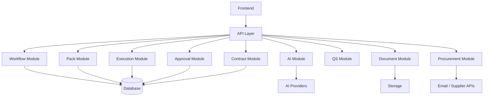
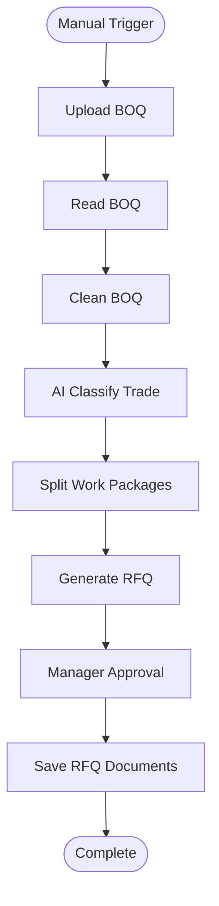
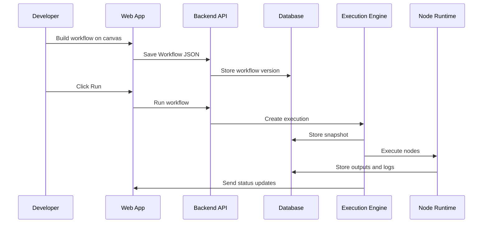

# QS-OS Product Master Blueprint V2
# Volume 6 – Complete Development Architecture
Version: 2.0

> This master blueprint consolidates the QS-OS technical documentation set into one complete product and development architecture.
>
> It combines:
>
> - Volume 1 – Workflow Engine Blueprint
> - Volume 2 – QS Node SDK Specification
> - Volume 2.1 – QS Node Developer Guide
> - Volume 3 – QS Pack Specification
> - Volume 4 – Workflow JSON Specification
> - Volume 5 – Execution Engine Specification
>
> This document is intended to guide founders, developers, technical partners, AI coding agents, product designers, investors, and future contributors.

---

# 1. Executive Summary

QS-OS is a **Construction Workflow Operating System** designed for Quantity Surveying, tendering, procurement, contract administration, cost control, and construction documentation.

It combines:

```text
ComfyUI-style visual node builder
+
n8n-inspired workflow orchestration
+
Quantity Surveying domain Packs
+
AI-first execution
+
Human approval and auditability
```

The platform allows users to build construction business processes by connecting reusable QS-specific nodes on a visual canvas.

Instead of building one fixed QS application, QS-OS becomes a modular operating system where capabilities are installed as Packs.

---

# 2. Core Product Formula

```text
QS-OS = Visual Workflow Canvas
      + Workflow JSON
      + Execution Engine
      + Node SDK
      + Pack Ecosystem
      + AI Orchestration
      + Human Approval
      + Construction Domain Logic
      + Audit Trail
```

---

# 3. Product Vision

QS-OS should become the digital operating layer for construction commercial workflows.

It should help teams automate and manage:

- BOQ processing
- Tender analysis
- Rate build-up
- RFQ preparation
- Supplier quotation comparison
- Procurement recommendation
- Purchase order preparation
- Variation order workflows
- Progress claims
- Payment certificates
- Final accounts
- Cost reporting
- Contract risk review
- AI-assisted QS decision support

The long-term vision is:

> A construction professional should be able to design, automate, audit, and improve QS workflows visually without writing code.

---

# 4. Strategic Positioning

QS-OS is not merely:

```text
Estimating software
BOQ software
Procurement software
Contract software
Document automation software
```

QS-OS is:

```text
A construction workflow operating system
```

It can contain estimating, procurement, contract, document, AI, finance, BIM, and reporting capabilities through installable Packs.

---

# 5. Design Philosophy

The platform is based on ten principles:

1. Workflows represent real business processes.
2. Nodes perform one responsibility.
3. Packs group domain capabilities.
4. Workflow JSON is the canonical format.
5. The Execution Engine runs workflows safely.
6. AI assists but does not silently make high-risk decisions.
7. Human approval is built into the system.
8. All executions are logged and auditable.
9. Construction terminology comes first.
10. The platform should grow through an ecosystem.

---

# 6. QS-OS System Overview

```text
User
  ↓
Web / Mobile Interface
  ↓
Workflow Canvas
  ↓
Workflow JSON
  ↓
Validation Layer
  ↓
Execution Engine
  ↓
Node Runtime
  ↓
Packs and Nodes
  ↓
Database / Storage / AI / Integrations
  ↓
Logs / Reports / Artifacts / Approvals
```

---

# 7. Master Architecture

```text
                           QS-OS Platform

┌────────────────────────────────────────────────────────────────┐
│                         Frontend Layer                         │
│  Web App | Mobile App | Workflow Canvas | Execution Viewer      │
└───────────────────────────────┬────────────────────────────────┘
                                │
┌───────────────────────────────▼────────────────────────────────┐
│                         API Layer                              │
│  Auth | Projects | Workflows | Packs | Executions | Approvals   │
└───────────────────────────────┬────────────────────────────────┘
                                │
┌───────────────────────────────▼────────────────────────────────┐
│                      Workflow Platform Layer                    │
│  Workflow JSON | Validator | Versioning | Templates | Import    │
└───────────────────────────────┬────────────────────────────────┘
                                │
┌───────────────────────────────▼────────────────────────────────┐
│                      Execution Engine Layer                     │
│  Scheduler | Queue | Planner | Runtime | Retry | Checkpoints    │
└───────────────────────────────┬────────────────────────────────┘
                                │
┌───────────────────────────────▼────────────────────────────────┐
│                         Pack Layer                             │
│  Core Pack | QS Pack | AI Pack | Document Pack | Procurement    │
└───────────────────────────────┬────────────────────────────────┘
                                │
┌───────────────────────────────▼────────────────────────────────┐
│                         Service Layer                          │
│  Database | Storage | AI | Email | Notification | Integrations   │
└───────────────────────────────┬────────────────────────────────┘
                                │
┌───────────────────────────────▼────────────────────────────────┐
│                         Data Layer                             │
│  Supabase PostgreSQL | Supabase Storage | Redis Queue            │
└────────────────────────────────────────────────────────────────┘
```

---

# 8. Product Layers

## 8.1 Interface Layer

The Interface Layer is where users interact with QS-OS.

Components:

- Dashboard
- Project workspace
- Workflow canvas
- Node library
- Property panel
- Execution viewer
- Approval inbox
- Document viewer
- Marketplace
- Admin settings

---

## 8.2 Workflow Layer

The Workflow Layer manages workflow definitions.

Components:

- Workflow JSON
- Workflow validator
- Workflow versioning
- Workflow templates
- Workflow import/export
- Workflow diff
- Workflow activation
- Workflow permissions

---

## 8.3 Execution Layer

The Execution Layer runs workflows.

Components:

- Execution request handler
- Scheduler
- Queue manager
- Graph planner
- Node runtime
- Retry manager
- Checkpoint manager
- Approval manager
- AI orchestrator
- Logger
- Audit service

---

## 8.4 Pack Layer

The Pack Layer provides domain capabilities.

Components:

- Pack registry
- Node registry
- Pack manager
- Pack installer
- Pack validator
- Pack permissions
- Pack templates
- Pack prompts
- Marketplace

---

## 8.5 Data Layer

The Data Layer stores operational data.

Components:

- PostgreSQL
- Object storage
- Redis or queue backend
- Audit logs
- Execution outputs
- Workflow snapshots
- Documents
- Artifacts

---

# 9. User Roles

Recommended roles:

```text
Platform Owner
Organization Admin
Project Admin
Quantity Surveyor
Senior Quantity Surveyor
Estimator
Procurement Officer
Contract Manager
Project Manager
Finance Officer
Approver
Supplier
Viewer
Developer
Pack Publisher
```

---

# 10. Role Responsibilities

## 10.1 Quantity Surveyor

Can:

- Upload BOQ
- Run BOQ analysis
- Prepare RFQs
- Review quantities
- Prepare claims
- Review variations
- Generate cost summaries

## 10.2 Senior QS

Can:

- Approve workflows
- Review AI output
- Validate cost summaries
- Approve recommendations
- Manage templates

## 10.3 Procurement Officer

Can:

- Manage suppliers
- Send RFQs
- Collect quotations
- Compare supplier prices
- Prepare purchase orders

## 10.4 Contract Manager

Can:

- Review contract clauses
- Manage variations
- Review EOT claims
- Review final accounts
- Approve contractual outputs

## 10.5 Admin

Can:

- Install Packs
- Grant permissions
- Manage users
- Manage organization settings
- Review audit logs

## 10.6 Developer

Can:

- Build nodes
- Build Packs
- Test workflows
- Publish Packs
- Maintain integrations

---

# 11. Core Product Modules

QS-OS should be structured into modules.

```text
Auth Module
Organization Module
Project Module
Workflow Module
Pack Module
Node Registry Module
Execution Module
Approval Module
AI Module
Document Module
Procurement Module
Contract Module
QS Module
Reporting Module
Notification Module
Audit Module
Marketplace Module
Admin Module
```

---

# 12. Module Map



---

# 13. Product Navigation Structure

Recommended navigation:

```text
Dashboard
Projects
Workflows
Executions
Approvals
Documents
Packs
Marketplace
Reports
Admin
```

Project workspace navigation:

```text
Overview
BOQ
Tender
Procurement
Contract
Claims
Variations
Documents
Workflows
Reports
Settings
```

---

# 14. First Product User Journey

The first MVP user journey should be:

```text
User creates project
  ↓
Uploads BOQ
  ↓
Selects "BOQ to RFQ" workflow template
  ↓
Runs workflow
  ↓
System reads BOQ
  ↓
AI classifies BOQ items
  ↓
System creates trade packages
  ↓
System generates RFQ documents
  ↓
Manager approves
  ↓
RFQs are ready to send
```

This creates a strong first product demo.

---

# 15. MVP Product Direction

The recommended MVP focus is:

```text
AI-powered BOQ-to-RFQ workflow builder
```

Why this MVP is strong:

- Easy to understand
- Highly relevant to QS teams
- Demonstrates workflow automation
- Demonstrates AI usefulness
- Demonstrates document generation
- Demonstrates human approval
- Demonstrates Pack architecture
- Can evolve into procurement and tendering system

---

# 16. MVP Workflow



---

# 17. MVP Scope

QS-OS MVP 0.1 should include:

```text
User authentication
Organization workspace
Project creation
Workflow canvas
Basic node library
Pack registry
Workflow JSON save/load
Manual workflow execution
Execution engine
Execution logs
Human approval
BOQ upload
Read BOQ node
AI classification node
Generate RFQ node
Document output
Basic dashboard
```

---

# 18. MVP Out of Scope

Do not include in MVP 0.1:

```text
Full marketplace
Commercial Pack billing
BIM integration
Mobile app
Advanced contract management
Advanced final account workflows
Multi-region infrastructure
Complex workflow diff
Advanced compensation engine
Full supplier portal
Full accounting integration
```

These can be added after the core engine works.

---

# 19. Technical Stack

Recommended stack:

## Frontend

```text
React
Next.js
React Flow
Tailwind CSS
Shadcn UI or equivalent component system
Zustand or similar state management
```

## Backend

```text
NestJS
TypeScript
REST API initially
WebSocket for live execution updates
```

## Database

```text
Supabase PostgreSQL
Row-Level Security where appropriate
JSONB for workflow definitions
Relational tables for indexing
```

## Storage

```text
Supabase Storage
Object storage abstraction
```

## Queue

```text
BullMQ
Redis
Queue adapter abstraction
```

## AI

```text
OpenAI-compatible provider abstraction
Optional local model provider later
Prompt registry
AI usage logging
```

## Deployment

```text
Vercel or similar for frontend
Containerized backend
Managed PostgreSQL
Managed Redis
Object storage
```

---

# 20. Technology Philosophy

QS-OS should avoid overengineering at the beginning.

Use:

```text
Simple monorepo
Clear module boundaries
TypeScript everywhere
JSON Schema validation
PostgreSQL first
Queue abstraction
Pack abstraction
AI abstraction
```

Do not start with:

```text
Microservices too early
Complex distributed engine too early
Premature marketplace billing
Overly complex plugin sandbox
Full BIM processing
```

---

# 21. Repository Structure

Recommended monorepo:

```text
qs-os/
├── apps/
│   ├── web/
│   └── api/
├── packages/
│   ├── workflow-json/
│   ├── node-sdk/
│   ├── pack-sdk/
│   ├── execution-engine/
│   ├── ui-components/
│   ├── shared-types/
│   └── test-fixtures/
├── packs/
│   ├── core-pack/
│   ├── document-pack/
│   ├── qs-pack/
│   ├── procurement-pack/
│   └── ai-pack/
├── docs/
│   ├── volume-1-workflow-engine-blueprint.md
│   ├── volume-2-node-sdk.md
│   ├── volume-2-1-node-developer-guide.md
│   ├── volume-3-pack-specification.md
│   ├── volume-4-workflow-json.md
│   ├── volume-5-execution-engine.md
│   └── volume-6-product-master-blueprint.md
├── tools/
│   └── qsos-cli/
└── README.md
```

---

# 22. Frontend Architecture

Frontend modules:

```text
Auth
Dashboard
Projects
Workflow Canvas
Node Library
Property Panel
Workflow Templates
Execution Viewer
Approval Inbox
Pack Manager
Marketplace
Admin
```

---

# 23. Workflow Canvas

The Workflow Canvas is the visual editor.

Features:

- Drag-and-drop nodes
- Connect ports
- Configure nodes
- Save workflow
- Validate workflow
- Run workflow
- View execution state
- View node logs
- View outputs
- Show errors
- Show approval pauses

---

# 24. Canvas Components

```text
Canvas
NodeCard
PortHandle
ConnectionLine
NodeLibraryPanel
PropertyPanel
ValidationPanel
ExecutionStatusOverlay
MiniMap
Toolbar
WorkflowHeader
```

---

# 25. Node Library UI

Node library groups:

```text
Core
Document
QS
Procurement
Contract
AI
Integration
Finance
BIM
```

Each node card should show:

```text
Name
Icon
Category
Description
Input ports
Output ports
Pack source
Version
Documentation link
```

---

# 26. Property Panel

The Property Panel edits node configuration.

Sections:

```text
General
Inputs
Configuration
AI
Approval
Retry
Error Handling
Security
Debug
Documentation
```

The panel should be generated from node UI schema.

---

# 27. Execution Viewer

Execution Viewer displays runtime progress.

It should show:

```text
Execution status
Timeline
Node states
Logs
Outputs
Artifacts
Approval tasks
Errors
Retry attempts
AI usage
```

---

# 28. Approval Inbox

Approval Inbox shows tasks waiting for user decision.

Fields:

```text
Approval title
Workflow name
Project name
Requested by
Due date
Attachments
Decision options
Comments
Audit history
```

---

# 29. Backend Architecture

Backend modules:

```text
AuthModule
OrganizationModule
ProjectModule
WorkflowModule
WorkflowValidationModule
PackModule
NodeRegistryModule
ExecutionModule
QueueModule
ApprovalModule
AIModule
DocumentModule
StorageModule
NotificationModule
AuditModule
MarketplaceModule
AdminModule
```

---

# 30. Backend Module Diagram

```text
API Controller
  ↓
Application Service
  ↓
Domain Service
  ↓
Repository
  ↓
Database / Storage / External Provider
```

Keep business logic out of controllers.

---

# 31. API Principles

APIs should be:

- Role-aware
- Organization-scoped
- Project-scoped where relevant
- Audited
- Validated
- Consistent
- Versionable

API response style:

```json
{
  "success": true,
  "data": {},
  "error": null
}
```

---

# 32. Core API Groups

```text
/auth
/organizations
/projects
/workflows
/workflow-templates
/packs
/nodes
/executions
/approvals
/documents
/ai
/reports
/admin
```

---

# 33. Workflow APIs

```text
GET    /workflows
POST   /workflows
GET    /workflows/:id
PUT    /workflows/:id
POST   /workflows/:id/validate
POST   /workflows/:id/activate
POST   /workflows/:id/archive
POST   /workflows/:id/run
GET    /workflows/:id/versions
POST   /workflows/:id/versions
```

---

# 34. Pack APIs

```text
GET    /packs
GET    /packs/installed
POST   /packs/install-local
POST   /packs/uninstall
POST   /packs/update
GET    /packs/:id
GET    /packs/:id/nodes
GET    /packs/:id/templates
GET    /packs/:id/prompts
POST   /packs/:id/permissions/grant
POST   /packs/:id/permissions/revoke
```

---

# 35. Execution APIs

```text
POST   /workflows/:id/run
GET    /executions/:id
GET    /executions/:id/logs
GET    /executions/:id/nodes
GET    /executions/:id/artifacts
POST   /executions/:id/cancel
POST   /executions/:id/pause
POST   /executions/:id/resume
POST   /executions/:id/retry
```

---

# 36. Approval APIs

```text
GET    /approvals
GET    /approvals/:id
POST   /approvals/:id/decision
POST   /approvals/:id/delegate
POST   /approvals/:id/comment
```

---

# 37. Database Master Model

Core database groups:

```text
Identity
Organization
Project
Workflow
Pack
Execution
Approval
Document
AI
Audit
Marketplace
```

---

# 38. Core Tables

```text
users
organizations
organization_members
projects
workflows
workflow_versions
workflow_dependencies
workflow_executions
node_executions
execution_outputs
execution_logs
execution_artifacts
execution_checkpoints
approval_tasks
packs
pack_installations
registered_nodes
pack_permissions
documents
document_versions
ai_usage_logs
audit_logs
notifications
```

---

# 39. Database Relationship Overview

```text
Organization
  ├── Users
  ├── Projects
  │   ├── Workflows
  │   │   ├── Workflow Versions
  │   │   └── Workflow Executions
  │   │       ├── Node Executions
  │   │       ├── Logs
  │   │       ├── Outputs
  │   │       ├── Artifacts
  │   │       └── Approval Tasks
  │   └── Documents
  └── Pack Installations
      └── Registered Nodes
```

---

# 40. Workflow JSON Storage Strategy

Use hybrid storage:

```text
Full workflow JSON stored in workflow_versions.definition JSONB
Important searchable fields extracted into relational columns
Execution uses immutable workflow snapshot
```

This gives flexibility and query performance.

---

# 41. Pack Architecture Summary

A Pack is:

```text
Nodes + Templates + Prompts + Assets + Permissions + Documentation + Tests + License
```

Pack types:

```text
Official
Verified Partner
Community
Private
Regional
Compliance
AI
BIM
Finance
Integration
```

---

# 42. Official MVP Packs

QS-OS MVP should ship with:

```text
Core Pack
Document Pack
QS Pack
Procurement Pack
AI Pack
```

---

# 43. Core Pack

Purpose:

Basic workflow control.

Nodes:

```text
Manual Trigger
Schedule Trigger
Condition
Loop
Merge
Delay
Variable
Human Approval
Logger
Error Handler
Sub-workflow
```

---

# 44. Document Pack

Purpose:

File and document operations.

Nodes:

```text
Upload File
Read Excel
Read PDF
OCR Document
Extract Table
Generate Word
Generate PDF
Save Document
Convert File
```

---

# 45. QS Pack

Purpose:

Quantity surveying operations.

Nodes:

```text
Read BOQ
Clean BOQ
Normalize BOQ Item
Classify Trade
Split Work Package
Rate Analysis
Cost Build-Up
Generate BOQ Summary
Tender Cost Summary
```

---

# 46. Procurement Pack

Purpose:

Supplier and quotation workflows.

Nodes:

```text
Supplier Lookup
Generate RFQ
Send RFQ
Collect Quotation
Compare Quotations
Recommend Supplier
Generate Purchase Order
```

---

# 47. AI Pack

Purpose:

Reusable AI capability.

Nodes:

```text
AI Classifier
AI Extractor
AI Reviewer
AI Summarizer
AI Comparator
AI Risk Detector
AI Recommendation
Prompt Runner
```

---

# 48. Node Architecture Summary

Each node has:

```text
Metadata
Input ports
Output ports
Configuration schema
UI schema
Validation logic
Execution logic
Error handling
Documentation
Tests
Version
```

Node lifecycle:

```text
Register
Initialize
Configure
Validate
Execute
Emit Outputs
Log
Cleanup
```

---

# 49. Node Development Rule

One node should perform one responsibility.

Good:

```text
Read BOQ
Classify Trade
Generate RFQ
Compare Quotations
Create Approval Task
```

Bad:

```text
Do Entire Tender Process
```

The workflow should combine nodes into a process.

---

# 50. Workflow JSON Summary

Workflow JSON stores:

```text
schemaVersion
workflow identity
dependencies
nodes
connections
variables
secrets references
triggers
settings
execution policy
validation
metadata
ui state
audit
migrations
```

It should not store:

```text
raw secrets
runtime logs
large binary files
temporary execution outputs
confidential marketplace sample data
```

---

# 51. Execution Engine Summary

The Execution Engine includes:

```text
Trigger Listener
Execution Request Handler
Workflow Loader
Snapshot Service
Workflow Validator
Dependency Resolver
Graph Builder
Execution Planner
Scheduler
Queue Manager
Node Runtime
Approval Manager
AI Orchestrator
Checkpoint Manager
Logger
Audit Service
Recovery Service
```

---

# 52. Execution Runtime Flow

```text
Trigger received
  ↓
Execution request created
  ↓
Workflow version loaded
  ↓
Immutable snapshot created
  ↓
Workflow validated
  ↓
Packs and nodes resolved
  ↓
Execution plan created
  ↓
Nodes executed
  ↓
Outputs stored
  ↓
Approvals handled
  ↓
Artifacts generated
  ↓
Workflow completed
```

---

# 53. AI Architecture

AI should be a first-class platform capability.

AI components:

```text
AI Provider Adapter
Prompt Registry
Prompt Versioning
AI Orchestrator
Structured Output Validator
Confidence Scoring
AI Usage Logging
Human Review Router
AI Safety Policy
```

---

# 54. AI Provider Abstraction

AI provider should be abstracted.

```text
AI Node
  ↓
AI Orchestrator
  ↓
Model Profile
  ↓
Provider Adapter
  ↓
OpenAI-compatible provider / local model / future provider
```

Workflow JSON should not depend directly on a specific AI vendor.

---

# 55. AI Governance

AI must be governed carefully.

Rules:

```text
AI output must be structured where possible
AI should provide confidence scores
High-risk AI outputs require human review
Prompt versions must be tracked
AI token usage must be logged
AI should not silently approve financial decisions
AI should not replace legally required professional judgment
```

---

# 56. High-Risk AI Use Cases

Require human approval for:

```text
Supplier award recommendation
Tender price recommendation
Contract entitlement decision
Variation approval
Payment certification
Final account recommendation
Legal or contractual risk conclusion
```

---

# 57. Human Approval Architecture

Approval is a core feature, not an afterthought.

Approval components:

```text
Approval Node
Approval Task
Approval Inbox
Decision Options
Approval Comments
Approval Due Date
Approval Resume Logic
Approval Audit Log
```

Approval decisions:

```text
approve
reject
request_changes
delegate
cancel
```

---

# 58. Document Architecture

Documents are central to QS workflows.

Document types:

```text
BOQ
RFQ
Quotation
Purchase Order
Variation Order
Progress Claim
Payment Certificate
Final Account
Cost Report
Tender Report
Contract Review
```

Document service responsibilities:

```text
Store files
Version files
Generate documents
Convert files
Attach documents to approvals
Attach documents to executions
Track document provenance
```

---

# 59. Procurement Architecture

Procurement module includes:

```text
Supplier database
RFQ generation
RFQ sending
Quotation collection
Quotation comparison
Supplier recommendation
Purchase order generation
Procurement approval
```

MVP should focus on RFQ generation and quotation comparison later.

---

# 60. Contract Architecture

Contract module includes:

```text
Variation Order
EOT Claim
Progress Claim
Payment Certificate
Final Account
Contract Review
Clause Risk Review
```

This may be Phase 2 after tendering and procurement MVP.

---

# 61. Reporting Architecture

Reporting should be generated from workflow data.

Reports:

```text
Tender Cost Summary
BOQ Trade Summary
Quotation Comparison Report
Procurement Recommendation Report
Progress Claim Report
Variation Summary
Payment Certificate Summary
Execution Audit Report
AI Usage Report
```

---

# 62. Notification Architecture

Notification channels:

```text
In-app
Email
WhatsApp
Telegram
Push notification
Webhook
```

Notification events:

```text
Approval required
Workflow completed
Workflow failed
Document generated
RFQ ready
Quotation received
Payment certificate ready
```

---

# 63. Security Architecture

Security principles:

1. Organization isolation
2. Role-based access control
3. Project-level permissions
4. Pack permissions
5. Node runtime sandboxing
6. Secret references only
7. Audit logs
8. Execution snapshots
9. Approval requirements
10. Safe workflow import

---

# 64. Permission Layers

Permissions exist at multiple levels:

```text
Platform permission
Organization permission
Project permission
Workflow permission
Pack permission
Node permission
Execution permission
Document permission
AI permission
```

---

# 65. Secrets Management

Secrets must be managed by a secret service.

Rules:

```text
Never store raw secrets in Workflow JSON
Never log secrets
Inject secrets only at runtime
Require permission before secret access
Mask secrets in debug mode
Allow secret rotation
```

---

# 66. Audit Architecture

Audit logs should record:

```text
User login
Workflow created
Workflow edited
Workflow activated
Workflow executed
Pack installed
Pack permission granted
Approval decision made
RFQ sent
Purchase Order generated
AI review completed
Payment certificate approved
```

Audit logs should be immutable.

---

# 67. Multi-Tenant Architecture

Every major record should include:

```text
organization_id
project_id where applicable
created_by
created_at
updated_at
```

The platform must prevent cross-organization data leakage.

---

# 68. Development Roadmap Overview

Recommended roadmap:

```text
Phase 0 – Documentation and Architecture
Phase 1 – Platform Foundation
Phase 2 – Workflow Canvas and JSON
Phase 3 – Node SDK and Core Pack
Phase 4 – Execution Engine MVP
Phase 5 – QS BOQ to RFQ MVP
Phase 6 – Human Approval and Audit
Phase 7 – AI Pack and Document Generation
Phase 8 – Procurement Expansion
Phase 9 – Contract and Claims Expansion
Phase 10 – Marketplace and Ecosystem
```

---

# 69. Phase 0 – Documentation and Architecture

Status:

```text
Volume 1 – Workflow Engine Blueprint
Volume 2 – QS Node SDK Specification
Volume 2.1 – QS Node Developer Guide
Volume 3 – QS Pack Specification
Volume 4 – Workflow JSON Specification
Volume 5 – Execution Engine Specification
Volume 6 – Product Master Blueprint
```

Outcome:

```text
Development-ready architecture foundation
```

---

# 70. Phase 1 – Platform Foundation

Build:

```text
Monorepo
Authentication
Organization management
Project management
Backend API structure
Database schema foundation
Storage abstraction
Basic UI shell
Admin layout
```

Deliverable:

```text
Users can log in, create organizations, create projects, and access dashboard.
```

---

# 71. Phase 2 – Workflow Canvas and JSON

Build:

```text
React Flow canvas
Node library panel
Property panel
Workflow save/load
Workflow JSON schema
Workflow validator
Workflow versioning
Workflow template loader
```

Deliverable:

```text
Users can visually create and save workflows.
```

---

# 72. Phase 3 – Node SDK and Core Pack

Build:

```text
Node SDK interfaces
Node registry
Node UI schema
Node validation
Core Pack
Document Pack basic nodes
QS Pack basic nodes
```

Deliverable:

```text
Users can add working nodes to the canvas.
```

---

# 73. Phase 4 – Execution Engine MVP

Build:

```text
Execution request handler
Workflow loader
Execution snapshot
Graph planner
Node runtime
Queue manager
Execution logs
Output storage
Basic retry
Basic error handling
```

Deliverable:

```text
Users can run simple workflows end-to-end.
```

---

# 74. Phase 5 – BOQ to RFQ MVP

Build:

```text
Upload BOQ
Read BOQ node
Clean BOQ node
AI classify trade node
Split work package node
Generate RFQ node
Save RFQ documents
Execution viewer
```

Deliverable:

```text
Users can upload a BOQ and generate RFQ packages.
```

---

# 75. Phase 6 – Approval and Audit

Build:

```text
Human approval node
Approval inbox
Approval decision flow
Workflow pause/resume
Approval audit log
Document attachment to approval
```

Deliverable:

```text
Users can review and approve generated RFQs before issue.
```

---

# 76. Phase 7 – AI and Document Generation

Build:

```text
AI Pack
Prompt registry
Prompt versioning
AI usage logs
Structured output validation
Document templates
PDF/Word generation
Report generation
```

Deliverable:

```text
AI-assisted workflows produce auditable documents and reports.
```

---

# 77. Phase 8 – Procurement Expansion

Build:

```text
Supplier database
Send RFQ
Collect quotation
Compare quotation
Supplier recommendation
Purchase order generation
Procurement approval
```

Deliverable:

```text
QS-OS supports procurement workflow from RFQ to PO draft.
```

---

# 78. Phase 9 – Contract and Claims Expansion

Build:

```text
Variation workflow
Progress claim workflow
Payment certificate workflow
Final account workflow
Contract review workflow
EOT claim workflow
```

Deliverable:

```text
QS-OS supports contract administration workflows.
```

---

# 79. Phase 10 – Marketplace and Ecosystem

Build:

```text
Pack marketplace
Publisher accounts
Pack certification
Commercial Pack licensing
Private organization Packs
Regional Packs
Community Packs
Pack analytics
```

Deliverable:

```text
QS-OS becomes an extensible ecosystem.
```

---

# 80. MVP 0.1 Feature List

Must have:

```text
Login
Organization
Project
Workflow Canvas
Node Library
Property Panel
Workflow JSON Save/Load
Manual Trigger
Core Pack
Document Pack
QS Pack Basic
AI Pack Basic
Execution Engine Basic
Execution Logs
Read BOQ Node
AI Classify Node
Generate RFQ Node
Human Approval Node
Artifact Storage
```

---

# 81. MVP 0.1 Demo Script

Demo flow:

```text
Create project
Upload tender BOQ
Open BOQ to RFQ workflow template
Show workflow canvas
Run workflow
Read BOQ
Classify trades
Generate RFQ documents
Pause for manager approval
Approve
Show generated RFQ artifacts
Show execution logs
```

This demo communicates the whole product vision.

---

# 82. MVP Success Criteria

MVP is successful if:

```text
A user can upload a BOQ
A workflow can process it
Nodes can execute in sequence
AI classification returns structured output
RFQ documents can be generated
A human approval step can pause/resume workflow
Execution logs are visible
Outputs are stored as artifacts
Workflow JSON can be saved and reloaded
```

---

# 83. MVP Technical Milestones

```text
M1 – Monorepo and database setup
M2 – Auth and project module
M3 – Workflow canvas prototype
M4 – Workflow JSON save/load
M5 – Node SDK and registry
M6 – Core Pack
M7 – Execution engine basic
M8 – Read BOQ node
M9 – AI classification node
M10 – Generate RFQ node
M11 – Human approval
M12 – Execution viewer
M13 – Demo-ready MVP
```

---

# 84. Development Team Structure

Lean MVP team:

```text
Product Lead
Technical Lead
Frontend Developer
Backend Developer
AI / Automation Developer
QS Domain Expert
UI/UX Designer
QA Tester
```

Optional later:

```text
DevOps Engineer
Security Engineer
Marketplace Manager
Pack Developer Relations
BIM Specialist
Contract Specialist
```

---

# 85. AI Coding Agent Strategy

QS-OS documentation should be structured so AI coding agents can help implement modules.

Recommended approach:

```text
One module at a time
One specification per task
Strict interfaces
Test-first development
Small commits
Clear file structure
Code review
```

Example AI coding tasks:

```text
Implement Workflow JSON TypeScript interfaces
Implement workflow validator
Implement Node Registry
Implement Pack manifest parser
Implement Read BOQ node
Implement execution log table
Implement basic node runtime
```

---

# 86. Development Principles

1. Build the smallest working engine first.
2. Do not build marketplace too early.
3. Do not overcomplicate plugin security before internal Packs work.
4. Use strict TypeScript types.
5. Use JSON Schema validation.
6. Keep node contracts stable.
7. Build with test fixtures.
8. Log everything important.
9. Preserve workflow snapshots.
10. Keep AI explainable and reviewable.

---

# 87. Testing Strategy

Testing layers:

```text
Unit tests
Node tests
Pack tests
Workflow JSON tests
Execution engine tests
Integration tests
End-to-end tests
Security tests
Performance tests
Regression tests
```

---

# 88. Test Fixtures

Create fixtures:

```text
Sample BOQ Excel
Sample cleaned BOQ JSON
Sample trade classification output
Sample RFQ template
Sample supplier list
Sample quotation
Sample workflow JSON
Sample execution logs
```

Fixtures are essential for stable development.

---

# 89. Quality Gates

Before release:

```text
Workflow JSON validates
Pack manifest validates
Nodes follow SDK contract
Execution engine runs sample workflow
Approval pause/resume works
AI output is schema-valid
Secrets are not leaked
Logs are generated
Artifacts are stored
Permissions are checked
```

---

# 90. Performance Targets

Initial targets:

```text
BOQ up to 5,000 rows for MVP
Workflow execution under 5 minutes for typical BOQ
Node logs visible in near real-time
AI batch classification supported
Generated documents stored reliably
```

Later targets:

```text
BOQ 50,000+ rows
Parallel batch processing
Large drawing and BIM support
Multi-user collaboration
Enterprise-scale execution
```

---

# 91. Data Governance

QS-OS will handle sensitive commercial data.

Sensitive data includes:

```text
Tender prices
Supplier quotations
Client names
Contract sums
Payment certificates
Variation values
Final account data
Project documents
```

Governance requirements:

```text
Access control
Audit log
Encryption where appropriate
Data retention policy
Export controls
Private Pack controls
AI data policy
```

---

# 92. AI Data Policy

AI usage must respect commercial confidentiality.

Policy options:

```text
Do not use customer data for training
Allow local model option later
Log AI usage but not sensitive raw prompts unnecessarily
Allow organization-level AI provider setting
Allow human review for high-risk AI output
```

---

# 93. Business Model Options

Potential business models:

```text
SaaS subscription
Per organization
Per user seat
Per project
Premium Packs
Private Pack development
Enterprise deployment
AI usage add-on
Marketplace commission
Professional services
```

Recommended early model:

```text
Subscription per organization
Free trial
Premium AI usage tier
Enterprise custom pricing
```

---

# 94. Marketplace Strategy

Do not launch public marketplace first.

Recommended stages:

```text
Stage 1 – Internal official Packs
Stage 2 – Private organization Packs
Stage 3 – Verified partner Packs
Stage 4 – Public marketplace
Stage 5 – Paid Pack ecosystem
```

---

# 95. Competitive Advantage

QS-OS differentiation:

```text
Domain-specific QS nodes
Workflow-first architecture
Pack ecosystem
AI-first but human-approved
Execution audit trail
Customizable business processes
Construction terminology
Reusable workflow templates
```

Most traditional QS software is feature-based.

QS-OS is process-based.

---

# 96. Product Risks

Major risks:

```text
Overbuilding before MVP validation
Workflow engine complexity
AI output reliability
BOQ format variation
User adoption friction
Security concerns
Pack compatibility issues
Performance on large files
Lack of QS validation
```

---

# 97. Risk Mitigation

Mitigation:

```text
Start with one workflow
Use real BOQ samples
Keep MVP narrow
Require human review
Use schema validation
Log AI confidence
Build internal Packs first
Create strong sample templates
Get QS expert feedback early
```

---

# 98. First 20 Nodes to Build

Recommended first 20 nodes:

```text
core.manual_trigger
core.condition
core.human_approval
core.logger
core.merge
document.upload_file
document.read_excel
document.generate_pdf
document.generate_word
document.save_file
qs.read_boq
qs.clean_boq
qs.classify_trade
qs.split_work_package
qs.cost_summary
procurement.generate_rfq
procurement.supplier_lookup
procurement.compare_quotation
ai.classifier
ai.reviewer
```

---

# 99. First 5 Workflow Templates

Recommended first templates:

```text
Tender BOQ to RFQ
BOQ Cost Summary
Quotation Comparison
AI Tender Risk Review
Progress Claim Draft Preparation
```

MVP should implement only the first one fully.

---

# 100. First Product Demo Workflow JSON

The demo workflow should use:

```text
Manual Trigger
Upload File
Read BOQ
AI Classify Trade
Split Work Package
Generate RFQ
Human Approval
Save Documents
Logger
```

This demonstrates the complete architecture.

---

# 101. Implementation Priority Matrix

## Must Build First

```text
Workflow JSON
Node Registry
Pack Registry
Canvas
Execution Engine Basic
Read BOQ Node
AI Classifier Node
Human Approval Node
Execution Logs
```

## Build Second

```text
Document generation
RFQ template
Execution viewer
Pack manager UI
Approval inbox
```

## Build Later

```text
Marketplace
Billing
BIM
Advanced contract workflows
Supplier portal
Mobile app
```

---

# 102. Suggested Database MVP Tables

```text
users
organizations
organization_members
projects
workflows
workflow_versions
pack_installations
registered_nodes
workflow_executions
node_executions
execution_logs
execution_outputs
execution_artifacts
approval_tasks
ai_usage_logs
documents
```

---

# 103. Suggested Backend MVP Modules

```text
AuthModule
OrganizationModule
ProjectModule
WorkflowModule
WorkflowValidationModule
PackModule
NodeRegistryModule
ExecutionModule
QueueModule
ApprovalModule
AIModule
DocumentModule
StorageModule
AuditModule
```

---

# 104. Suggested Frontend MVP Pages

```text
/login
/dashboard
/projects
/projects/:id
/projects/:id/workflows
/workflows/:id/editor
/executions/:id
/approvals
/packs
/admin
```

---

# 105. Suggested Package Names

```text
@qsos/shared-types
@qsos/workflow-json
@qsos/node-sdk
@qsos/pack-sdk
@qsos/execution-engine
@qsos/ui
@qsos/core-pack
@qsos/document-pack
@qsos/qs-pack
@qsos/procurement-pack
@qsos/ai-pack
```

---

# 106. Product Naming

Main product:

```text
QS-OS
```

Possible expanded name:

```text
Quantity Surveying Operating System
```

Tagline options:

```text
Build construction workflows visually.
The workflow operating system for Quantity Surveyors.
AI-powered QS workflows with human approval.
From BOQ to RFQ, visually.
```

Recommended tagline:

```text
The workflow operating system for Quantity Surveyors.
```

---

# 107. Brand Positioning Statement

QS-OS is a visual workflow platform for construction commercial teams.

It helps Quantity Surveyors, estimators, procurement officers, and contract managers automate BOQ, RFQ, quotation, variation, claim, and reporting processes using domain-specific nodes, AI assistance, and auditable human approval.

---

# 108. Investor Explanation

Simple explanation:

```text
QS-OS is like n8n or ComfyUI, but for construction commercial workflows.
Instead of generic automation blocks, QS-OS provides Quantity Surveying nodes such as Read BOQ, Rate Analysis, Generate RFQ, Compare Quotations, Variation Order, and Payment Certificate.
```

---

# 109. Developer Explanation

Technical explanation:

```text
QS-OS is a TypeScript-based workflow platform with a visual graph editor, canonical Workflow JSON format, domain-specific Node SDK, installable Pack system, and durable execution engine.
```

---

# 110. QS User Explanation

User explanation:

```text
QS-OS lets you create your own QS workflows visually.
You can upload BOQs, classify items, generate RFQs, compare quotations, prepare claims, and route outputs for approval without manually repeating the same process every time.
```

---

# 111. MVP Demo Explanation

```text
In this demo, we upload a BOQ.
QS-OS reads it, classifies the items by trade, creates procurement packages, generates RFQ documents, pauses for manager approval, and stores the final documents with a full execution log.
```

---

# 112. Governance Model

QS-OS needs governance for:

```text
Official Packs
Third-party Packs
AI prompts
Workflow templates
Permissions
Marketplace publication
Security review
Versioning
Deprecation
Data privacy
```

Governance should be practical but strict for commercial workflows.

---

# 113. Documentation Set

Completed documentation set:

```text
Volume 1   – Workflow Engine Blueprint
Volume 2   – QS Node SDK Specification
Volume 2.1 – QS Node Developer Guide
Volume 3   – QS Pack Specification
Volume 4   – Workflow JSON Specification
Volume 5   – Execution Engine Specification
Volume 6   – QS-OS Product Master Blueprint V2
```

Recommended additional documents:

```text
Volume 7 – Database Schema Specification
Volume 8 – API Specification
Volume 9 – UI/UX Product Specification
Volume 10 – MVP Development Plan and Sprint Backlog
Volume 11 – AI Governance and Prompt Specification
Volume 12 – Security and Permission Specification
```

---

# 114. From Documentation to Development

After Volume 6, the next practical step is not more theory.

The next step should be:

```text
Build QS-OS MVP Skeleton
```

MVP Skeleton means:

```text
Monorepo
Frontend shell
Backend shell
Database schema
Workflow JSON package
Node SDK package
Pack SDK package
Core Pack
Basic workflow canvas
Basic execution engine
```

---

# 115. First Development Sprint

Sprint 1 objective:

```text
Create the QS-OS platform skeleton.
```

Tasks:

```text
Initialize monorepo
Create apps/web
Create apps/api
Create shared-types package
Create workflow-json package
Create database migrations
Set up authentication
Create project dashboard shell
Create workflow editor route
Create basic React Flow canvas
```

---

# 116. Second Development Sprint

Sprint 2 objective:

```text
Implement Workflow JSON save/load.
```

Tasks:

```text
Define TypeScript interfaces
Define JSON Schema
Create workflow validator
Create workflow CRUD API
Create workflow_versions table
Save canvas as Workflow JSON
Load Workflow JSON into canvas
Display validation result
```

---

# 117. Third Development Sprint

Sprint 3 objective:

```text
Implement Node Registry and Core Pack.
```

Tasks:

```text
Define Node SDK interfaces
Create node registry table
Create pack installation table
Create Core Pack manifest
Create Manual Trigger node
Create Logger node
Create Human Approval node schema
Show registered nodes in canvas library
```

---

# 118. Fourth Development Sprint

Sprint 4 objective:

```text
Implement basic Execution Engine.
```

Tasks:

```text
Create execution tables
Create run workflow endpoint
Create execution snapshot
Create simple graph planner
Create node runtime
Execute nodes sequentially
Store logs
Store outputs
Show execution viewer
```

---

# 119. Fifth Development Sprint

Sprint 5 objective:

```text
Implement BOQ to RFQ demo.
```

Tasks:

```text
Create Read BOQ node
Create Clean BOQ node
Create AI Classify node
Create Split Work Package node
Create Generate RFQ node
Create BOQ to RFQ template
Run demo workflow end-to-end
```

---

# 120. Build Sequence Diagram



---

# 121. Product Readiness Checklist

Before public MVP:

```text
[ ] User can log in
[ ] User can create project
[ ] User can open workflow editor
[ ] User can add nodes
[ ] User can connect nodes
[ ] User can configure nodes
[ ] User can save workflow
[ ] Workflow JSON validates
[ ] User can run workflow
[ ] Execution logs appear
[ ] BOQ can be uploaded
[ ] BOQ can be parsed
[ ] AI classification works
[ ] RFQ document generated
[ ] Human approval works
[ ] Artifact can be downloaded
[ ] Audit log records key events
```

---

# 122. Technical Readiness Checklist

Before production:

```text
[ ] Database migrations stable
[ ] Auth and authorization implemented
[ ] Organization isolation tested
[ ] Workflow snapshots immutable
[ ] Pack permissions enforced
[ ] Secrets not stored in JSON
[ ] AI calls logged
[ ] Retry tested
[ ] Approval resume tested
[ ] Execution cancellation tested
[ ] Error states visible
[ ] File storage secured
[ ] Basic monitoring enabled
[ ] Backups configured
```

---

# 123. Commercial Readiness Checklist

Before selling:

```text
[ ] Clear MVP demo
[ ] Clear pricing model
[ ] Target customer defined
[ ] Onboarding flow ready
[ ] Sample BOQ demo data prepared
[ ] Security explanation ready
[ ] AI data policy ready
[ ] Support process ready
[ ] Terms and privacy drafted
[ ] Case study or pilot customer identified
```

---

# 124. Recommended Pilot Customers

Ideal pilot users:

```text
Small to medium contractors
QS consultancy firms
Specialist subcontractors
Procurement teams
Construction developers
Educational QS departments
```

Best first pilot:

```text
Contractor tendering team that frequently receives BOQs and prepares RFQs.
```

---

# 125. Pilot Success Metrics

Measure:

```text
Time saved preparing RFQs
BOQ items processed
Accuracy of trade classification
Number of RFQ documents generated
Approval turnaround time
User satisfaction
Manual rework reduced
Workflow execution success rate
```

---

# 126. Long-Term Product Expansion

Future product areas:

```text
Tender Intelligence
Cost Database
Supplier Marketplace
Contract Administration
Progress Claim Automation
Final Account Automation
BIM Quantity Extraction
AI Contract Reviewer
Construction Finance Integration
Enterprise Workflow Governance
```

---

# 127. North Star Metric

Possible North Star Metric:

```text
Number of successful QS workflow executions per organization per month
```

Supporting metrics:

```text
BOQ rows processed
Documents generated
Approvals completed
Hours saved
AI recommendations reviewed
RFQs issued
Quotations compared
```

---

# 128. Master Data Objects

Core domain objects:

```text
Organization
User
Project
Workflow
Workflow Version
Workflow Execution
Node Execution
Pack
Node
Document
BOQ
BOQ Item
Trade Package
Supplier
RFQ
Quotation
Purchase Order
Contract
Variation Order
Progress Claim
Payment Certificate
Final Account
Approval Task
AI Review
Audit Log
```

---

# 129. Domain Object Relationship

```text
Project
  ├── BOQ
  │   └── BOQ Items
  ├── Trade Packages
  │   └── RFQs
  │       └── Quotations
  ├── Purchase Orders
  ├── Variations
  ├── Claims
  ├── Payment Certificates
  ├── Documents
  └── Workflows
      └── Executions
```

---

# 130. Future AI Agent Layer

After the workflow engine is stable, QS-OS can introduce AI agents.

Possible agents:

```text
Tender Assistant
Procurement Assistant
Contract Review Assistant
Variation Assistant
Claim Assistant
Cost Report Assistant
Supplier Comparison Assistant
```

Agents should use workflows and nodes as tools.

They should not bypass the execution engine.

---

# 131. Agent Architecture

```text
User request
  ↓
AI Agent
  ↓
Select workflow or tools
  ↓
Run QS-OS workflow
  ↓
Human approval if needed
  ↓
Return result with audit trail
```

The workflow engine remains the control layer.

---

# 132. BIM Future Direction

BIM integration should come later.

BIM capabilities:

```text
Read IFC
Extract model quantities
Map model elements to BOQ
Compare drawing/model with BOQ
Detect missing quantities
Generate measurement report
```

BIM is powerful but should not distract from the first BOQ-to-RFQ MVP.

---

# 133. Regional Expansion

QS-OS can expand through regional Packs.

Examples:

```text
Malaysia QS Pack
Indonesia QS Pack
GCC Tender Pack
UK NRM Pack
Australia Cost Planning Pack
```

Regional Packs may include:

```text
Local measurement rules
Local document templates
Local tax logic
Local language
Local procurement practices
```

---

# 134. Educational Version

QS-OS could later support educational use.

Education features:

```text
Student workflow templates
BOQ learning workflows
Rate analysis tutorials
QS process simulations
AI explanation mode
Lecturer review dashboard
```

This can build community and future adoption.

---

# 135. Enterprise Version

Enterprise features:

```text
Private deployment
Private Pack registry
Advanced audit
Advanced RBAC
Workflow approval policies
Custom AI provider
Data residency
Single sign-on
Enterprise reporting
Pack certification
```

---

# 136. Final Architecture Formula

```text
QS-OS Product =
  Domain-Specific Workflow Canvas
  + Canonical Workflow JSON
  + Durable Execution Engine
  + Pack Ecosystem
  + Node SDK
  + AI Orchestration
  + Human Approval
  + Audit and Governance
```

---

# 137. Final MVP Formula

```text
QS-OS MVP =
  Project Workspace
  + Workflow Canvas
  + Workflow JSON
  + Core Pack
  + QS Pack
  + AI Pack
  + Execution Engine
  + BOQ to RFQ Workflow
  + Human Approval
  + Execution Logs
```

---

# 138. Final Strategic Formula

```text
QS-OS starts with BOQ-to-RFQ automation
and grows into the workflow operating system
for construction commercial management.
```

---

# 139. Decision: What to Build First

Build first:

```text
Workflow Canvas
Workflow JSON
Node Registry
Pack Registry
Execution Engine
Read BOQ Node
AI Classifier Node
Generate RFQ Node
Human Approval Node
Execution Viewer
```

Do not build first:

```text
Full marketplace
Full BIM
Full contract suite
Full mobile app
Full supplier portal
Complex billing
```

---

# 140. Master Implementation Checklist

```text
[ ] Create monorepo
[ ] Create frontend app
[ ] Create backend app
[ ] Create shared TypeScript types
[ ] Create database migrations
[ ] Create Workflow JSON package
[ ] Create Node SDK package
[ ] Create Pack SDK package
[ ] Create Core Pack
[ ] Create Pack Registry
[ ] Create Node Registry
[ ] Create workflow canvas
[ ] Create workflow save/load
[ ] Create workflow validator
[ ] Create execution tables
[ ] Create execution engine
[ ] Create node runtime
[ ] Create execution logs
[ ] Create Read BOQ node
[ ] Create AI Classify node
[ ] Create RFQ Generator node
[ ] Create Human Approval node
[ ] Create execution viewer
[ ] Create demo workflow
[ ] Test end-to-end
```

---

# 141. Recommended Next Documents

After this master blueprint, the next practical documents should be:

```text
Volume 7 – Database Schema Specification
Volume 8 – API Specification
Volume 9 – UI/UX Product Specification
Volume 10 – MVP Sprint Backlog
```

However, development can already begin using Volumes 1–6.

---

# 142. Recommended Immediate Next Step

The immediate next step should be:

```text
Prepare MVP Sprint Backlog
```

or

```text
Start repository skeleton
```

The documentation is now sufficient to begin technical implementation.

---

# 143. Closing Statement

QS-OS is a strong product concept because it changes the way QS software is imagined.

Traditional software gives users fixed screens and fixed features.

QS-OS gives users a workflow operating system.

Users can build, automate, review, approve, and improve their own QS processes using visual nodes, Packs, AI, and human approval.

This master blueprint should be treated as the foundation document for moving from concept into development.

---

# Appendix A – Documentation Map

```text
Volume 1 – Workflow Engine Blueprint
Purpose:
Define the original platform vision and high-level architecture.

Volume 2 – QS Node SDK Specification
Purpose:
Define how every node is structured and executed.

Volume 2.1 – QS Node Developer Guide
Purpose:
Give developers practical guidance for building nodes.

Volume 3 – QS Pack Specification
Purpose:
Define how nodes become installable Packs.

Volume 4 – Workflow JSON Specification
Purpose:
Define the canonical workflow file format.

Volume 5 – Execution Engine Specification
Purpose:
Define how workflows run.

Volume 6 – Product Master Blueprint V2
Purpose:
Combine everything into a complete product and development architecture.
```

---

# Appendix B – QS-OS Concept in One Page

```text
QS-OS is a construction workflow operating system.

It lets Quantity Surveyors and construction commercial teams build workflows visually.

A workflow is made of nodes.

Nodes come from Packs.

Packs contain domain capabilities.

Workflow JSON stores the graph.

The Execution Engine runs the graph.

AI assists with classification, extraction, review, and recommendation.

Human approval controls high-risk decisions.

Audit logs preserve accountability.

The first MVP is BOQ to RFQ automation.

The long-term platform becomes an ecosystem for tendering, procurement, contracts, claims, cost reporting, BIM, and finance.
```

---

# Appendix C – Core Terminology

```text
Workflow:
A business process represented as a graph.

Node:
A reusable unit of work.

Pack:
An installable collection of nodes, templates, prompts, and assets.

Workflow JSON:
The saved workflow definition.

Execution:
A running instance of a workflow.

Execution Snapshot:
Immutable copy of workflow definition used for a run.

Artifact:
A file generated or used during execution.

Approval Task:
Human decision point that pauses workflow.

AI Orchestrator:
Service that manages AI calls, prompts, schemas, and logging.

Node Runtime:
Controlled environment where node logic executes.

Pack Registry:
Database of installed Packs.

Node Registry:
Database of available node types.
```

---

# Appendix D – MVP Demo Narrative

```text
A contractor receives a tender BOQ.

Normally, a QS manually reviews the BOQ, groups items by trade, prepares RFQ packages, and sends them to suppliers.

With QS-OS, the QS uploads the BOQ and runs the BOQ-to-RFQ workflow.

The system reads the BOQ, cleans the data, classifies items by trade using AI, groups them into work packages, generates RFQ documents, and pauses for manager approval.

Once approved, the RFQ documents are stored and ready for issue.

Every step is logged.
Every output is traceable.
AI output is reviewable.
The workflow can be reused on the next tender.
```

---

# Appendix E – Development Principle

```text
Do not build a giant QS app.

Build the engine.

Then build the Packs.

Then build the workflows.

Then grow the ecosystem.
```

---

# End of Volume 6
